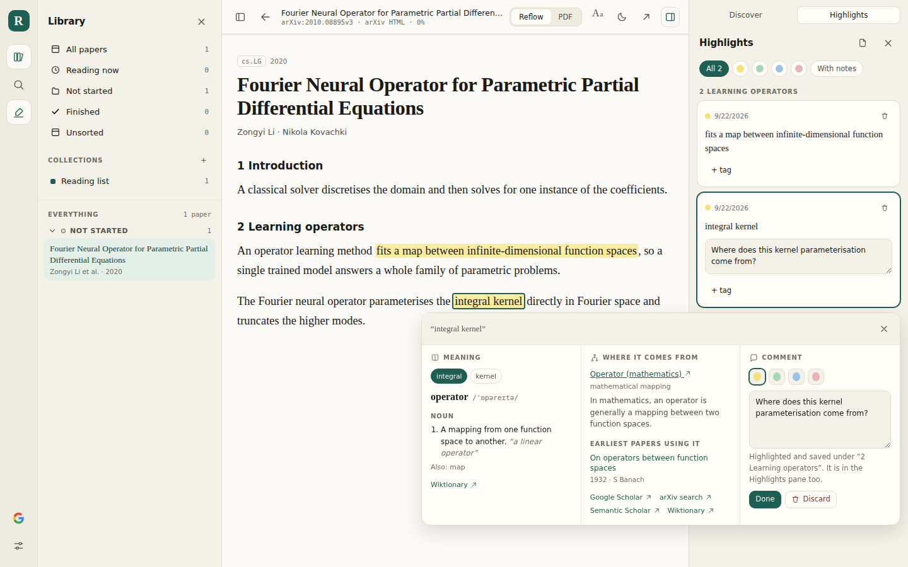
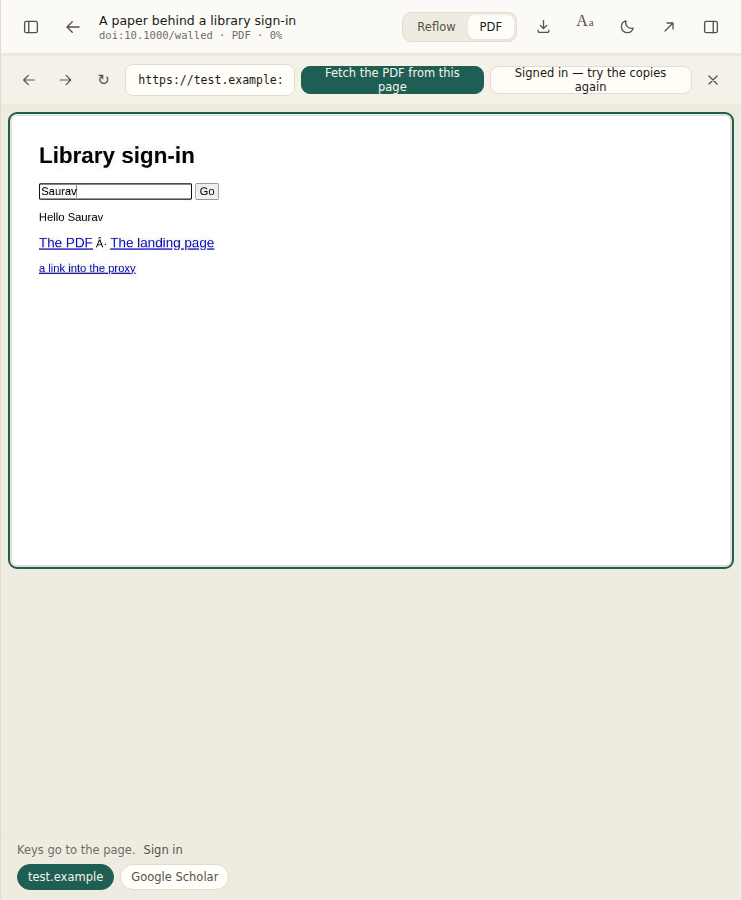
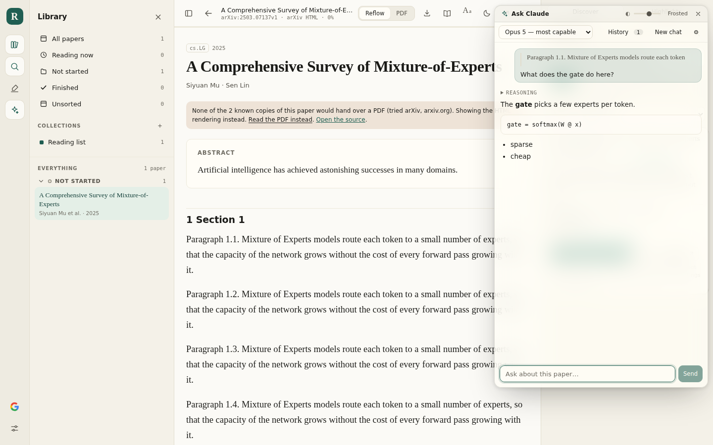

# Reader

A reader for research papers. Search arXiv, OpenAlex, Semantic Scholar, Crossref and
Google Scholar from one box — papers or the people who wrote them — see every place a paper can be
read from and open it from whichever one will part with a file, read it as its PDF or
reflowed as text to highlight it, and keep what you collect: the PDFs in your own
Google Drive, the notes and the bibliography in a Git repository.



The window is in three parts. On the left, the library: your collections, and the
papers in them split into what you are **reading now**, what you have **not started**
and what you have **finished**. In the middle, the paper. On the right, a dock
holding **Discover** and **Highlights** — tabs, so the reading column never has a
panel crowding it on both sides.

Right-click a selection in a paper and a box opens with three panes: what the word
**means**, where the idea **comes from** — a background paragraph, the earliest
papers to use the phrase, the most cited ones since, and links out — and a
**comment** that highlights the passage as you type it, the way Acrobat does.

Press **⌘\\** and a Claude window floats over the paper — see
[Ask Claude](#ask-claude).

## Running it

```bash
npm install
npm run dev          # http://localhost:5173
```

`npm install` pulls a Chromium for the browser tests. To skip it —
`PLAYWRIGHT_SKIP_BROWSER_DOWNLOAD=1 npm install` — which is enough for
everything except `scripts/smoke.mjs`, `scripts/versions-drive.mjs` and
`scripts/scholar-flow.mjs`.

For a production build:

```bash
npm run build
npm start            # http://localhost:8080
```

`npm start` runs a small Express server that serves the build **and** the `/api`
routes. Those routes are not optional: arXiv sends no CORS headers, so the browser
cannot fetch its search API, HTML renderings or PDFs directly — and neither do the
publishers and repositories that hold everything else. Everything else — OpenAlex,
Semantic Scholar, Crossref, Unpaywall, GitHub and Google — sends CORS headers and is
called straight from the page.

## Searching

One box searches every selected source at once and merges the answers
into one list. Sources are merged rather than concatenated: two records of the same
paper — matched on DOI, then arXiv id, then a normalised title — become one entry
that takes the best field from each, so the abstract can come from one index and the
open-access PDF from another. The order is [reciprocal rank
fusion](https://dl.acm.org/doi/10.1145/1571941.1572114): each source votes with
`1/(60 + rank)`, so a paper two indexes both rank highly beats one that only a single
index ranked first, without their scores having to mean the same thing.

Quote a phrase to match it exactly. A query that *is* an arXiv id jumps straight to
that paper; one that merely contains a number does not.

A query that could be a person's name — a few words, no digits, no quotes, none
of them a word a topic is made of — also asks OpenAlex's, Semantic Scholar's and
Scholar's author records who that is, and when someone comes back the panel is laid
out the way Google Scholar lays out a person: their **profile at the top** —
affiliation, paper count, citations, h-index, ORCID, interests — and **everything
they wrote beneath it, newest first**, or most cited first at the flick of a
switch. The order is asked of the source, so the pages follow on from one another,
and applied again to what comes back, since Semantic Scholar lists a person's
papers in an order of its own. A record whose name does not fit the query is left
out, so a topic that merely looks like a name — *graph neural networks* — finds
nobody and its paper results stand on their own; `author:` in front of a query
settles it the other way.

None of the indexes disambiguates people perfectly, so the other records the name
could mean sit under the profile as chips, and "search every paper with that name
on it" falls back to matching the name across every source's author field instead
of on an identifier. A name no index keeps a record for — which is most people who
are not prolific authors — shows the paper results with that fallback and the
person's Google Scholar page offered alongside.

| Source | Needs the proxy | Papers | Authors | On by default |
| --- | --- | --- | --- | --- |
| arXiv | yes | yes | by name | no |
| OpenAlex | no | yes | yes | only without a proxy |
| Semantic Scholar | no | yes | yes | no |
| Crossref | no | yes | by name | only without a proxy |
| Google Scholar | yes | yes | yes | **yes**, with a proxy — see below |

Scholar is what a fresh search asks, on its own, whenever there is a proxy to
ask it through. The other four are chips on the panel: press one and it joins
the search, press Scholar's and it leaves. Without a proxy Scholar is out of
reach, and the search falls back to OpenAlex and Crossref.

### Every copy of a paper, not just the first link

Open a result and it lists **everywhere the paper can be read** — the publisher's
copy, the arXiv preprint, each institutional repository deposit, PubMed Central —
with what each one is and whether it is a file or a page you would have to click
through. This is the same list Google Scholar shows as "All 14 versions", built
from [Unpaywall](https://unpaywall.org/), OpenAlex's full `locations` array,
Semantic Scholar and Crossref — and, when the paper came from Scholar, from
Scholar's own versions page, which is the longest of the lot. They are folded
together on the URL, so one copy that five sources all report appears once.

It matters because a single link is a coin toss. A DOI resolves to a login wall, a
repository link has rotted, a URL ending in `.pdf` turns out to be a landing page —
and none of that is knowable until it is asked. So the reader **tries each copy in
turn**, best first, and takes the first one that returns actual PDF bytes. The proxy
is what makes that answerable rather than a guess: it refuses anything that is not a
PDF, so a landing page counts as a failure and the next copy gets a turn. The order
is files before pages, and preprint servers before repositories before publishers,
which is the order in which they answer an anonymous request without a paywall, a
cookie banner or a captcha in the way.

The line under the title in the reader then says which copy you are looking at.

### Reading a different copy

The first copy to hand over a PDF is not always the paper. A conference's link
is often the **poster** that was shown there, a repository deposit can be the
talk's **slides**, and a workshop copy may be a two-page abstract. They are all
PDFs, so the proxy passes them. What gives them away is their shape: a poster
is one or two enormous pages, slides are landscape, an abstract is a page or
two. So each file a copy hands over is measured with pdf.js before it is
shown (`src/lib/pdfShape.ts`). A file that looks like a poster, slides or an
abstract is held back while the other copies are asked. It is shown only when
none of them has anything better, and then the reader says why it may not be
the paper. Adding a paper from the search pane makes the same check, so the
poster is not the file that goes to Drive.

The bar under the progress line says which copy is on screen — **Reading the
copy at Caltech Repository ▾** — and opens the list of every copy. Each one
says what it answered when it was asked (*looks like a poster — one page of
48×36 in*, *refused: …*), so a copy is never picked blind. Pick one and it is
fetched on its own. The file on screen stays until the new one arrives, and
stays for good if the new copy will not hand its file over. A refusal says
why and offers the way round. A copy behind a sign-in can be opened in the
browser in the pane. A copy behind Cloudflare's check for a person is linked,
so you can open it in a tab of your own (your browser passes the check), then
drop the file on the bar.

The copy you pick is remembered for that paper. The next open asks that copy
first, and alone, so a quicker copy cannot answer in its place, and it is
never second-guessed for its shape. The file replaces the one in Drive
in place, keeping its id and link, so the next open reads the copy you
picked from any browser, not the one saved first. Any other PDF left in the
paper's folder — an earlier copy saved twice — goes to Drive's trash, so the
folder holds the copy you picked and nothing beside it. If the file on record
was deleted in Drive by hand, the pick is uploaded afresh; if it was put in
the trash, it comes back out with the new copy in it. A file you hand over
yourself, from the reader or from Discover, replaces the one in Drive the same
way. **Forget my pick** goes back to the ranked order.

### Google Scholar

Scholar publishes no API, so `server/scholar.js` asks for the same pages a person
would open — the search results, a profile, an "all versions" cluster — and parses
the HTML. It is a real source, with a chip of its own, and it answers three things
nothing else does:

- **Papers no index has a record of.** Theses, technical reports, workshop papers, a
  copy on somebody's own page. This is why a search for a person who is not a
  prolific author finds anything at all.
- **People, by their own profile.** Scholar's profile search gives the affiliation,
  the verified email domain — the one thing that reliably tells two people of the
  same name apart — and a curated list of what they have written. The list itself
  names no files, so opening one of its papers asks for the entry's own page, which
  is where Scholar shows the copy it found — "[PDF] from bu.edu", the one on the
  person's own university's site that no index has a record of — and the cluster
  the paper belongs to, from which every other copy follows. Scholar refuses its
  profile pages more readily than a search, so when that page is refused the paper
  is looked up by its exact title instead, which finds the same record the Papers
  tab shows, file and cluster included.
- **Every version of a paper.** "All 84 versions" is the longest list of copies
  anywhere, and it feeds straight into the versions list above.

**It will often refuse.** Scholar blocks servers far more readily than people, and
the proxy is a server. When it answers with a captcha the panel says so, in those
words, and the other four sources carry on — a refusal is never shown as "no
results". It is on by default anyway, because what it finds is what nothing else
does; the panel says what a refusal means the moment one happens, and the other
sources are one press away.

**When it does, you can be shown the captcha.** A captcha is Scholar asking for a
person, and the panel offers to supply one: press *Show me the captcha* and the
proxy opens the refused page in a real browser window on its own machine, captcha
and all. Solve it there. The moment Scholar accepts the answer it shows the results
in that window; the proxy notices, closes the window, and the search runs again —
this time through that browser, which now carries the cookie the solve earned. The
proxy keeps asking Scholar through that browser from then on, so one solve lasts
(its profile is `~/.reader/scholar-profile`; delete it to go back to plain
requests). The window has to be the proxy's rather than a tab of your own: a
captcha solved in your browser would satisfy Google about your browser, and it is
the proxy Google is asking about. So this needs a proxy with a screen — `npm start`
on your own machine, pointed at from Settings → Paper proxy — and the Cloudflare
Worker says so instead of offering.

Two things make it work more often. `SCHOLAR_BROWSER=1 npm start` drives a real
Chromium for every request instead of sending a plain one, which Google's
fingerprinting minds much less. And running the proxy somewhere that is not a
datacentre — a laptop, a home server — matters more than anything else. From
Cloudflare Workers, expect captchas.

The proxy is polite whatever the mode: one Scholar request at a time, at least a
second and a half apart, with a five-minute cache, so typing in the search box does
not spend the whole budget on the first word. Its terms of service do not permit
automated access; this is here for one person's own reading, not for pointing a
crowd at.

Every result also carries a plain link to its Scholar page, and every person to
their profile, which works whether or not the source is turned on.

#### Through SerpApi instead

[SerpApi](https://serpapi.com) fetches Scholar's pages on its own machines and
answers with JSON, so a proxy that goes through it is never the one Scholar shows
a captcha to. It is the way Scholar works from anywhere that looks like a server,
the Cloudflare Worker above all. It costs money past a free allowance — one
SerpApi search per Scholar page asked for: a search, a profile's works, one of
those works opened, a paper's versions — and it needs a key, so it is opt-in:

```bash
SERPAPI_KEY=… npm start                        # the Node proxy
npx --yes wrangler@4 secret put SERPAPI_KEY    # the Worker, then redeploy it
```

With the key set every Scholar route goes through SerpApi (`server/serpapi.js`),
mapped onto the same shapes as the direct parsing, so nothing downstream knows
which was asked; `/health` says `"scholar": "serpapi"`. Without it the proxy asks
Scholar directly as above. The key never leaves the proxy: not into the page,
which anyone can read, and not into an answer. A refusal from SerpApi — a bad key,
a spent allowance — is reported as SerpApi's, not as a captcha, so the panel does
not offer a window for it. The five-minute cache applies either way, so typing in
the search box does not spend the allowance on the first word twice.

People cost more. SerpApi has discontinued its profile search, so a person is
found the way Scholar's bylines allow: a search for papers by the name, from
which every author with a profile is collected, and then — for the first three
— their profile, for the full name, the affiliation and the verified email. Up
to four searches, then; the profiles are cached, so opening one of those people
afterwards costs nothing more.

`SERPAPI_KEY=… node scripts/scholar-live.mjs` asks SerpApi for real, from any
machine, and prints what came back; it is the check to run once, since the field
names are SerpApi's and not a contract — `scripts/serpapi.test.mjs` pins the
mapping to saved answers in their documented shape.

### Getting a paper from a terminal

`npm run fetch` is the same resolution and download, run from Node rather than
from a page. It is an npm script, so it has to be run **from a clone of this
repository** — `npm run` looks for `package.json` in the directory you are in,
and says `ENOENT … package.json` if it is not there:

```bash
git clone https://github.com/saurav717/reader.git
cd reader
PLAYWRIGHT_SKIP_BROWSER_DOWNLOAD=1 npm install    # see below
npm run fetch -- "attention is all you need" --email you@example.org
```

Everything after `--` goes to the script; without it, npm keeps the flags for
itself.

`PLAYWRIGHT_SKIP_BROWSER_DOWNLOAD=1` is worth the typing: Playwright is a
devDependency for the browser tests, and installing it otherwise downloads a few
hundred megabytes of Chromium that the fetcher never touches. Drop the variable
when you want to run `scripts/smoke.mjs` and the rest.

```bash
npm run fetch -- 1706.03762 --email you@example.org
npm run fetch -- --doi 10.5555/3295222.3295349 --list
```

It searches, lists every copy it found, tries them in order, and writes the first
one that hands over a PDF — named exactly as the app names it in Drive.

It is worth having for one reason beyond convenience: **it isolates the failure**.
The app needs a proxy because a browser tab may not fetch a cross-origin PDF — that
is the browser's rule, not the network's, and Node has no such rule. So if
`npm run fetch` gets the paper and the app does not, the paper is fine and the proxy
is the problem. If `npm run fetch` cannot get it either, no proxy was ever going to.

With Google Drive for desktop, `--out` is all that "save it to Drive" needs, since
the folder *is* Drive:

```bash
npm run fetch -- "attention is all you need" --out ~/"Google Drive/My Drive/Papers_collection"
```

Without it, add the paper in the app: uploading needs a Google token, the app
has one in the browser, and nothing here holds a refresh token on disk.

### Adding a paper is saving it to Drive and opening it

**Add to collection** on a search result does the whole chain in one press: put the
paper in the collection, find every copy, download from whichever one answers, put
the file in `My Drive/Papers_collection/<paper>/`, and open the paper on **the copy
that was just saved** — read back out of Drive, which the browser can do directly.
The button reports each step as it goes — *Finding a copy…*, *Downloading…*,
*Saving to Drive from arXiv…* — and the reader opens when the file is in Drive.

Every step after the first is best effort, and the result says what did not
happen. A paper none of the indexes has a free copy of is still added and still
opened — on its abstract, with the copies to try by hand — and a line under the
result says the file is not in Drive and which copies were tried. Drive refusing
the upload (the Drive API not enabled on the Cloud project, say) is reported the
same way, with Google's own reason. A paper that went up without its PDF says so
too. None of that is left to the sync log behind Settings, because the result is
where you are looking at the time.

**Read** beside it is the same add without the wait: the paper opens at once and
Drive catches up in the background.

Saving needs Drive connected and a proxy configured. Without either the button
still adds and opens the paper, and a line under the result says the file will
not reach Drive, which half is missing and where to fix it — because that is
exactly where the question gets asked. A result lists every place the paper can
be read and those links open on a click, which makes the file look like something
the page already has. It is not: opening a link is a *navigation*, which the
browser allows across origins, while reading the same URL from script is a
*fetch*, which it refuses. Until something fetches the bytes on the page's behalf
there is nothing to upload, and that something is the proxy. Drive
cannot stand in for it — its API takes bytes, not a URL to go and collect.

## Putting it online

The app needs a server for the `/api` routes, so a pure static host will not do.
Two paths that work as-is:

**Vercel** — `api/[...path].js` and `vercel.json` are committed, so it deploys
unchanged:

```bash
npx vercel            # first run links the project and gives you a preview URL
npx vercel --prod
```

**Any Node host** (Render, Railway, Fly, a VPS) — build command `npm run build`,
start command `npm start`, and it listens on `$PORT`.

**A static host** (GitHub Pages, S3, Netlify without functions) — possible, with a
caveat. `npm run build:pages` produces `dist-pages/` for a `/reader/` sub-path:

```bash
npm run build:pages                                   # no proxy compiled in
VITE_API_BASE=https://…workers.dev npm run build:pages   # or name one now
```

Without a proxy the app still runs, and says so in the UI: search falls back to
OpenAlex, Crossref and Semantic Scholar (all of which send CORS headers, and all
of which index arXiv), the reader shows abstracts, PDFs become links out rather
than something you can read or save here, and Drive saves metadata without the
PDF. Highlighting, collections, notes and export are unaffected.

To get arXiv and the PDFs back on a static host, put the proxy on Cloudflare's
free tier — `worker/index.js` is the same routes in Workers form:

```bash
# your site's origin goes in ALLOWED_ORIGINS at the top of worker/index.js;
# it ships with https://saurav717.github.io and the two localhost ports.
npm run check:worker    # bundles it without deploying: ~24 KiB, no bindings
npm run deploy:worker   # asks you to log in the first time, then prints the URL
```

The URL it prints is `https://reader-arxiv-proxy.<your-subdomain>.workers.dev`
— `name` in `wrangler.toml` is the first half of it. Check it before depending
on it:

```bash
curl -H 'Origin: https://saurav717.github.io' https://<that>/health
# {"ok":true}, and Access-Control-Allow-Origin echoing that same origin
```

A wide-open proxy is one anyone can point at arXiv on your account's quota, so
`ALLOWED_ORIGINS` is not optional — a site that is not on the list fails CORS,
and from the page that looks exactly like the Worker being down. An origin is a
scheme and a host: `https://saurav717.github.io`, never the `/reader/` path the
app is served under.

Then tell the app about it. Either rebuild with `VITE_API_BASE` set to the
Worker's URL, or — and this is the point of it being a setting — paste that URL
into **Settings → Paper proxy** and press **Test it**. The address is kept in
this browser beside the client ID, takes effect immediately, and arXiv appears
in the source list without a reload. A site published once can be pointed at a
proxy, or moved to another one, without being rebuilt or redeployed.

`VITE_API_BASE` remains the default for the build; the setting only overrides
it. A proxy address has to be same-origin or `https` (or `http://localhost`),
since an `https` page cannot call an `http` one.

Whichever you pick, add the resulting origin to **Authorised JavaScript origins**
on your OAuth client before Google sign-in will work there.

## Connecting Google

Sign-in and Drive are two separate consents, and both are optional — without them
the app still works, with your library in this browser only.

There is no backend here, and that shapes everything below: the app talks to
Google from the page itself, with an OAuth client **you** own. Nothing you sign
into is visible to anyone hosting the site.

### 1. A Google Cloud project with the Drive API on

In the [Google Cloud Console](https://console.cloud.google.com/), create a
project (or pick one you already have), then **APIs & Services → Library →
Google Drive API → Enable**. Without this the sign-in works and every Drive call
comes back 403.

### 2. An OAuth client ID

**APIs & Services → Credentials → Create credentials → OAuth client ID → Web
application.**

You will be asked to configure the **OAuth consent screen** first if you have
not before: **External** user type, an app name, your own address for the
support and developer contact fields. Leave it in **Testing** and add every
Google account you will sign in with under **Test users** (newer consoles put
this under **Google Auth Platform → Audience**) — an app in testing can only be
used by the accounts listed there, which for a personal reading tool is exactly
right.

Miss that step and sign-in stops at Google's own page, before the app sees
anything:

> **Access blocked: <app> has not completed the Google verification process.**
> The app is currently being tested and can only be accessed by
> developer-approved testers. Error 403: `access_denied`

The fix is to add *that* account — the one named at the bottom of the block
page, which is not always the one you meant to use — to **Test users**, and to
sign in again. (A testing app's grant also expires after seven days, so you will
be asked to consent again about weekly. **Publish app** stops both: a
`drive.file`-only app asks for no sensitive scope and so is not subject to
Google's verification review, despite what the block page implies.)

Under **Scopes**, nothing needs adding: the app asks for what it needs at the
moment it needs it.

Then, on the client itself, fill in **Authorised JavaScript origins** with every
origin the app is served from — scheme and host, no path, no trailing slash:

| Where you run it | Origin to add |
| --- | --- |
| `npm run dev` | `http://localhost:5173` |
| `npm start` (built server) | `http://localhost:8080` |
| GitHub Pages | `https://yourname.github.io` |
| Vercel | `https://your-project.vercel.app` |

`https://yourname.github.io/reader/` is **not** an origin — the path is not part
of one, and pasting it is the most common reason sign-in fails with
`redirect_uri_mismatch` or a popup that closes instantly. **Authorised redirect
URIs** can be left empty: this app uses the token flow, which has no redirect.

Changes to a client can take a few minutes to propagate.

### 3. Give the app the client ID

Copy the client ID — it looks like
`000000000000-xxxxxxxxxxxx.apps.googleusercontent.com` — and put it in one of
three places, in order of how permanent you want it:

| Where | Applies to | Needs a rebuild |
| --- | --- | --- |
| **Settings → Google OAuth client ID** | this browser | no |
| `.env` (`VITE_GOOGLE_CLIENT_ID=…`, see `.env.example`) | your local builds, and it is gitignored | yes |
| `.env.production` | every build of this repo, including the deployed site | yes |

`.env.production` is committed, and holds the client ID this project's own
deployment is built with. That is deliberate: a client ID is **not** a secret.
It is visible in the page source of every browser-side OAuth flow by design,
and it is useless anywhere else, because Google only honours it on the origins
listed under **Authorised JavaScript origins** on the client itself. Someone who
copies it into their own site gets `redirect_uri_mismatch`, not your Drive.

The client **secret** issued alongside it is a different matter — and this app
never uses it. There is no backend to keep one in, and the token flow the page
uses does not send one. Leave it in the Cloud Console; it belongs in none of
these files.

A client ID set in Settings wins over the compiled-in one, so a fork does not
have to rebuild to use its own.

### 4. Connect Drive, which the app asks for first

With a client ID configured, **the connect screen stands in front of the app
until Drive is connected**. One button does both consents at once: your name and
email, and one scope, `drive.file` — *see, edit, create and delete only the
specific Drive files you use with this app*. Google's consent screen will phrase
it roughly that way. The app cannot read anything in your Drive that it did not
create, which is the whole point of using that scope rather than the blanket
one. **Not now** goes straight to the app with everything kept in this browser.

It asks **once an hour at most**, not on every visit. The sign-in is kept in
this browser for as long as the token Google issued lasts — about an hour — so
a reload, or a tab closed and reopened, comes back signed in and connected
with no window at all. A page with no backend cannot hold a refresh token,
though, so once that hour is up the visit starts disconnected, and the screen
stands in front again: a paper added before you reconnect is a paper Drive
never hears about. The asking is cheap then: the app remembers *that* you
connected, and reconnecting reuses the grant you already gave — Google's
window opens and closes again without a question. Sign out, and it forgets.

Settings keeps both consents separately, for signing in without Drive at all.

Allow the popup if the browser blocks it — every step opens one, and a blocked
popup looks like nothing happening. The app says so when it can; see the table
under **What lands in Drive, and when**.

Settings then reads **Google Drive connected**, with a count of how many papers
are saved, and a **Sync all** button that pushes everything already in your
library.

### 5. Check it

Add a paper, open it, and look for the cloud tick in the reader's top bar —
click it and Drive opens on the file. In Drive itself, **My Drive →
Papers_collection**.

The token is kept in this browser's `localStorage` for the hour it lives, so
a reload does not sign you out; there is no backend to hold a refresh token,
so nothing longer-lived is kept anywhere. After the hour the app asks Google
for a new one using the grant you have already given, with no dialog, and a
token Drive refuses is dropped at once so the next request asks afresh.
**Sign out** revokes the token outright and forgets it.

### What lands in Drive

```
My Drive/
  Papers_collection/                                  <- name configurable in Settings
    Fourier Neural Operator … (arXiv 2010.08895)/     <- one folder per paper
      Fourier Neural Operator … (arXiv 2010.08895).pdf
      Fourier Neural Operator … (arXiv 2010.08895).json
```

Every paper gets a folder of its own, created the first time it is saved, and
each row in a collection carries a Drive button that opens it. Which collections
a paper belongs to is recorded in the sidecar rather than in the path, because a
paper can be in several at once and a path can only say one thing.

A library synced under the older layout — one folder per collection — is moved
across the first time each paper syncs again: the files are re-parented in place
rather than downloaded and uploaded a second time.

The `.json` sidecar holds the paper's metadata and your highlights, shaped after the
[W3C Web Annotation](https://www.w3.org/TR/annotation-model/) model, so the export
is the storage format rather than a lossy copy of it. It is re-uploaded whenever you
edit a highlight or a note.

Two consequences of using the least-privilege `drive.file` scope, both deliberate:

- The app can only see files it created itself. It cannot read the rest of your Drive.
- For the same reason it cannot write into a pre-existing folder you point it at, so
  it creates its own top-level folder instead. Rename it in Settings; move it in Drive
  and the app will create a new one next time.

PDFs are fetched through the proxy — arXiv, or whichever repository Unpaywall,
OpenAlex or Semantic Scholar points at. A paper with no free copy anywhere any of
them can see saves its metadata sidecar and says so in the sync log.

### Removing a paper

The bin on a row does not act at once: a notice names the paper, says that it
leaves every collection with its highlights, and says what happens in Drive
before it happens. With Drive connected, the paper's folder is **moved to
`Papers_collection/Junk`**, PDF and sidecar inside it — not deleted — so getting
it back is dragging the folder up one level in Drive. Saving the same paper again
later makes a fresh folder in the root and leaves the junked one alone.

```
My Drive/
  Papers_collection/
    Junk/
      Fourier Neural Operator … (arXiv 2010.08895)/   <- removed from the library
```

If Drive refuses the move, the paper stays in the library and the notice says
why; it offers to remove the entry anyway and leave the copy in Drive where it
is. If Drive is not connected the notice says the copy stays put and offers to
connect first. A paper that was never saved to Drive says so, and only the entry
goes.

### What happens when you click Read

This is the whole path, because it is the part that has the most ways to go
quiet:

1. **The PDF is located.** arXiv papers already know where theirs is. For
   everything else the reader asks Unpaywall (if you have given a contact
   address), then OpenAlex, then Semantic Scholar — a search result and the
   per-work record often disagree about what is free to read. What it finds is
   kept with the paper, so the next open is immediate. That single link is one
   way in, not the gate: a paper whose copy is already in Drive opens on that
   copy at once, and a paper with no link of its own — one from a Google
   Scholar profile, with no DOI and no arXiv id — opens on whichever of the
   copies under *every copy of a paper* will answer, the ones on the author's
   own university site included. A list of nothing but landing pages does not
   count: a paper behind a login opens on its abstract, with the copies listed
   beside it, rather than on the wall. Only when every one of those has come
   back empty does the reader say there is no PDF.
2. **It is fetched through the proxy**, in full, and handed to the browser's own
   viewer as a blob. In full, because a failure you can explain beats a blank
   grey pane. If Drive already holds a copy, it comes from there instead and the
   line under the title says **PDF from your Drive** — asked for by the id the
   library recorded when it saved the paper, or, with none on record, by name,
   so a copy saved from another browser counts too. Drive is asked before any
   publisher is — and at once, the moment the pane opens, while the indexes
   are still being asked where else the paper is, so a paper already in Drive
   is on screen before that list is back. The copies, when Drive has nothing,
   are asked three at a time, best first, and the first to answer wins:
   one at a time was the sum of every refusal before the one that answered,
   and a refusal is not quick — a publisher's page fetched in full, a login
   wall followed, a check for a person met — so ten copies could be minutes
   before the reader said anything. While they are being asked, the pane
   already offers **Browse to a copy and sign in here**, since a paper behind
   a login is one whose copies all refuse, and waiting for each to say so was
   the slow part.
3. **The same bytes go to Drive** — `Papers_collection/<title>/<title>.pdf`,
   beside the `.json` sidecar of your highlights. The copy uploaded is the one
   on screen, so reading a paper and saving it is one download, not two. The
   line under the title reads *saving to Drive…* while it happens, and a cloud
   tick appears in the top bar when it is done; click it and Drive opens on the
   file.
4. **Afterwards the reader opens that copy**, not the publisher's.

Step 3 is on by default and is **Settings → Save a paper when I open it**. It
exists because adding a paper is not when its PDF is usually within reach:
papers collected before you connected Drive, before you configured a proxy, or
on a day the publisher was down, have nothing in Drive but their metadata.
Opening one is the moment the file is at hand.

If nothing arrives in Drive, it is one of five things, and the app says which:

| What you see | What it is |
| --- | --- |
| No **PDF** switch in the top bar, a *no server* banner in Discover | No proxy configured — see **Settings → Paper proxy** |
| *its PDF will not reach Drive* under **Add to collection** on every search result | The line says which of the two is missing — the Drive consent, the proxy, or both |
| *Added, but the file is not in Drive* or *Added, but Drive would not take it* under the result you just added | The download or the upload failed, and the line carries the reason — which copies were tried, or what Google answered |
| *No open-access PDF could be found* in the sync log | The paper is not free to read anywhere the three indexes can see |
| *Drive request failed (403)* | The Drive API is not enabled on your Cloud project |
| A popup that closes instantly, or `redirect_uri_mismatch` | The origin is not on the OAuth client's **Authorised JavaScript origins** — and a path is not an origin |
| *Access blocked … has not completed the Google verification process*, `access_denied` | The consent screen is in **Testing** and the account shown on that page is not one of its **Test users** |
| *The Google window was closed before sign-in finished* | Either it was closed, or it was the block page above — that page ends the window without telling the app why, so the message carries the same advice |
| *The browser blocked the Google sign-in window* | Pop-ups are blocked for this site; allow them and click again |
| Nothing at all, Settings shows Drive as not connected | Sign-in is only identity; **Connect Drive** is the second consent |

## Mirroring to a Git repository

Drive holds the PDFs. A repository holds everything that is text:

```
collections/<collection>/<paper>.json    the W3C annotation sidecar
collections/<collection>/<paper>.md      the paper and your highlights, readable
library.json                             the index
references.bib                           BibTeX for everything you have added
```

The split is on purpose, and it is the whole reason both exist. A PDF is a binary
blob: committing it bloats a repository's history permanently, runs into the 100 MB
per-file limit and Git LFS's 1 GB free tier, and gains nothing from being diffed —
and pushing publisher PDFs to a *public* repository is redistribution rather than
personal use. Notes and highlights are the opposite: small, textual, and worth being
able to read back through `git log`.

Point it at a repository in **Settings → Git mirror**. It needs:

- **A repository that already exists**, with at least one commit — an empty
  repository has no branch to write to. A private one, ideally.
- **A fine-grained personal access token**, scoped to that one repository, with
  **Contents: read and write** and nothing else.

Two things to know about the token. It lives in this browser's `localStorage`, so
any script running on this origin could read it — scope it narrowly, give it an
expiry, and revoke it when you stop using the app. And because there is no backend,
that is the only place it *can* live; if that is not a trade you want, the Drive
mirror alone needs no long-lived secret.

Writes are batched. Everything that changes within a few seconds of each other —
adding a paper, three highlights and a note — goes into **one commit** built through
the Git Data API, rather than one commit per file through the Contents API. A flush
whose tree turns out identical to the one already there makes no commit at all, so
re-syncing an unchanged paper does not fill the history with noise. The ref update is
never forced: if something else pushed in between, the write fails and the next flush
rebuilds on top of it rather than throwing that commit away.

### Reading the copy in Drive

Once a paper has been synced, Drive holds the same bytes the proxy fetched — and
Google's API, unlike arXiv and the publishers, answers the browser directly. So
the reader reads a synced paper back out of Drive instead of fetching it again:
one request to Google rather than a round trip through the server to arXiv, and
the line under the title says **PDF from your Drive** when that is where it came
from. A paper already in Drive therefore opens even on a deployment with no
server at all. If the copy has been deleted or the grant has lapsed, the reader
falls back to the proxy without saying anything.

The library records the file's id when it does the saving, and asks by that id.
But the file can be in Drive without this browser's library knowing — saved
from another browser or another machine, saved before the library was cleared,
or saved by a sync whose answer never made it back — so a paper with no id on
record is looked for by name first, `Papers_collection/<paper>/<paper>.pdf`
(one look, straight to the folder, for a paper synced as metadata only; three
for one the library has never synced), and only when Drive has nothing is a
copy asked for through the proxy. A copy found that way is recorded, so the
next open asks by id. It is a look and never a create: a paper Drive does not
have leaves no folder behind. This is what makes a paper behind a login a
one-time sign-in: the copy the sign-in got goes to Drive, and every open after
that reads it from there without going near the publisher.

Drive can only ever be the *second* place a PDF comes from. Putting a file there
means uploading bytes, and getting the bytes in the first place is exactly the
cross-origin fetch the browser refuses — there is no asking Drive to go and
fetch a URL on your behalf. So the proxy is what gets a paper into Drive, and
Drive is what saves you going back to the proxy afterwards.

For the same reason, a PDF you downloaded from arXiv yourself and dropped into
the folder is not picked up: under the `drive.file` scope the app cannot see
files it did not create. Widening that scope would let it read the rest of your
Drive, which is the trade this app deliberately does not make.

## Getting the PDF

arXiv, OpenAlex and Semantic Scholar all answer a search with an abstract. Only
arXiv also hands over something to reflow, so for everything else the PDF *is* the
paper, and the reader goes and gets it:

1. Most open-access results already carry a link — `best_oa_location` from
   OpenAlex, `openAccessPdf` from Semantic Scholar.
2. When a result carries none, the reader asks both APIs again by DOI when it
   opens the paper. A search hit and the per-work record do not always agree
   about what is free to read. What it finds is kept with the paper — and a
   later **Read** on the same result keeps it too, rather than taking the
   result's own empty link over it.
   Nor is that link the only way to a PDF: the copy in Drive and the list of
   every place the paper is published each count on their own, so a paper the
   DOI lookups know nothing about still opens when Drive holds it or one of
   its copies hands over the file.
3. The file is fetched through `/api/pdf`, because a publisher's PDF is
   cross-origin and the browser will not read it from the page.
4. It is fetched **once**. Opening a paper straight from a search result asks
   for the same file twice — the viewer to show it, the Drive sync to upload it
   — so a download in progress is handed to both, and the last one is held for
   a minute afterwards in case the second request is a moment late. The copy
   that goes to Drive is the copy on screen.

A paper opens on its PDF: the paper as it was published, figures, tables,
typesetting and all, handed to the browser's own viewer. The **Reflow / PDF**
switch in the top bar appears whenever there is a PDF to show, and the button
beside it saves the file.

Reflow is the other half of the switch, and the one you can highlight. Choosing
either sets what the *next* paper opens in too — under **Reading** in Settings if
you would rather set it there — so a reader who never wants the text rendering
never sees it, and one who always does never sees a PDF. The reflowed text is
only made once it is being looked at, so reading PDFs costs nothing for a
rendering nobody reads.

Reflow scrolls as one long column, or — with the book button beside the text
size — reads like a book: two pages side by side with a fold between them, or
one tall page when the window is narrow or held upright. Turn the page with
the arrows on either side, the arrow keys, Page Up/Down, the space bar, a
swipe or the wheel; the slider under the pages jumps anywhere, and the paper
reopens on the page it was left at. The choice is remembered on the device.
It is the same text laid out in CSS columns, so highlighting and looking
things up work the same in both. `scripts/book-smoke.mjs` checks both
layouts at desktop and iPad sizes.

arXiv's HTML rendering comes without its stylesheet, so `src/styles.css`
gives LaTeXML's classes a look of its own — the title block, the abstract,
numbered sections, equations with their numbers, figures, ruled tables,
footnotes and the bibliography. And Safari cannot `for await` over a stream,
which pdf.js does to read a page's text: `src/lib/streamIterator.ts` fills
that in, without which every PDF failed to reflow in Safari.

Wherever there is a PDF, the reflowed text is the PDF, read out in full. The
whole file is opened in the browser with [pdf.js](https://mozilla.github.io/pdf.js/)
— loaded on demand, the first time it is needed — and every page's glyphs and
drawings are handed to `src/lib/pdfLayout.ts`, which makes a document of them:

- **Text.** Glyph runs on one baseline are a line; lines a line-height apart
  are a paragraph; a word broken at the line's end is mended; a run in a
  bold, italic or monospaced face keeps it, and a run raised or lowered on
  the line is a superscript or subscript. Two columns are read down one and
  then the other (a recursive XY-cut, which also puts a full-width title
  before the columns under it), and a paragraph that runs from the foot of
  one column to the top of the next, or across a page, is one paragraph.
  Headings are the lines set larger or bolder than the body, with levels from
  their numbering; bullets become lists; the references become one entry
  each; running heads, page numbers and the arXiv stamp are left out; the
  title and authors are left to the reader's own heading, which already
  shows them; and accents TeX sets apart from their letters ("na¨ıve") are
  put back.
- **Figures.** A line that says *Figure 3.* is a caption, and the figure is
  everything between it and the running text on the far side of it — the
  drawings, the axis labels, the legend, the other panels. That region is
  painted from the page itself, at twice its size, and shown as an image
  under its caption, so a plot looks exactly as it was typeset. The labels
  inside it are in the picture, not the text.
- **Tables.** *Table 2.* is a caption too, and the rows under it are read
  into a real table: cells that overlap horizontally are a column, cells on
  one baseline a row, a heading that spans two columns gets a colspan. A
  table whose cells cannot be told apart is painted instead, like a figure.
- **Equations.** A line numbered *(3)* at the column's edge, or set mostly in
  a mathematics font, is display mathematics, and mathematics read glyph by
  glyph out of a PDF is not worth reading — so the equation and the lines a
  fraction or a sum spreads over are painted from the page and shown in
  their place.
- **Footnotes** are the small text at the foot of each page, kept small and
  set after the text of that page.

pdf.js parses in a web worker — the worker script is bundled into a `.js`
file of its own, since a static host that does not know `.mjs` is JavaScript
serves it as something else and a worker made from that never starts — and
when the browser will not start the worker at all, the same code is loaded
on the main thread and reads there, slower but the same. When a PDF cannot
be read at all, the notice under the title says why, in pdf.js's words.

`scripts/pdf-reflow.test.mjs` is that layout written down against made-up
pages, and `scripts/reflow-smoke.mjs` prints a two-column paper with Chromium
and reads it back through the app — with the worker, and again without it. Inline mathematics stays as the glyphs it
was set in, which is legible for *x* and *n* and not for much more; a scan,
or a PDF whose fonts carry no mapping back to letters, has no text to read,
and the reader says so and shows what it has.

Where there is no PDF to open — no proxy to fetch it through, or no free copy
anywhere OpenAlex or Semantic Scholar can see — or where every copy refused
to hand it over, the reader falls back to the HTML rendering arXiv keeps for
recent papers (ar5iv for older ones), or to the abstract, and says which.

`/api/pdf` is the only route that fetches a URL this app did not choose, so it is
deliberately narrow: https only, never at a private, loopback or link-local
address, every redirect hop checked against the same rules, a size cap, and the
body has to actually be a PDF — which keeps it from being a general-purpose proxy
and catches the publisher who answers a sign-in page instead of the paper.
`scripts/pdf-proxy.test.mjs` is those rules written down (`npm run test:api`).

## Papers behind a login: signing in with your institution

IEEE, ACM, Springer, Elsevier and the rest hand their PDFs to a browser that has
signed in through a university, and a web page to everyone else. The proxy is
everyone else. It asks for the paper anonymously, gets the sign-in page, refuses
it — a page is not a PDF — and the result says so:

> Added, but the file is not in Drive: None of the 2 known copies of this paper
> would hand over a PDF (tried IEEE ×2) — IEEE asks for a sign-in.

Nothing the app's own page can do changes that. It may *open* the publisher in a
new tab, and if you are signed in there the PDF shows — but it may not *read* what
comes back, cookies or no cookies; that is the browser's cross-origin rule, and it
is the same rule that made the proxy necessary in the first place. So the sign-in
has to happen where the fetching happens: on the proxy.

That is what the offer under the result does. **Sign in at ieeexplore.ieee.org
with your institution** opens a real browser window — Chromium, on the machine
the proxy runs on — at the publisher's own page for the paper, where the
*Institutional Sign In* link is. Sign in there the way you would anywhere:
pick your institution, log in with its account, come back to the paper. Then
close the window, or press **I have signed in**, and the reader asks for the
paper again — and this time the proxy asks through that signed-in browser,
which is what turns the page into the file. It is saved to Drive and opened
like any other — the copy fetched after the sign-in, not a second download —
and from then on the paper opens on that copy: Drive is asked before the
publisher is, so the sign-in is for the first open only.

The session is kept in a browser profile of the proxy's own (`~/.reader/browser-profile`,
or `READER_PROFILE_DIR`), so the next paper from the same publisher needs no
sign-in: a copy that comes back as a login wall is retried through the profile
before anyone is asked. **Settings → Institutional access → Forget sign-ins**
deletes the profile and every session in it. Nothing is written anywhere else,
and no cookie ever reaches the page.

**It needs the proxy on your own machine.** A window has to open on a screen, and
the Cloudflare Worker has none — so from the Worker the same result offers the
other way in, the browser inside the reader (next section), which the Worker
can do with Cloudflare's own browser. The site on GitHub Pages does not have to
be rebuilt to use it:

```bash
git clone https://github.com/saurav717/reader.git && cd reader
npm install          # with the Chromium: that is the window
npm run build
npm start            # http://localhost:8080
```

then paste `http://localhost:8080` into **Settings → Paper proxy** on the site
and press **Test it**. The site keeps talking to Google for Drive as before; only
the fetching moves to your machine, and the proxy answers the site's origin by
name (`ALLOWED_ORIGINS`, comma-separated, extends the list). Settings shows
whether the proxy it is talking to can open a window, and why not when it cannot
— Playwright not installed, no Chromium, no display.

Two things worth knowing. If a sign-in page refuses the browser as "not secure"
— Google-backed institutional accounts sometimes do this to a Chromium that is
not Chrome — run the proxy with `READER_BROWSER_CHANNEL=chrome` (or `msedge`) and
it uses the browser you already have, with a profile of its own. And a sign-in
only gets what your institution subscribes to: a publisher that still answers
with a page after you have signed in is one your library does not have, and the
result says that too.

For IEEE specifically the landing page never links the file, so a signed-in
fetch asks IEEE's stamp endpoints for it by article number; for everyone else
the page's `citation_pdf_url` — the tag publishers put there for Google Scholar
— is followed to the file. `scripts/access.test.mjs` pins both.

### A browser inside the reader: sign in without a screen on the proxy

The window above needs the proxy's screen to open on, and the proxy is not
always on a machine with one — a server, a container, a laptop in another
room. The same offer has a second form that needs no screen at all. Under a
result that came back walled, **Browse to ieeexplore.ieee.org and sign in
here** opens **a browser in the PDF pane**, where the paper would be:



It first asks where to go — every site the paper is published on, the one
that asked for the sign-in first, at its landing page since that is where
the institutional sign-in link is; Google Scholar's page for the paper, for
copies no index lists; or any https address typed in, your library's portal
say. The chosen site opens in the proxy's own Chromium, **headless**, and
what that page shows is streamed into the pane as pictures — Chromium's own
screencast, a JPEG whenever something changes — while what you do to the
picture goes back: clicks, scrolling, keys once the page has been clicked,
text pasted in. Sign in there the way you would in any browser; the
institution's page, the password box, the two-factor prompt all appear where
the paper will. The address bar and the back, forward and reload buttons are
the ones you would expect, and the chips under the page jump to the other
copies.

Then one of two things gets the file:

- **The browser meets the PDF.** Click the publisher's *PDF* link once
  signed in, or open a link that is the file, and the moment the proxy's
  browser meets a PDF it keeps the bytes, closes itself, and the reader opens
  the paper on them — *PDF from the browser here* under the title — and
  saves them to Drive like any other copy. Headless Chromium does not show a
  PDF so much as download it, and this is that download, caught.
- **Fetch the PDF from this page**, for a landing page that only links the
  file. The proxy follows the page to its file the way the signed-in retry
  does — the `citation_pdf_url` tag, IEEE's stamp endpoints, the links the
  page shows once rendered — with this browser's cookies.

And **Signed in — try the copies again** closes the browser and asks every
copy again, which now goes through the sign-in just made: it is the same
profile as the window's (`~/.reader/browser-profile`), so a sign-in made
either way holds for both, and for the next paper from that publisher.
**Settings → Institutional access → Forget sign-ins** deletes it as before.

Whichever of the three gets the file — met by the browser, fetched from the
page, or the copies tried again — it goes to Drive like any other copy, and
the next open of the paper reads it from Drive rather than asking the
publisher again. (It used not to, for the copies tried again: the failure
that came first had already queued the paper's save, with the metadata and
nothing else, and the copy that arrived after the sign-in was shown but never
sent. Now a file that arrives on a later attempt goes up whatever was queued
before it.)

It needs a proxy with a browser to drive, and nothing else — no `DISPLAY`,
no window, no pop-up — which is either of two:

- **The Node proxy with a Chromium**: `npm install` without
  `PLAYWRIGHT_SKIP_BROWSER_DOWNLOAD`, or `READER_BROWSER_CHANNEL=chrome`. On
  your own machine or on a server with no screen, pointed at from Settings.
- **The Cloudflare Worker, with Cloudflare's own browser.** Browser Rendering
  is a headless Chrome that Cloudflare runs and a Worker drives, and it is on
  the free plan (with a daily allowance of browser minutes; the Workers Paid
  plan has more). `wrangler.toml` binds it as `BROWSER`, so `npm run
  deploy:worker` is all it takes — and then the site on GitHub Pages signs in
  to a publisher with nothing running anywhere of yours. A Durable Object
  (`worker/browserSession.js`, bound in `wrangler.toml` too) holds the one
  connection to that browser for the session's life and streams Chrome's
  screencast into memory, so a frame or a click costs a few milliseconds
  rather than a fresh connection each; the app carries a session token on
  each request, and if the object is evicted while idle the next request
  reconnects to the same browser. (`worker/browse.js` is the same thing
  without the object, reconnecting per request: slower, and only the
  fallback.) Cloudflare rations browsers rather than requests — on the free
  plan a few new browsers a minute, three alive at once, and ten minutes of
  browser time a day; the Workers Paid plan has hours a month — so the
  object starts one only when it has none: picking another site points the
  open browser at it, a page the site closed is replaced by a new page in
  the same browser, a session left idle by an eviction is adopted rather
  than replaced, and so is any session of the account's that nothing is
  connected to; and closing the pane keeps the browser for most of a
  minute — blank, for the next open to point at another site, since
  picking another site or trying the copies again is so often what
  follows — before it is closed for good, as it is two minutes after
  anyone last looked at an open pane.
  Before it asks Cloudflare for a browser it asks what Cloudflare will
  allow (`puppeteer.limits()`: how many are alive against how many may be,
  and whether another may be started this minute, and if not, in how
  long). A minute's allowance spent is waited out for exactly the time
  named, with the request held, rather than asked again every few seconds
  — a refused ask may count against the minute the way an answered one
  does, so the old way could keep the minute spent on its own. A full
  house — every browser it allows alive and held by something — is looked
  at again every few seconds for one that has come free. After most of a
  minute of that the refusal is shown: *Cloudflare would not start another
  browser just now*, followed by which limit it was and how long until
  another try, with Cloudflare's own words on the end. The pane counts that
  wait down and tries again on its own, twice, before leaving it to you.
  The connection to a session is made by the Worker itself rather than
  by `puppeteer.connect`, for two things that does not do: an ask over
  the protocol that gets no answer fails in thirty seconds rather than
  Puppeteer's three minutes, on every call on a page and not only the
  connection; and when the first ask over a fresh socket fails, the
  socket is closed. Cloudflare accepts the socket for a session whose
  Chrome has stopped answering, and a session with a socket open is
  alive, held, and spending the day's browser time until Cloudflare's own
  cap ends it ten minutes on — which is how one such session spent a
  whole day's allowance before anyone had pressed a card.
  Every step of opening has a deadline of its own — a look at Cloudflare's
  sessions or limits, a connection to a session, a start, taking the
  browser, the first picture, and the whole open at a minute and a half —
  because Puppeteer waits three minutes for any answer over the protocol
  and Cloudflare will accept a connection to a session whose Chrome has
  stopped answering, so without them a click could leave *Opening the
  proxy's browser…* spinning for minutes with every click after queued
  behind it. A step that runs out is answered with what took too long,
  the session it was on is left alone for a few minutes, the connection
  let go, and the next click starts afresh; the app gives up on its side
  after two minutes with a sentence saying where to look.
  The day's browser time being spent is told apart from a minute's:
  Cloudflare refuses both with the same code, but its words differ, and
  when they say the day is spent the refusal says so at once, with no
  wait to count down, since none short of tomorrow cures it. Its words
  do not always differ — *Rate limit exceeded* has been all it said with
  the day spent — so a refusal that its limits contradict (a start
  allowed, nothing to wait for, room for one more, and refused all the
  same) is looked at once more and then said to be most likely the day's
  time, with no countdown either; the Browser Rendering page of the
  Cloudflare dashboard shows today's use and settles it.
  `/browse/status` on the Worker shows what the object holds and what
  Cloudflare last said its limits were, which is the place to look when
  it keeps refusing or hangs: `held` and `page` say whether a browser is
  held and has a page, `opening` how long an open has been in flight,
  `avoiding` which sessions would not answer lately, `lastError` what
  last went wrong and when, `log` the last twenty things that happened
  (kept in the object's storage, so an instance started after an eviction
  still has them), and `browsers` the limits — three
  alive and none free means something is still connected to each (a pane
  open in another tab, or the last connection not yet let go — each is
  freed a minute and a half after whatever drove it disconnects); no new
  browsers allowed and no time named, for longer than a minute, means the
  day's browser time is spent, and the Node proxy on your own machine —
  which has no such limit — or the Workers Paid plan is the way on. The
  bare *Unable to create new browser: code: 429* is the same refusal from
  a Worker deployed before this reuse, and `npm run deploy:worker` brings
  it up to date. The sign-in outlasts the browser session
  only where the Worker has somewhere to keep its cookies: bind a KV
  namespace as `SESSIONS` (the `[[kv_namespaces]]` block in `wrangler.toml`)
  and they
  are saved when the browser closes or hands over a file, restored when the
  next one opens, and used to retry a login wall on `/pdf` — which is also
  what **Signed in — try the copies again** and **Forget sign-ins** act on
  there. Without it, the button is not shown and a sign-in lasts the session.
  They go back into a fresh browser in one protocol call for the lot
  (`Network.setCookies`), and are read from KV while the browser is being
  got rather than after: a sign-in through an institution leaves a hundred
  cookies and more, and putting them back one `page.setCookie` at a time —
  two round trips to the browser each — was ten seconds gone before the
  page was asked for, and *putting the sign-in back took longer than 10
  seconds* at every open, with no browser ever shown. A restore that fails
  or runs long now costs that sign-in and not the open: the page opens,
  `/browse/status` says the sign-in was not put back, and the person signs
  in again where they need to.

Settings says which of the forms the proxy it is talking to can do.

The pictures come over one WebSocket from the Worker (`/browse/stream`):
its session object pushes each status the moment something is newer than
what the pane last got — a frame as Chrome paints it, the URL, a PDF met
— and takes input off the same socket, so a scroll or a keystroke never
waits behind a frame, and a frame never waits for a round trip. From the
Node proxy, or a Worker deployed before the stream, the pictures are
polled instead: one request the proxy holds until there is a newer frame
or something else has changed, then the next — one frame a round trip,
which is what made the pane from the Worker feel slow. Either way a page
nobody is doing anything to costs one held connection and no traffic.
Input is not waited for either: the Worker's session object used to
apply each event with Puppeteer and wait for the browser to take it before
the next — a click two round trips to the browser, a scroll two more, and
the pane's next batch behind the answer — which, from an object far from
its browser, was most of a second a scroll. Now every event in a batch
goes down the wire at once, in order, over the page's own DevTools session
with the mouse's state kept in the object, and the pane hears back at
once; a scroll waiting to go takes the next scroll's distance onto its
own. The object itself lives where its first request came from, near the
person; with the browser at Browserless that is far from the browser, and
`BROWSER_SESSION_LOCATION` in `wrangler.toml` (`wnam` for San Francisco,
`weur` for London or Amsterdam) makes a new object next to it, leaving
the pane's own hop as the only long one. One page is open at a time, it is
closed when the reader leaves it, and the proxy closes it itself after five
minutes with nobody watching. Only a POST from this app can open, drive or
close it — a page on another site could otherwise steer a signed-in browser
on somebody's proxy — and it opens only https addresses, never a private
one, and refuses to follow a link a page shows into the proxy's own network.
`READER_BROWSER_ARGS` passes extra flags to that Chromium (`--proxy-server=`
on a machine behind one), split the way a shell would.
`scripts/browse.test.mjs` pins what it refuses and how a click on the
picture is read.

#### A site that checks for a person first

Some sites put a check in front of the file — academia.edu's downloads sit
behind Cloudflare's, the page that says *Performing security verification*
and, when it is not sure, shows a box to tick. In the pane that page is the
site's page like any other: the status line under it says so by name, and
the box, if one appears, is yours to click. When the check passes the page
follows on to the file on its own, and the browser meets the PDF as above.

Two things make that work, and both are the browser's own standing. The
browser presents itself as what it is: its user-agent string and the
client-hint headers Chrome sends beside it describe the same browser. (It
used to be given a user-agent string typed in by hand, and a string on its
own is worse than the truth — Chrome answers an override that comes without
client-hint metadata by sending no `Sec-CH-UA` headers at all and an empty
`navigator.userAgentData`, and a browser whose string and hints disagree is
the one thing a check is sure about. Cloudflare's never showed the box; it
looped.) And the file is fetched by the page that was let in: the clearance
a check grants is a cookie bound to the browser that earned it, and a
request from anywhere else carrying that cookie is challenged again and
answered with the check's page, not the file. So *Fetch the PDF from this
page* and the collection of a PDF the browser met both ask the page to
`fetch()` the file itself first, with its own cookies, and fall back to the
proxy's own fetch — with the cookies copied over, following the page's
links — only for a URL the page may not read.

What no proxy can promise is that the check passes. It is the site's call,
made about the browser and the network it comes from — and **from the
Worker, Cloudflare's check never passes, by Cloudflare's own design.** The
browser the Worker drives is Cloudflare's, and Cloudflare tells every site
it protects that requests from its rendering browsers are bots, whatever
the browser looks like and whoever is behind it — its documentation says so
in as many words, and offers a WAF skip rule to a site that wants to let
them in, which academia.edu has no reason to write. So the box ticks,
the widget says it is verifying, the page reloads, and the box is back:
not a failed solve but a refused visitor, and no number of ticks changes
it. The pane says so rather than letting anyone find out by ticking. The
proxy notices the check from the response itself — Cloudflare marks every
challenge page it serves with a `cf-mitigated: challenge` header, which is
surer than the page's title — and counts how many times it has come, and
how many of those after the person did something to the page, which is
what a check coming back after the box was ticked looks like. The status
carries that (`check`) and whose browser it is (`where`), and the line
under the page is worded from both: from the Worker, that the check is
Cloudflare's and so is the browser, and is not expected to pass from
here; from the Node proxy, that the box is theirs to tick, and, if it
comes back after a tick, that the site is refusing this browser. Either
way the line ends with the way out — **Open it in a tab of your own**,
where your own browser passes such a check without noticing, and the
file dropped on the paper — and the two other ways in still stand: the
Node proxy on your own machine, whose Chromium and address are yours, or
the drop-in itself. `scripts/browse.test.mjs` pins the header, the
counting, and the words.

It is not one site's quirk: every site that puts Cloudflare's check in
front of its files — academia.edu, Europe PMC, and more each month —
loops the same way from the Worker's browser, and the proxy's plain
fetch of the file meets the same check first. So `/pdf` looks for the
same header on what comes back, and answers a check as a check
(`botCheck`, with `where` the fetch was made from) rather than as a
login wall a sign-in would get past: from the Worker the reader then
says, under the failure, that the check is Cloudflare's and the Worker's
requests never pass it, and puts the file's own URL on the drop-in for a
tab of your own; from the Node proxy the sign-in offer stands, since a
window on your machine, or the browser in the pane, passes such a check.
`scripts/pdf-proxy.test.mjs` pins both answers.

#### Through Browserless, from the Worker

The way round that needs nothing of your own running anywhere is a browser
that is neither Cloudflare's nor yours. [Browserless](https://www.browserless.io)
runs Chromiums on addresses of its own and speaks the same DevTools protocol
over a WebSocket that Cloudflare's browser does, so the Worker can drive one
of those exactly as it drives Cloudflare's — the same session object, the
same screencast into the pane, the same fetch of the file by the page that
was let in (`worker/browserless.js`). What changes is whose browser it is,
which is the one thing such a check is about: from a browser on an address
of its own the box, when one appears, is yours to tick, and the tick counts.

It is opt-in, and a fallback. Make an account (the free plan has some
thousand units a month; a session is a unit per half minute), take the API
token from its dashboard, and give it to the Worker as a secret:

```bash
npx --yes wrangler@4 secret put BROWSERLESS_TOKEN    # then npm run deploy:worker
```

With the token set, the Worker still opens Cloudflare's free browser first
for every site, and only when a page comes back as Cloudflare's check —
the `cf-mitigated: challenge` header, seen by the session object from the
page's own response — does it hand the session over: a browser at
Browserless is started, given the sign-in's cookies, pointed at the same
page, and Cloudflare's is closed, with the pane's token unchanged so the
pane carries on as it was. The line under the page says what is happening
while it does, and then whose browser it is. The host is remembered for a
week, so the next paper from academia.edu opens at Browserless straight
away rather than meeting the check first. `/pdf` does the same for a file
asked for plainly: a fetch answered with the check is asked for again from
a Browserless page, which passes the checks that need no box on its own
and hands the file back — most do, from a real browser on an ordinary
address — and one that needs a person is reported as met *there*, with
the host remembered, so that **Browse to a copy** opens the pane at
Browserless with the box ready to tick. A Worker with the token and no
`[browser]` binding uses Browserless for everything.

Three optional settings go in `wrangler.toml` as plain vars, beside the
secret: `BROWSERLESS_URL` picks the region (`wss://production-sfo.browserless.io`
is the default; `-lon` and `-ams` exist), `BROWSERLESS_PROXY = "residential"`
makes the browser leave from a home address, which such a check likes
best and which Browserless meters by the megabyte on top of the browser
time — try without it first, and turn it on if the box keeps coming back
after a tick — and `BROWSERLESS_COUNTRY` picks that address's country.
A browser at Browserless is closed the moment the pane closes rather than
kept for the next open, since its time is what is metered and starting
one is not what is rationed there; and a Browserless session cannot be
reconnected to, so a session object evicted mid-page starts afresh. A
session runs **two minutes on the free plan**, which is that plan's cap
on session time and so the default asked for: enough to tick a box and
have the file follow. When it is up the pane closes and says why, and
the site is a click away from opening again — at Browserless straight
away, since the host is remembered, though a check passed in the session
that ended does not carry over. A click split across the hand-over — the
press on Cloudflare's page, the release on Browserless's — is let pass
rather than failing the batch, since Puppeteer keeps the mouse's state
per page; the next click is whole. A paid plan allows longer, and `BROWSERLESS_SESSION_MS`
raises the ask; a session asked for longer than the plan allows is
refused before any browser starts, with the cap in the refusal, and the
Worker asks again at that cap rather than giving up.
Browserless's own refusals — a bad token, say — come back in its words, in
the line under the page and in `lastError` on `/browse/status`. One of them
is a wait rather than a fault, and is treated as one: *429 Too Many
Requests* is its browsers all being in use (the free plan has one), or one
asked for too soon after the last, and a session of the account's is most
likely still running — the last pane's, closed a moment ago and not yet
gone, or a copy `/pdf` is fetching through Browserless, whose session runs
until the file is had or its time is up. The Worker hands that up the way
it hands up Cloudflare's rate limit, and the pane counts twenty seconds down
and tries again on its own, twice, with Browserless's own words (the page's
title, not its markup) under the countdown. Two things in the reader keep
that slot free for the pane: the copies are asked one per site at a time,
so two copies at academia.edu are not two sessions at Browserless; and
opening the pane while the copies are still being asked stops them — the
download nobody is waiting for is cancelled, not merely left — and asks
them again only if the pane closes without a file. To take the Worker out of the picture and ask
Browserless from your own machine, at the same address the Worker uses:

```bash
BROWSERLESS_TOKEN=… node scripts/browserless-live.mjs https://www.academia.edu/download/78156473/10.pdf
```

says whether Browserless gave a browser, whether the page came as the
check, whether the check passed on its own, and what the page is showing,
and leaves a picture in `browserless-live.png`. `scripts/browse.test.mjs`
pins the address it connects at (never with the token in a log), the
hand-over, the memory, and what `/pdf` does with the file; `scripts/pdf-proxy.test.mjs`
pins the answer when Browserless met the box too.

#### PubMed Central, the way it means programs to be asked

One family of such sites has a way round that needs no person at all.
A paper's PubMed Central copy is offered by the indexes as a page on
ncbi.nlm.nih.gov or europepmc.org, and both put a check in front of an
anonymous fetch — Europe PMC Cloudflare's, NCBI its own. But both keep
interfaces meant for programs, with no check on them: NCBI's [OA Web
Service](https://www.ncbi.nlm.nih.gov/pmc/tools/oa-service/) names, for
every article in the open-access subset, the PDF on its FTP host — which
serves the same paths over https to anyone — and Europe PMC's REST API on
ebi.ac.uk turns a PubMed id into a PMC id. So when a PMC or Europe PMC
URL will not hand over its file, `/pdf` asks the OA service for it
(`server/pmc.js`) and serves that instead, on either proxy; an article
outside the open-access subset is answered as before. No checking site
is fetched twice, and every step asks a service that expects to be asked
by a program, so a refusal is an answer rather than a wall.

#### OpenReview, from its API, signed in

OpenReview answers a fetch of a paper's PDF on openreview.net with a 403
and sends a browser to a check of its own: `/challenge?redirect=/pdf?id=…`,
*Verifying your browser*, with Cloudflare's Turnstile box inside. It is not
Cloudflare's challenge page, so it carries no `cf-mitigated` header, and
the pane used to take it for an ordinary page. But the box is Cloudflare's,
and from the Worker's browser it never passes. It ticks, says
*Verification hiccup, retrying…*, and comes back, as often as anyone ticks it.

OpenReview's API is where programs are meant to ask: `api2.openreview.net`
for current venues, `api.openreview.net` for older ones, a note's PDF at
`/pdf?id=…`. Since September 2026 the check stands in front of that too.
An anonymous request answers `403 ChallengeRequiredError`, from a home
address as from the Worker. A signed-in one does not. The check page says
as much (*Have an OpenReview account? Sign in to skip this check*), and the
API signs a program in the way OpenReview's own Python client does: `POST
/login` with an email and a password, and a bearer token back. So give the
proxy an OpenReview account:

```bash
npx --yes wrangler@4 secret put OPENREVIEW_USERNAME   # the account's email
npx --yes wrangler@4 secret put OPENREVIEW_PASSWORD   # then npm run deploy:worker
```

(or the same two names in the environment of the Node proxy). `/pdf` then
signs in to each API once, keeps the token for as long as the Worker
instance lives, signs in again when a request says the token has expired,
and asks the API for any OpenReview URL: the file, the forum, an
attachment, or the check page itself, whose `redirect` names the paper
(`server/openreview.js`). A note the current API does not have is asked
of the old one. The Worker never asks openreview.net itself, which only
ever answers it with the check. When the API will not hand the file over,
the failure says what each host answered, and, when that was the check
and no account is set, which two secrets would get past it. The account
only reads papers, but it is yours, and anyone who can reach the Worker's
`/pdf` fetches OpenReview papers as you: a spare account is the tidy choice.

In the pane, OpenReview's check page is known as a check by where it is
(`challengedHost`). A pane that lands on it, or on an OpenReview file, has
the proxy ask the API, so the paper opens with nobody ticking anything,
and *Fetch the PDF from this page* on a forum does the same.

The check itself is not left running. From Cloudflare's own browser its
box says *Success!*, *Verifying…*, and OpenReview sends the browser back
to the check — round and round for as long as the pane is open, spending
the day's browser time. So the pane stops it (`endlessCheck` in
`src/lib/browse.ts`): in the Worker's browser at once, in any other once
the check has come three times running. It closes the proxy's browser and
says so. Then it waits on the API ask, and if that fails too it offers the
file from a tab of your own, dropped on the pane. Each ask of the API — the
sign-in, and the file, body and all — has thirty seconds to answer. Before
that deadline an API that stopped answering held the request open until the
browser gave up, and Safari says only *Load failed*. A connection that
breaks mid-file is now said as that, too.

`scripts/pdf-proxy.test.mjs` and `scripts/browse.test.mjs` pin the URLs
it reads, the order it asks in, the sign-in and its renewal, and the words.

### With only the Worker: hand the file over yourself

The Worker will never sign in for you, but the page can take a file from you.
Under the same result — and in the reader, when a PDF fails to load — is the
other way through: **open it at ieeexplore.ieee.org** in a tab of your own,
where your institution's sign-in already holds and the PDF simply shows,
download it, and **drop it on the result** or choose the file. It is checked to
be a PDF (a sign-in page saved as `.pdf` is refused), goes up to the paper's
folder in Drive, and the paper opens on it, with *PDF from your file* under the
title. Nothing leaves the browser except to Drive, and no proxy is involved at
all — which makes it the route that works from the site on GitHub Pages as it
is, and from any publisher, IEEE or not.

## How highlighting works

A highlight is stored as the quoted text plus 32 characters either side, not as a
character offset (`src/lib/anchor.ts`). That way it survives a re-render, a switch
between the HTML and abstract views, and a new arXiv version of the same paper. The
numeric offset is kept only to break ties between several identical quotes. When a
quote genuinely cannot be found, the note is kept and flagged rather than dropped.

In the reader: select text, then click a colour or press `1`–`4`; `N` highlights and
opens a note. `⌘K` / `Ctrl-K` opens the palette, which searches your library and
arXiv together.

## The lookup box

Right-click a selection — or use **Look up** on the selection toolbar, which a
trackpad can reach. Three panes, each fetched straight from the browser from a
keyless service that sends CORS headers, so the box works on a static host with no
proxy at all:

| Pane | Where it comes from | When it has nothing |
| --- | --- | --- |
| Meaning | [dictionaryapi.dev](https://dictionaryapi.dev); chips pick which word of a phrase to define | says so, and links to Wiktionary |
| Where it comes from | Wikipedia's lede, plus OpenAlex sorted oldest-first and most-cited-first | falls back to the search links below it |
| Comment | your own library | — |

The comment pane writes a real highlight as soon as there is something to attach it
to — a colour you pick, or the first character you type — so the passage is marked
up while you are still writing, and the comment lands in the Highlights pane and in
the Drive sidecar like any other note. **Discard** removes it again.

None of it is a term-of-art oracle: the dictionary has nothing to say about
"attention head", and OpenAlex's oldest match for a phrase is the oldest thing it
has indexed, which is not always the thing that coined it.

## Ask Claude

A chat window that floats over whatever you are reading, in the manner of Cluely:
glass rather than a panel, so the paper stays visible through it, and it reads your
screen before it answers, so there is nothing to paste.



- **Open it** with **⌘\\** (or ⌘J, or the ✦ on the rail), from anywhere. **Esc**
  from inside it, or ⌘\\ again, closes it.
- **Ask about a passage**: select it, and press **Ask** on the selection toolbar.
  The window opens with the passage quoted above the box, waiting for the question.
- **It reads the screen** fresh for every question: the paper's details and
  abstract, the paragraphs in view, the text you last selected, and your
  highlights and notes. The whole text of the paper goes in the system prompt
  behind a cache breakpoint, so the second question about a paper reads it from
  Anthropic's cache at a tenth of the price. The ⚙ menu lists each part and has a
  switch for it. In **PDF** mode the browser's own viewer draws the page, so the
  text is not reachable — Claude has the details and abstract to go on, and says
  so; switch to **Reflow** for the full text.
- **Move it**: drag the title bar, resize from any edge or corner, double-click the
  bar to send it home (and again to fill the workspace). ⌘ + an arrow moves it,
  faster the longer the key is held; ⌘⇧ + an arrow throws it at that edge and
  cycles a half, a third and two thirds. The slider in the bar sets how see-through
  it is, and the button beside it cycles four frames — Frosted, Clear, Terminal and
  Aurora. It keeps its place across reloads. On a phone it is a sheet across the
  bottom.
- **History**: every conversation is filed in this browser as soon as it is
  answered, named after its first question. There is no account; clearing the
  site's data clears them. What went with each question from the screen is not
  stored.
- **Models**: Opus 5, Sonnet 5 or Haiku 4.5, picked in the window. Opus and Sonnet
  think adaptively at medium effort, and the summary of that thinking folds away
  above the answer.

### The key

Anthropic offers no "sign in with Claude" for other websites, and a Claude.ai
subscription cannot be spent from a web page, so the window asks for an **API key**
from [console.anthropic.com](https://console.anthropic.com/settings/keys) the first
time. It is kept in this browser's localStorage under its own name and sent straight
to `api.anthropic.com` — the SDK adds the header Anthropic requires for calls made
from a browser. Usage bills your own account. **Forget my key** under ⚙ removes it.

The SDK (`@anthropic-ai/sdk`) is loaded the first time a question is sent, as a chunk
of its own, so a visit that never asks anything never downloads it.

The code: `src/components/Assistant.tsx` (the window), `src/lib/assistant.ts` (what is
sent, the history, the SDK), `src/lib/screen.ts` (reading the passage in view and the
selection), `src/lib/floatWindow.ts` (the window's geometry) and `src/lib/markdown.ts`
(drawing the answers).

## Layout

```
server/api.js           the /api routes (arXiv and PDF proxy), dev and prod
server/fetchPdf.js      which URLs the PDF route will fetch, and what it accepts
                        back; shared with the Cloudflare Worker
server/index.js         production Express server
src/lib/anchor.ts       text-quote anchoring: resolve, paint, unpaint
src/lib/api.ts          where the proxy is: the build's default, the setting
                        that overrides it, and the check behind "Test it"
src/lib/sources.ts      arXiv / OpenAlex / Semantic Scholar / Crossref search,
                        author search and a person's papers in order, the
                        merge, and the OpenAlex lineage query behind the
                        lookup box
src/lib/sidecar.ts      the annotation format both mirrors write
src/lib/github.ts       the Git mirror: notes, index, BibTeX, one commit a flush
src/lib/contact.ts      the address OpenAlex, Crossref and Unpaywall ask for
src/lib/lookup.ts       dictionary and Wikipedia lookups for a selection
src/lib/status.ts       reading, not started or finished
src/lib/paperContent.ts fetches and sanitises the full text
src/lib/pdf.ts          finds a paper's PDF, fetches it (Drive first, then each
                        known copy in turn), and saves it
src/lib/locations.ts    every place a paper can be read from, and the Scholar links
src/lib/scholar.ts      the Google Scholar source, through the proxy
server/scholar.js       Scholar's pages, fetched and parsed; also the politeness
                        and the telling apart of a captcha from a network block
server/scholarBrowser.js  the same, through a real Chromium (SCHOLAR_BROWSER=1), and
                        the window a captcha is shown in
server/serpapi.js       Scholar through SerpApi instead, when SERPAPI_KEY is set
src/lib/google.ts       Google Identity Services + Drive REST
src/lib/driveSync.ts    what a synced paper looks like in Drive
src/lib/store.tsx       app state, IndexedDB persistence, the sync queue
src/lib/db.ts           IndexedDB wrapper
src/components/         the UI
scripts/smoke.mjs       browser smoke test (see below)
scripts/pdf-proxy.test.mjs  what the PDF proxy serves and what it refuses
scripts/search.test.mjs     query shapes, de-duplication and ranking
scripts/locations.test.mjs  which copies of a paper are collected, how duplicates
                            fold together, the order they are tried in, and the
                            fall-through when one will not answer
scripts/versions-drive.mjs  the whole chain in a browser (see below)
scripts/scholar.test.mjs    reading Scholar's HTML, pinned to saved fixtures
scripts/scholar-captcha.test.mjs  the captcha window's routes, and what they refuse to open
scripts/serpapi.test.mjs    Scholar through SerpApi, pinned to its documented answers
scripts/scholar-flow.mjs    Scholar search → versions → download → Drive → viewer
scripts/scholar-live.mjs    asks the real Scholar; run by hand, not in CI
scripts/fetch-paper.mjs     find and download a paper from a terminal, with no
                            browser and no proxy — `npm run fetch`
scripts/fakeGoogle.mjs      Identity Services and Drive, stubbed, for the two
                            browser tests
scripts/github.test.mjs     what the Git mirror writes, and that a flush is
                            one commit
scripts/proxy-setting.test.mjs  which proxy address wins, and what is refused
scripts/bundle.mjs          loads the app's TypeScript into the test runner
```

Your library, collections and highlights live in IndexedDB. Settings and the last
view live in `localStorage`.

## Tests

```bash
npm test                       # everything below that needs no network
npm run test:api               # the PDF proxy's rules, and the institutional sign-in around it
npm run test:unit              # query building, merging, the Git mirror, the proxy setting

npm run build && npm start     # in one terminal
node scripts/smoke.mjs         # in another
node scripts/assistant-smoke.mjs  # Ask Claude, with Anthropic's API stubbed
node scripts/copies-smoke.mjs  # a poster passed over, another copy picked by hand

npm run build                  # then, needing no server of its own:
node scripts/versions-drive.mjs

npm run build:pages            # and the same checks against the static build,
BUILD=dist-pages SITE_PATH=/reader/ node scripts/versions-drive.mjs   # as Pages serves it

node scripts/scholar-flow.mjs  # the Scholar chain, against saved Scholar pages
npm run test:scholar           # ask the real Scholar — by hand, from a laptop
```

`scripts/bundle.mjs` is how the unit tests reach the app's TypeScript: Node can strip
the types itself but will not resolve the extension-less imports the app is written
with, so the module under test is bundled with esbuild first.

A Playwright script that drives a real Chromium through search → add → read →
highlight → open the PDF → download it → look up → comment → note → reload, checks
the panels are on the sides they should be, that a paper opens on its PDF and that
the browser's viewer really renders it, that the highlights re-anchor, that the note
and the chosen mode survive a reload, that results from several sources merge into
one list, that a person's name puts their profile at the top with their papers under
it in either order, that a paper
which is not on arXiv opens on its PDF too, that a synced paper is read back out of
Drive rather than fetched through the proxy twice, and that a paper collected before
Drive was connected is uploaded when it is opened — the copy on screen, fetched once. It writes screenshots to
`.smoke/`, and stubs arXiv, the PDF routes, the dictionary, Wikipedia, OpenAlex,
Crossref and Semantic Scholar, so it needs no network beyond the local server.

`scripts/versions-drive.mjs` drives the chain this reader exists for, on a paper
that is *not* on arXiv: search every index → list every copy → try them in order →
watch the first two fail (a publisher link that gives back a web page, a repository
link that has rotted) → download from the third → upload it to Drive → read it back
out of Drive and show it. It brings its own server and its own Drive: Google
Identity Services, the Drive REST API and the PDF proxy are all stubbed in the page,
so it needs no network and no Google account. It also checks that a name no index
keeps a record for says so, and offers Scholar. `BUILD` and `SITE_PATH` run the same
checks against `dist-pages` under a sub-path, which is the shape the deployed site
is served in.

`scripts/scholar-flow.mjs` does the same for the Scholar source: search Scholar →
open the paper → ask Scholar for every version → try each until one hands over a
file → save it to Drive → show the saved copy. Everything on this side of Scholar
is the shipped code, including the proxy routes and the HTML parsing; only the one
fetch this repository cannot make is replaced, by the saved pages in
`scripts/fixtures/`. It also checks that a captcha is reported as a captcha rather
than as an empty result.

**`npm run test:scholar` is the one that asks Scholar itself**, and it is meant to
be run by hand from a machine Google trusts. It prints what came back for a paper
and for a person, whether anything parsed, and — when nothing did — whether Scholar
refused or the request never reached it at all. `--save` overwrites the fixtures
with what Scholar returned, which is how to find out what changed when the parsing
tests start failing.

## Known limits

- PDF mode hands the file to the browser's own viewer, so highlighting only works in
  Reflow mode — which is why the switch is there, and why choosing it sticks. Reflow
  reads the text out of the PDF itself, so it is as good as the file: inline
  mathematics comes out as the glyphs it was set in, a figure's text lives in
  the picture rather than the text, and a scan has no text to read at all.
  Without a PDF, Reflow needs an HTML rendering, which arXiv has for recent
  papers and ar5iv has for most older ones; otherwise it falls back to the
  abstract.
- A PDF is only there to be had if the paper is open access, or your institution
  subscribes to it. Behind a paywall, every copy in the versions list is the
  publisher's, none of them will answer an anonymous request, and the reader says
  which ones it tried and offers the sign-in above — which only a proxy on your own
  machine can open a window for, never the Worker.
- Google Scholar is scraped, not queried, because there is no API to query. That
  means two things. It breaks if Google changes its markup — `npm test` pins the
  parsing to saved fixtures, so it fails loudly rather than returning nothing — and
  it is refused outright from datacentre IPs, which is where a proxy usually runs.
  `node scripts/scholar-live.mjs` says which of those is happening from a given
  machine.
- The whole PDF is fetched before the viewer sees it, which is what makes a failure
  explainable rather than a blank pane — but it also means no progressive rendering,
  and a cap (64 MB) on how big a file the proxy will pass. The most recent one is
  also held for a minute after it lands so that the viewer and the Drive upload are
  one download; that is one paper's worth of memory, not a cache of your library.
- A static deployment cannot save PDFs to Drive on its own. Drive will not fetch a
  URL for you, and the browser will not fetch a publisher's PDF from the page, so
  without a proxy the only thing that reaches Drive is the metadata sidecar. The
  Worker in `worker/` is what makes the rest of it work, and Settings → Paper proxy
  is where its address goes.
- The Google token is kept in `localStorage` for the hour it lives, so a reload
  stays signed in; there is no backend to hold a refresh token, so after that
  hour Drive re-authorises on the grant already given, and the connect screen
  asks first if the page is opened fresh.
- The GitHub token has no expiry of its own, and has to be stored in `localStorage`
  for the mirror to work without a backend. See above.
- Semantic Scholar rate-limits unauthenticated search fairly aggressively; its author
  endpoints are the first to say so.
- Author disambiguation is the indexes', not ours. OpenAlex and Semantic Scholar each
  merge and split people imperfectly, so one person can appear as two records with
  different citation counts, and two people who share a name can appear as one.
- Crossref and Unpaywall want a contact address, and Unpaywall refuses without one.
  Setting it in Settings is optional; leaving it empty costs you Unpaywall's PDF
  lookups and the faster "polite pool" on OpenAlex and Crossref.
- The lookup box is English-only: the dictionary endpoint and the Wikipedia it
  queries are both `en`.
- A comment made from the lookup box anchors like any other highlight, so in PDF
  mode — where there is no text layer of ours to anchor to — there is no right-click
  box either.
