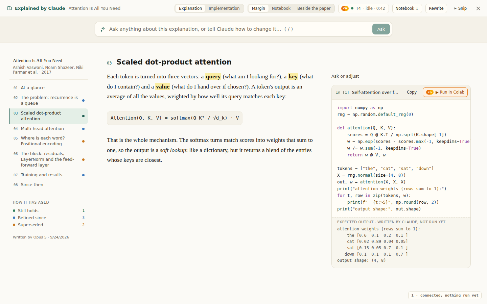

# Run in Colab, from the page

Every Python cell Claude writes on the Explain and Implementation pages has a
**Run in Colab** button that is switched off, and a note that it waits on a
Colab connection. Google's Colab API — in beta, on an allowlist, and now
granted to this project — is that connection. This document is the answer to
*can it be done safely and properly*: what the API is as far as it could be
checked, how running a cell would look on the page, the rules that keep it
safe, and what it takes to build. The pictures are static mock-ups in the
app's own colours and type; the sources are in
[`mockups/colab-src/`](mockups/colab-src/) and are re-rendered with
`node docs/mockups/colab-src/render.mjs`.

> **Built.** The design below is now in the app: `src/lib/colab.ts` (the
> store, the runtime, the Jupyter kernel client), `src/components/Colab.tsx`
> (the chip, the menu, the first-run card, a cell's output),
> `src/components/Charts.tsx` (loss curves and the GPU's use, added on
> request) and `server/colab.js` (the proxy's half, shared by the Worker and
> `npm start`). Two things were decided by building rather than by the
> reference page: the runtime calls go through the proxy, since Colab's
> session backend does not take another origin's requests, and the kernel's
> WebSocket goes straight from the page when the runtime allows it. In
> practice Colab's runtime proxy (`*.prod.colab.dev`) refused the page's
> own socket, so the proxy carries it on a signed one-minute ticket —
> `server/colabSocket.js` and `worker/colabSocket.js`, the fallback this
> document names under *Where the calls run*. See the README's *Running the cells
> in Colab*. The GPU watch has since become a watch of the whole
machine — GPU, CPU, RAM and disk, one probe shown in the runtime menu
(`src/lib/telemetry.ts`) — and the Implementation page has a *Run it on
Colab* panel under its budget (`src/lib/colabRun.ts`, `ColabRunPanel` in
`src/components/Implement.tsx`): Colab's machines with the budget on each, the
plan's needs against the machine as measured, the steps as cells, and the
machine drawn as they run; the README's *Run it on Colab, from the page* has
the pictures. The rest of this document is the design as written.

**Short answer: yes.** The API does the two things the page needs — start a
runtime in the reader's own Colab account, and hand back a Jupyter server to
talk to — and everything else is the standard Jupyter protocol that Colab's
own frontend speaks. Three details must be checked against the reference
before building, because the reference page could not be opened from the
machine this was written on. They are listed under
[What to confirm first](#what-to-confirm-first) and take half a day with the
API key in hand.

---

## What the API is

Two Google products are called "Colab API", and only one of them is this one.

- **[The Colab API](https://developers.google.com/colab/api/reference/rest)**
  at `colaboratory.googleapis.com` (`v1`, `v1beta`): "lets you programmatically
  manage Colab runtimes". Beta, allowlisted per Google Cloud project, the
  discovery documents behind an API key. This is what was granted, and it is
  the consumer Colab: the free tier and Pro, the same runtimes
  colab.research.google.com uses, billed to the person's own compute units.
- **Colab Enterprise** at `notebooks.googleapis.com`, and the
  [`gcloud beta colab`](https://docs.cloud.google.com/sdk/gcloud/reference/beta/colab)
  commands: runtime templates, executions, schedules — Vertex AI, a Google
  Cloud project with billing, a service account. Not this. Search results
  mix the two; the runtime-template and schedule resources belong here.

The reference page was blocked from this sandbox, so the shape of the API was
read off the thing Google built on it: the
[Colab CLI](https://github.com/googlecolab/google-colab-cli), open source
under Apache 2.0 since June 2026 and written for exactly this job — start a
runtime, run code in it, get the output back, without a browser tab. It shows
the whole path end to end.

**Sign-in.** Google OAuth, with one scope the reader does not have yet:
`https://www.googleapis.com/auth/colaboratory`, beside `userinfo.email`,
which the session backend insists on. (The CLI also asks for
`cloud-platform`, because `gcloud` refuses a scope list without it; a website
has no such reason, and should not ask.) The scope is not in the Cloud
Console's public list — that was the reason the
[Colab MCP server dropped its runtime mode](https://github.com/googlecolab/colab-mcp/discussions/41)
and pointed people at the CLI — which is what the allowlist unlocks for the
reader's client ID.

**A runtime.** One call assigns a machine:

```
GET  https://colab.research.google.com/tun/m/assign?nbh=<notebook id>&variant=GPU&accelerator=T4
     → an XSRF token, or the assignment already made for that notebook
POST the same URL, X-Goog-Colab-Token: <that token>
     → { endpoint, accelerator, runtimeProxyInfo: { url, token, tokenExpiresInSeconds } }
GET  /tun/m/assignments            every runtime this account has
GET+POST /tun/m/unassign/<endpoint>   stop one
GET  /tun/m/ccu-info               compute units left, and the burn rate
```

Accelerators are `NONE`, `T4`, `L4`, `G4`, `A100`, `H100`, `V5E1`, `V6E1`, with
`shape=hm` for high memory; a `412` means the account already has as many
runtimes as its tier allows; a `400` on an accelerator means no entitlement
for it. The CLI additionally talks to a `RuntimeService` at
`colab.pa.googleapis.com`. The public API at `colaboratory.googleapis.com` is,
by its own description, this layer made official — *runtimes* to create, list
and delete, and something that returns the proxy URL and token — under
proper REST names.

**Running code.** `runtimeProxyInfo.url` is a Jupyter server. The CLI uses an
off-the-shelf Jupyter kernel client against it: `POST /api/kernels` for a
kernel, a WebSocket to `api/kernels/<id>/channels?colab-runtime-proxy-token=…`
(the token also goes in an `X-Colab-Runtime-Proxy-Token` header), and then
the [Jupyter messaging protocol](https://jupyter-client.readthedocs.io/en/stable/messaging.html)
as every notebook frontend speaks it: an `execute_request` out; `stream`,
`display_data`, `execute_result`, `error` and finally `execute_reply` back,
in order, as the kernel produces them. Files go through `/api/contents/…`.
The kernel keeps its state between calls, so `In [2]` sees what `In [1]`
defined, the way it does in a notebook. The proxy token expires
(`tokenExpiresInSeconds`) and is re-fetched from the assignment.

None of this is exotic. It is what Colab's own page does when you press
Shift-Enter, minus the notebook.

### What to confirm first

Half a day with the API key, before any UI work:

1. **The runtime resource.** On the reference page: the method that creates
   a runtime, the one that lists them, the one that stops one, and the one
   that returns the proxy URL and its token (a `connect`, `getProxyInfo` or
   similar). If the last does not exist, the session backend's `/tun/m`
   endpoints above are the fallback the CLI uses.
2. **Who pays, and how it is keyed.** Whether calls need the project's API
   key (`?key=`) beside the person's OAuth token, and whether the quota is
   the project's or the person's. The discovery URL needs the key; the calls
   may too. A key that must travel with every call belongs on the proxy, not
   in the page (see [Where the calls run](#where-the-calls-run)).
3. **Cross-origin.** Whether `colaboratory.googleapis.com` answers a
   preflight from the site's origin (Google's public APIs generally do, for
   a bearer token), and whether the runtime proxy accepts a WebSocket whose
   `Origin` is the reader rather than `colab.research.google.com`. This one
   decides how much of the traffic has to go through the proxy.

```bash
# 1 and 2: the discovery document, with the key
curl -s "https://colaboratory.googleapis.com/\$discovery/rest?version=v1beta&key=$KEY" | jq '.resources | keys, .resources.runtimes.methods | keys'
# 3: does the API answer a browser's preflight from the site?
curl -si -X OPTIONS "https://colaboratory.googleapis.com/v1beta/runtimes?key=$KEY" \
  -H 'Origin: https://saurav717.github.io' -H 'Access-Control-Request-Method: POST' \
  -H 'Access-Control-Request-Headers: authorization,content-type' | grep -i access-control
```

---

## How it would look

The button is where it already is: on every Python cell, beside **Copy**. What
changes is that it works, and that the bar gets a small chip saying what is
running, which opens to a menu about the runtime. Nothing new appears until
the first cell is run.

### 1. Connected, nothing run yet



The chip in the bar — the Colab mark, a dot, the machine, its state and how
long it has been up — is the one place the runtime is visible. The cell is
as it is today, with **Run in Colab** live. Its output is still labelled
*Expected output · written by Claude, not run yet*; that label is the whole
point of running it.

### 2. The first click: consent, machine, and what the reader may do

![under the Run in Colab button, a card: a paragraph saying the run starts a runtime in your own Colab account, a choice of CPU, T4 or L4/A100 with what each costs, a Google row saying it will ask once for Colab access on top of Drive, two columns — what the reader can do and what it cannot — a green "Connect and run In [1]" action, a "Not now — download the notebook instead" action, and a hint that the code was written by Claude and runs as you](mockups/colab-2-connect.png)

The first **Run** on a page with no runtime does not run anything. It opens
this card, which says in one screen everything a person should know before
their Google account is used: that a runtime starts *in their own Colab*,
which machine (CPU by default — free and quick; the GPU is a choice), that
Google will ask once for Colab permission on top of Drive, and — in two
columns — what the reader can then do and what it cannot. **Connect and
run** opens Google's window, starts the runtime, and runs the cell; about
fifteen seconds the first time. The line at the foot is the honest one: the
code was written by Claude, and runs as you.

### 3. Running: the output streams in as the kernel prints it

![the cell's header now reads In [*], "Running on T4 · 1.8 s" with a spinner, and a red Stop button; below the code, an output area labelled "streaming from Colab" with the first two lines printed and a caret; under it a folded line saying Claude expected a different set of weights, with Show](mockups/colab-3-running.png)

`In [1]` becomes `In [*]`, as in a notebook. **Stop** interrupts the kernel.
The output area fills line by line from the kernel's `stream` messages,
exactly as Colab shows it; the chip in the bar says *running In [1]*. What
Claude expected is folded under it, one click away, until the run finishes.

### 4. Ran: the real output replaces the guess, and the difference is a question away


This is what the feature is for. The *expected output* label is gone; this
is what the code printed, on which machine, when. The page compares it with
what Claude wrote — *matches* when it is the same text, *differs* otherwise,
with the differing lines tinted — and turns the difference into a question:
**Ask Claude why the numbers differ** puts the cell, the two outputs and the
question in the ask bar, the way *Ask or adjust* on a section does today.
Here the shape and the row sums match and the weights do not, which is a
seed, and a good thing to have Claude say so.

### 5. The chip's menu: what is running, what it costs, and how to stop it


Everything about the runtime, in the one place the chip points at: what it
is, what it has cost, and what has run. **Run all** asks before it starts
and stops at the first error. **Open this runtime in Colab** is the escape
hatch — Colab's own notebook UI attached to the same kernel (the CLI's
`colab url` does this) for editing, plots or a terminal, and it is the only
route to mounting Drive, deliberately. **Stop the runtime** releases the
machine now; **Disconnect Colab** revokes the permission and leaves Drive
connected.

### 6. Dark: a traceback is a question for Claude; a runtime that ended says so where it matters

![in dark mode, a cell whose header reads "✕ Failed after 0.3 s" and whose output is a red ValueError traceback, with "Ask Claude to fix this cell" under it; beneath the cell, an orange card: Colab ended the runtime after 90 minutes idle, variables from In [1] are gone, with a button to start a new T4 and re-run In [1], and Later](mockups/colab-6-error-dark.png)

An error is shown as Colab shows it, and **Ask Claude to fix this cell** sends
the cell and its traceback into the revise flow that already exists: Claude
rewrites that one cell, which comes back marked *Revised* and unrun, with
**Run in Colab** on it again. When Colab ends an idle runtime — it does, on
the free tier — the cells keep their outputs, marked as from a runtime that
is gone, and the card offers a new machine and the re-run that would bring
the state back. A socket that closes is not a runtime that ended: the page
sends a keep-alive frame down every kernel socket while nothing else goes,
and opens a dropped one again to the same kernel (a few tries, a growing
wait apart) before it says the runtime is gone — the tunnel, the Worker's
bridge and the browser may each close a silent connection well before
Colab's own idle limit. The notebook tab has since gained an ask bar of
its own that writes, changes and fixes cells (`src/lib/notebookAsk.ts`),
Rewrite on that tab rewrites the notebook rather than the page, and the Ask
AI window is shown the notebook while the tab is open. A notebook with no
code yet opens on a start that asks which model writes it and writes it
with that one, and a notebook seeded from a page is signed by the model that
wrote the page — "Claude" in the mockups above stands for whichever model
the reader picked.

---

## Where the calls run

The reader has two ways of talking to Google already, and the choice here is
which of them Colab follows.

**In the browser, like Drive.** `src/lib/google.ts` asks Google for a token
with Google Identity Services, keeps it in `sessionStorage` for an hour, and
calls Drive from the page. Colab would be an incremental consent on the same
client ID — the same `tokenFor` with one more scope — and the page would
call the API and open the WebSocket to the runtime itself. Nothing but the
browser and Google see the code or its output; the owner's proxy carries no
traffic and no cost. It needs question 3 above answered yes, and if the API
insists on a project key with each call, the key sits in the page —
restricted by HTTP referrer, as Google intends browser keys to be, but on
the project's quota.

**Through the proxy, like Gemini and the browser inside the reader.**
`server/geminiRelay.js` and `worker/browserSession.js` are the two patterns:
a request the page would have sent to Google goes to the Worker instead,
which checks the pass (anyone signed in with Google, per `server/passes.js`),
adds the secret, and forwards it; and a Durable Object holds a long-lived
connection open and bridges a WebSocket to it. A `/colab/*` route would do
the same for the runtime calls, and a `ColabSession` object the same for the
kernel's WebSocket. It works whatever the cross-origin answer is, keeps any
key in the Worker's secrets beside `GEMINI_KEY`, and can rate-limit and
count. It also means the proxy sees every cell and every output, and pays
for the Worker's time while a kernel is connected.

**Recommendation: the browser for the kernel, the proxy only where the probe
says so.** The Jupyter client is the same code either way — a WebSocket, a
message codec, a reducer from messages to an output — so build it once
against the runtime proxy URL and let one setting decide whether that URL is
Google's or the Worker's. Start a runtime through the proxy if and only if
the API wants the project key with each call; open the kernel WebSocket from
the page if the runtime proxy lets it, since that is where the volume is and
what the owner should not have to carry. This is how Drive and Gemini
already divide: personal data straight from the browser, the owner's secrets
behind the Worker.

---

## What "safe and proper" means here

The threat that matters is specific to this feature: code written by a model
from a paper's text, run in a person's Google account. A paper can carry an
instruction — in white text, in a footnote, in a figure caption — and the
path *paper → Claude → cell → your Colab* is real. These rules keep it a
short path.

1. **Nothing runs without a click on that cell.** Not when the page opens,
   not when it finishes writing, not when a cell is revised. **Run all**
   asks first, and stops at the first error. A cell Claude has just
   rewritten goes back to *not run yet*.
2. **Exactly the code shown is what runs.** No hidden preamble. If a page
   needs `pip install`, that is a visible cell. The **Copy** button and the
   **Run** button hand the kernel the same string.
3. **Consent is late, small and separate.** The Colab scope is asked for at
   the first **Run**, not at sign-in and not with Drive; the token is kept
   as the Drive token is — this tab, an hour, never on disk — and
   **Disconnect Colab** revokes only that grant. The reader does not ask
   for `cloud-platform`.
4. **It is the person's runtime, and it says so.** One runtime per browser,
   the machine chosen explicitly (CPU unless you pick otherwise), the tier
   and the cost in the chip's menu, a **Stop** that works, and the runtime
   visible in Colab's own *Manage sessions*, so it can be killed from there
   too. Colab's idle timeout does the rest; the page can offer to stop the
   runtime when it closes.
5. **The reader never mounts Drive and never puts credentials in the
   kernel.** No `drive.mount`, no `colab auth`, from the page. A runtime with
   nothing mounted is a VM that can, at worst, waste its own time; a runtime
   with Drive mounted can read every file in it. Anyone who wants Drive in
   the kernel opens the runtime in Colab's UI and does it there, on purpose.
6. **Output is data, not markup.** `stream` and `text/plain` are rendered as
   text with ANSI stripped; `image/png` as a data URL; `text/html` and
   `application/javascript` display data are dropped. Kernel output is never
   set as `innerHTML`. Outputs are capped in size and lines.
7. **Secrets stay off the page.** Any API key or quota project belongs in
   the Worker's secrets, gated by the pass, as `GEMINI_KEY` is; the client ID
   is public, as it is today. If another signed-in visitor may spend the
   project's Colab quota is the owner's decision, made once, in the Worker,
   the way it is made for Gemini.
8. **Provenance stays on screen.** An output says which machine ran it and
   when. A cell whose code has changed since it ran is marked stale. Claude's
   guess is never shown as a result, and a result is never shown as a guess.

---

## What it takes

- **`src/lib/colab.ts`** — the scope and the token (reusing `tokenFor` and the
  session-storage handling in `google.ts`); `assignRuntime(machine)`,
  `listRuntimes()`, `stopRuntime()`; a `Kernel` over a WebSocket speaking the
  Jupyter protocol — `execute(code, onMessage)` that resolves on
  `execute_reply`, interrupt, restart, reconnect when the proxy token
  expires. About 400 lines, most of it the message codec. The Jupyter
  protocol has no dependency worth adding; the frames are JSON.
- **`src/components/Explain.tsx`** — a per-cell state (`idle`, `queued`,
  `running`, `ran`, `failed`, `stale`) beside the existing block; the output
  reducer and its rendering under the cell; the verdict against
  `block.output`; the chip and its menu; **Run all**; **Ask Claude why …**
  and **… fix this cell** as calls into the revise flow with the cell and
  its output as chips. The Implementation page's shell cells run through the
  same kernel as `!` lines, beside **Run locally**.
- **`worker/index.js`** — a `/colab/*` route and, if the probe says the
  WebSocket must be bridged, a `ColabSession` Durable Object on the pattern
  of `browserSession.js`. Only what the probe requires.
- **Tests** — a unit test for the codec and the reducer against recorded
  kernel messages; a smoke test with a stand-in runtime (a small WebSocket
  server speaking Jupyter, the way `explain-smoke.mjs` stands in for
  `api.anthropic.com`) so the states above are photographed from the real
  page, not from mock-ups.
- **Effort** — half a day for the probe; three to four days for the client
  and the page; two more if the WebSocket has to go through the Worker.

**Notebook ↓** and the Implementation page's **Commit to GitHub and open in
Colab** stay as they are. They are the route for anyone who is not
allowlisted, prefers Colab's own UI, or wants Drive in the kernel.

## Open questions

- Which of the two keyings the API uses (question 2), which decides whether
  the Worker is in the path at all.
- Whether visitors other than the owner may start runtimes on the project's
  allowlist, or only the owner; this is a line in the Worker either way.
- Whether a GPU should ever be the default for a page whose plan calls for
  one (the Implementation page knows the machine it budgeted for), or CPU
  always, with the GPU one click away. The mock-ups choose the second.

## Sources

- [Colab API reference](https://developers.google.com/colab/api/reference/rest) — the beta, its allowlist and discovery documents
- [googlecolab/google-colab-cli](https://github.com/googlecolab/google-colab-cli) — the scopes, the `/tun/m` endpoints, the runtime proxy and the Jupyter client, in `src/colab_cli/auth.py`, `client.py`, `runtime.py` and `contents.py`; also on [PyPI](https://pypi.org/project/google-colab-cli/)
- [colab-mcp discussion #41](https://github.com/googlecolab/colab-mcp/discussions/41) — why the `colaboratory` scope was unavailable to outside developers, and the pointer to the CLI
- [Introducing the Google Colab CLI](https://developers.googleblog.com/introducing-the-google-colab-cli/) — Google's announcement, June 2026
- [gcloud beta colab](https://docs.cloud.google.com/sdk/gcloud/reference/beta/colab) — Colab Enterprise, for the distinction
- [Jupyter messaging](https://jupyter-client.readthedocs.io/en/stable/messaging.html) — the protocol over the WebSocket
