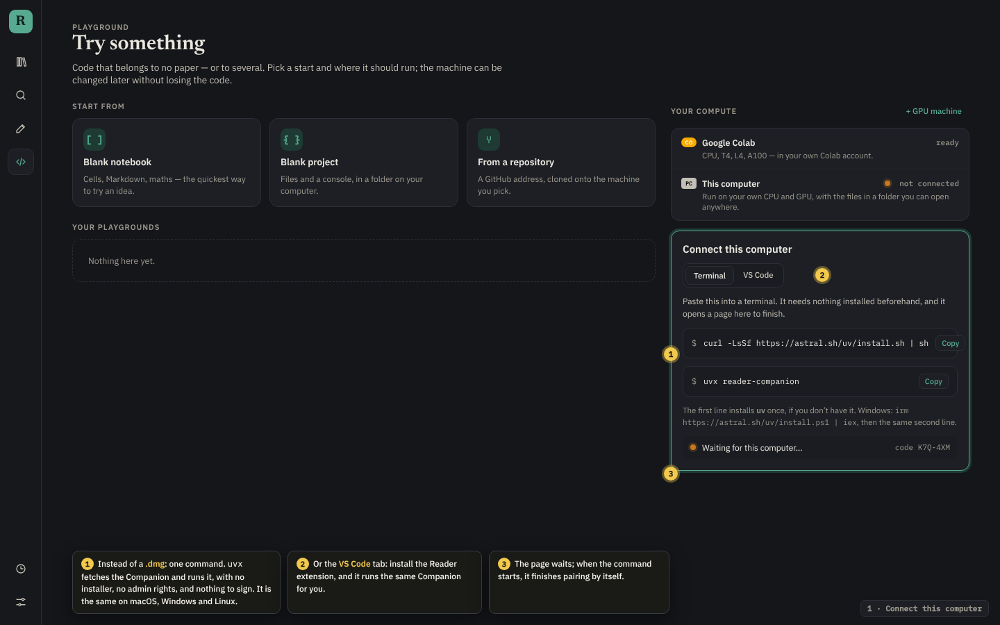
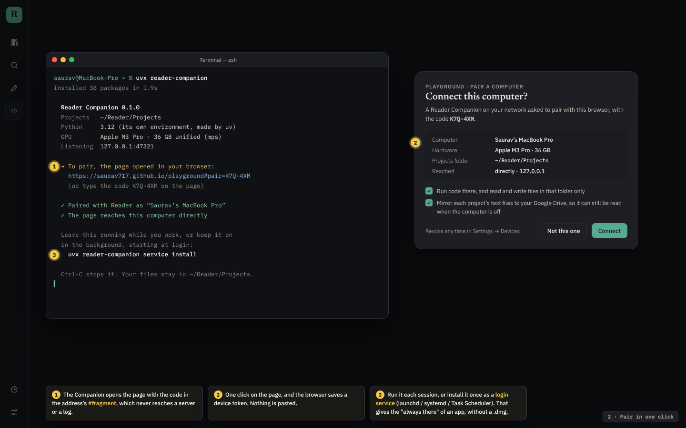
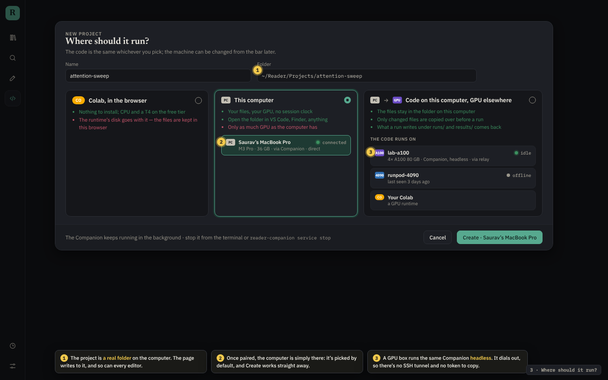
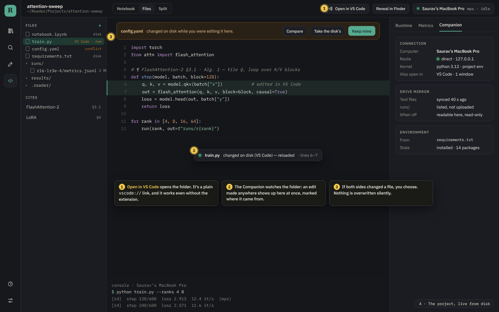
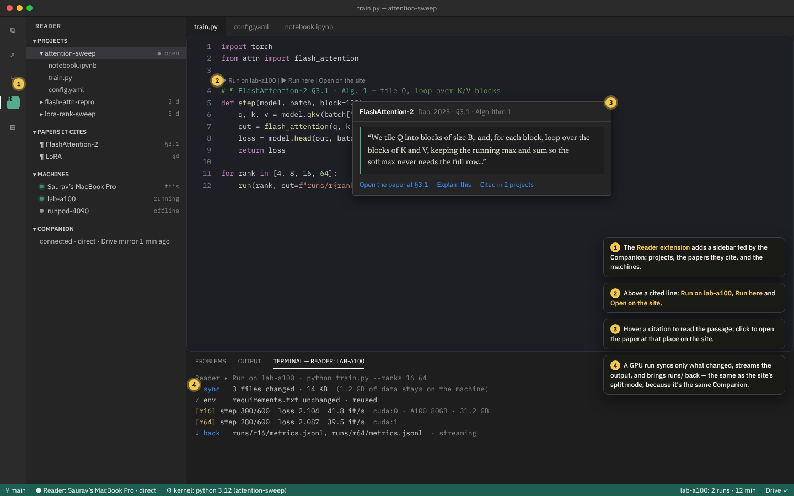
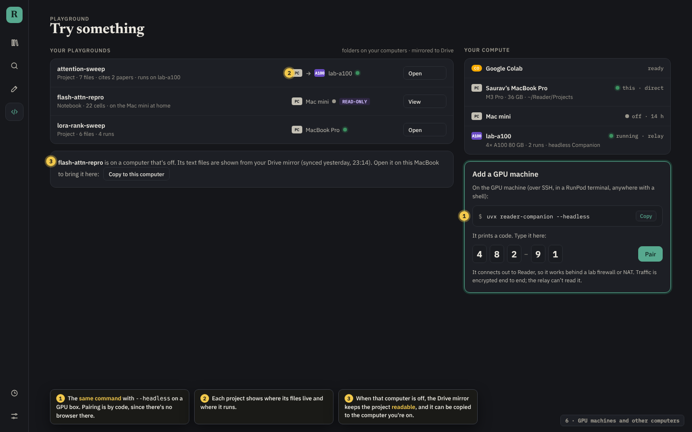

# Reader Companion: your machines, one click from the page

The Playground runs code on any Jupyter server. Today you start that server
yourself: a `pip install`, a long `jupyter server` command with this site's
origin in it, then you paste the token into a form. That works, but it is the
wrong job to give a person, and it stops when the terminal closes.

The **Companion** does that job. It is one command, `uvx reader-companion`: the same on
macOS, Windows, Linux and a GPU box, with no installer to download, sign or
notarize. The Reader extension for VS Code runs the same thing for you, for
anyone who would rather click. It keeps a Jupyter server running, pairs with the site in
one click, and keeps a folder on disk, the site and VS Code showing the same
project. This document is the design.

> **Built: step 1.** `companion/` is the package, and the Playground's
> **Connect this computer** card starts it, finds it and pairs with it (see
> the README's *Connect this computer*). It is served from the site rather
> than PyPI: `curl -LsSf https://saurav717.github.io/reader/companion.sh | sh`
> installs uv if needed and runs the wheel the site build carries. Your code
> runs in `~/Reader/.venv`, or in the Python given with `--python`. A real
> terminal (xterm.js on Jupyter's terminals, your own shell) replaced the
> command box. For Safari, which won't let an `https` page call `127.0.0.1`,
> `--tunnel` opens a Cloudflare quick tunnel instead of the relay of step 5:
> it needs no server of ours, but Cloudflare carries the traffic. From
> step 4: **Open in VS Code**, and the extension's first version. It has
> projects, papers, the Companion's state, `¶` links, the shared Python and
> **Start the Companion**, served as a `.vsix` from the site. It doesn't yet
> pick the kernel through the Jupyter extension's server API, or run on a GPU
> machine. From step 3: **an installer to double-click** (a `.command` in a zip
> for macOS, a `.cmd` for Windows, a line for Linux) that installs the
> Companion with `uv tool install` and runs `reader-companion setup`. That
> makes a **Reader app** on the computer, installs the VS Code extension,
> starts the Companion at every login (launchd, systemd or the Startup folder;
> `reader-companion uninstall` undoes it), and opens the page to pair. The
> app opens the site in an app window, starting the Companion first. It is
> made on the computer, not downloaded, so it needs no signing (see *Why not a
> `.dmg`*). The page installs the VS Code extension through the Companion
> (`/companion/vscode`). Steps 2, 3, 5 and 6 are not built yet. The
pictures are static mock-ups in the app's own colours. Their sources are in
[`mockups/companion-src/`](mockups/companion-src/), and
`node docs/mockups/companion-src/render.mjs` renders them again.

### Why not a `.dmg`

A desktop app has to be built per OS, signed and notarized (an Apple developer
account), and shipped with its own updater, and a GPU box would still need
something else. The Companion's real job — a Jupyter server, a file watcher,
a pairing handshake — is a Python program, and
[`uv`](https://github.com/astral-sh/uv) can fetch and run a Python program,
with its own Python, in one command. So:

| | `.dmg` app | `uvx reader-companion` (this design) |
|---|---|---|
| Get it | download, drag to Applications | paste one line |
| Platforms | one build each, signed | the same package everywhere, GPU boxes included |
| Updates | its own updater | `uvx` runs the newest release each time |
| Always on | login item | `reader-companion service install` (launchd / systemd / Task Scheduler) |
| Cost to ship | Apple developer account, notarizing, per-OS CI | `uv publish` to PyPI |
| For people who'd rather click | yes | the VS Code extension, which runs it for them |

A `.dmg` can still wrap the same package later. Nothing in the design depends on it.

---

## The idea in one paragraph

A playground project is **a folder on disk**. The Companion owns that folder
and the kernel that runs it, and it is the one thing every client talks to:
the website in any browser, VS Code through a thin extension, and another
Companion on a GPU machine. The disk is the source of truth. The site and
VS Code are views onto it, and a copy in your Google Drive keeps the project
readable when the machine is off. The site already speaks Jupyter
(`chooseBackend` in `src/lib/colab.ts`), so the first version needs almost no
new code on the page: pairing just produces the `{ url, token }` record the
"Add a server" form makes by hand today.

```
            ┌────────────── your Mac ───────────────┐
            │                                       │
 browser ───┼──► Companion (uvx reader-companion)   │
 (site)     │      ├─ Jupyter server (kernels, files)
            │      ├─ file watcher ──► live updates │
 VS Code ───┼──►   ├─ pairing + device tokens       │
 (extension)│      └─ sync ──────────────┐          │
            │   ~/Reader/Projects/<name>/ │          │
            └─────────────────────────────┼──────────┘
                                          │  folder copied before a run,
                                          ▼  runs/ and results/ back
                         ┌──── GPU machine ────┐
                         │ Companion (headless)│        Google Drive
                         │ Jupyter + kernels   │        (a read-only mirror
                         └─────────────────────┘         of each project)
```

---

## What it looks like

### 1 · Connect this computer



- **One command from the page.** *Your compute* → **Connect this computer**
  shows `uvx reader-companion`, with the one-time `uv` install line above it
  for anyone who doesn't have `uv` yet (and the PowerShell line on Windows).
  The **VS Code** tab says: install the Reader extension instead.
- **Nothing to install up front.** `uvx` fetches the package from PyPI, makes
  it its own Python 3.12, and runs it. Projects get their own environments
  (from a `requirements.txt` or `pyproject.toml`). Your system Python is never
  touched.
- **The page waits for it.** While the card is open, the page looks for a
  Companion; when the command starts, pairing finishes by itself.

### 2 · Pair with the site (one click)



1. The Companion prints what it found (projects folder, Python, GPU) and opens
   the site at `/playground#pair=<one-time-code>`. The code
   goes in the URL **fragment**, so it never reaches a server or a log.
3. The page shows **"Connect this Mac (Saurav's MacBook Pro)?"**. You click
   **Connect**, and the page and Companion exchange the code for a long-lived
   **device token**.
4. **This PC** appears under *Your compute* with a green dot, and the
   "Where should it run?" dialog picks it by default. Nothing is typed or pasted.

The other way round works too: the Companion prints a 6-digit code, and you
type it on the page. That covers pairing a second browser, or a phone.

**Settings → Devices** lists every paired machine, with its last-seen time
and a **Revoke** button.

### 3 · Keeping it running

- **For a session:** leave the terminal open. Ctrl-C stops it.
- **Always:** `uvx reader-companion service install` registers it to start at
  login (launchd on macOS, systemd on Linux, Task Scheduler on Windows), and
  `service stop` / `service uninstall` undo that. That gives the "it's just
  there" of an app without one.
- **From VS Code:** the extension starts it when VS Code opens, if it isn't
  already running.
- **On the page:** *Your compute* shows each computer's state, and the
  Companion stops kernels that have been idle for a set time.



### 4 · A project, three ways in

Each project is a plain folder:

```
~/Reader/Projects/attention-sweep/
  .reader/project.json   ← id, title, papers it cites, which machine runs it
  notebook.ipynb
  train.py
  runs/   results/       ← what comes back from a GPU run
```



- **On the site.** The project opens exactly as it does today. Edits go through
  the Jupyter contents API straight to disk.
- **In Finder or any editor.** Edit `train.py` in anything. The Companion's file
  watcher sees the change and pushes it to every open page, and the page
  refreshes that file in place. If you also had unsaved edits to it, the page
  offers **Keep mine / Take the disk's** instead of overwriting.
- **In VS Code.** See below.

### 5 · VS Code

You need **no extension** to start: **Open in VS Code** on the site uses VS Code's own `vscode://file/<path>` link to open the folder.
VS Code's Jupyter support can then use the Companion's server as the kernel.

The **Reader extension** (VS Code Marketplace and Open VSX) makes that
seamless and adds the site's own features. It is also the no-terminal way in:
it runs `uvx reader-companion` itself, installing `uv` first if needed, so
someone who never opens a terminal installs one extension and is done.



- **Reader sidebar.** Your projects (the Companion lists them), the papers each
  one cites, and its GPU machines with their state.
- **Kernel picked automatically.** It registers the Companion with VS Code's
  Jupyter extension, using the remote-server provider API, so a notebook in a
  Reader project runs on the right kernel with no prompt.
- **Citations.** A `# ¶ FlashAttention-2 §3.1` comment becomes a link, and its
  hover shows the passage. Clicking opens the paper on the site at that place.
- **Run on GPU.** The command palette's **Reader: Run on lab-a100** calls the
  Companion to sync the folder, run the command, and stream the output into a
  terminal. `runs/` and `results/` come back the way the site's split mode
  does it.
- **Open on the site.** This opens the same project in the browser, with
  Metrics and the Explain pages.

Apart from starting it, the extension holds no state and no sync logic of its own. It only talks to
the Companion on `localhost`, so VS Code and the site can never disagree.

### 6 · GPU machines without SSH tunnels



You run the same command on the GPU box in headless mode
(`uvx reader-companion --headless`) and type the code it prints on the page. Then it appears
under *GPU machines* everywhere.

- **It dials out.** It opens an outbound connection to the site's relay (see
  below), so there is no port to open, no tunnel, and no `?token=` to copy.
  That works behind a lab firewall or NAT, and on RunPod and similar hosts.
- **Split mode is direct.** The Mac's Companion copies the folder to the GPU
  Companion before a run and brings `runs/` and `results/` back. It copies
  only what changed (content hashes), and it can handle large files, unlike
  the page's current 2 MB limit through the contents API.

### 7 · "Updated online"

The disk is the truth, but the project should not vanish when the laptop is
closed:

- **A Drive mirror.** The library already lives in your Google Drive. The
  Companion mirrors each project's text files (code, notebooks, `project.json`,
  small results) to `Reader/Projects/<name>/` there. The site reads that copy
  when no Companion is online and shows the project **read-only**, with
  "last synced 2 h ago".
- **A second computer.** A Companion on another machine pulls the mirror on
  first open, so the project follows you. If both machines changed the same
  file while apart, one copy is kept as `train (conflict, MacBook).py` and you
  choose. Nothing is silently lost.
- **Git where it fits.** A project that is a git repository (*From a
  repository*) syncs through git instead. The Companion shows its branch and
  status, and never commits on its own.
- **Out of the mirror.** `runs/`, `results/` and weights above a size limit
  are listed but not uploaded, unless a project's keep rules (playground.md,
  step 7) say so.

---

## How it connects

The page has to reach the Companion from any browser. There are two routes,
and both carry the same protocol (Jupyter's REST and WebSocket APIs, plus a
small `/companion/*` set for pairing, file events and sync):

1. **Directly on `localhost`.** The Companion listens on
   `127.0.0.1:<port>`, and the page connects there. This is the fastest route,
   and nothing leaves the machine. Browsers differ on whether an `https://`
   page may call `http://localhost`, and some ask for local-network
   permission. The page tries this route first.
2. **Through the relay.** The Companion keeps one outbound WebSocket open to
   the site's Worker (a Durable Object per paired device, much like the
   Worker's existing Colab socket relay in `worker/colabSocket.js`). The page
   connects to the same object. This route works in every browser, from a
   phone, and for GPU machines behind NAT.
   **Traffic is encrypted end to end** with a key exchanged at pairing, so the
   relay forwards bytes it cannot read.

The page uses the direct route whenever it answers, falls back to the relay,
and shows which one it is on in the machine chip.

### Security

- A pairing code is single-use and lasts five minutes. A device token is
  scoped to one device, stored in the OS keychain, and can be revoked from
  either side.
- The Companion accepts requests only from the site's origin, from the
  extension (with a token it gets over a local socket), or from the relay with
  a valid device token.
- Kernels run as you, inside the projects folder. The file API serves nothing
  outside the Companion's folder (`~/Reader`, or `--root`) — except a folder
  you link in: from 0.8.0, `/companion/folders` (the page's token and origin,
  as every call that reaches files) lists folders anywhere on the computer
  (`GET ?path=`), shows the computer's own folder chooser (`POST {action:
  "choose"}`), and links the folder picked into `~/Reader/linked/` (`POST
  {action: "link", path}`) — a symbolic link (a junction on Windows), which
  Jupyter follows, so a project uses that folder in place. The terminal could
  already reach the whole computer; this makes it a click and says so.
- From 0.9.0, `/companion/browsers` (token and origin) lists the browsers on
  the computer and their profiles (`GET`): Chromium browsers' `Local State`,
  with the Google account signed in to each profile, and Firefox's
  `profiles.ini`. It also opens a link in one of them (`POST {url, browser,
  profile}`), which is how a project's Overleaf opens in the profile signed in
  to its account. Only an `https://` link opens, and only in a browser and a
  profile the listing has, so nothing the page sends becomes an option of the
  command.
- From 0.10.0, `/companion/paper` (token and origin) is the Write tab's.
  `GET` says what compiles a paper here (`latexmk`, Tectonic) and whether
  `git` is installed. `POST {action}` takes four actions:
  - `compile {folder, engine}` returns the PDF (base64) and the log, read into
    errors and warnings with their file and line.
  - `install-tectonic` downloads Tectonic into `~/.reader-companion/bin`.
  - `clone {folder, url, token}` clones Overleaf's Git or a GitHub repository;
    no other remote is accepted.
  - `sync {folder}` commits, pulls (merging) and pushes, and leaves a conflict
    marked rather than resolving it.
  Folders are relative to the Companion's, and one that climbs out is
  refused. The token is kept in the Companion's config (0600), by remote, and
  given to git through `GIT_ASKPASS`. It is never written into the clone.
- From 0.11.0, `compile` runs Overleaf's own command: `latexmk -cd
  -jobname=output -outdir=<build> -synctex=1 -interaction=batchmode -f`. It
  uses the project's compiler (`-pdf`, `-xelatex`, `-lualatex` or `-pdfdvi`)
  and main document, and `-halt-on-error` in place of `-f` when asked. The
  build folder is the Companion's own (`~/.reader-companion/build/<hash>`),
  with the paper's folders mirrored for `\include`, so no build file is left
  in the paper or synced. `GET` adds the TeX's version. More actions:
  - `templates`, `save-template {name, zip}`, `apply-template {template,
    folder, replace}` and `delete-template`: a `.zip` kit is unpacked under
    `templates/`, with names that climb out refused, and copied into a new
    paper's folder.
  - `token {url}` says whether a token is kept. It is stored for the remote
    and its host too, so an Overleaf account's other projects need none.
  - `forget-token {host}` forgets them.
- From 0.11.1, `compile` passes `latexmk -g`: it compiles every time it is asked, as Overleaf does. Without it, latexmk skips a file it failed on until the file changes, so a package installed after a failed compile changed nothing until the next edit.
- From 0.12.0, the Companion can install a TeX Live of its own, with TeX Live's
  installer (`install-tl`, the same TeX Live as MacTeX and Overleaf), into
  `~/.reader-companion/texlive`: no password, PATH and any other TeX left
  alone. `GET` adds `texlive` (installed, and how an install is going), and
  its programs come before any other TeX's. Actions: `texlive` (the status),
  `install-texlive {scheme: full|medium}` (in the background; full is about
  5 GB without documentation, 20–60 minutes), `cancel-texlive`,
  `remove-texlive`, and `install-packages {names}` (its `tlmgr install`, a
  `.sty`'s name looked up with `tlmgr search --global --file` when it isn't a
  package's). Compiling puts the TeX's own folder first on the PATH, so
  latexmk finds pdflatex and biber from the same TeX Live.
- Secrets (playground.md, step 8) live in the keychain and are passed to a
  kernel's environment. They are never put in the Drive mirror.

---

## What it is built from

| Part | Choice | Why |
|---|---|---|
| Companion | **A Python package on PyPI**, `reader-companion`: a `jupyter_server` extension plus a small CLI | Jupyter is already Python, and the page already speaks its protocol. The extension adds `/companion/*` (pairing, file events, sync) to the same server. |
| Distribution | **`uvx`** (or `pipx run`) | One command on every OS, no installer, no signing, the newest release each run. |
| Always on | `service install`: launchd / systemd / Task Scheduler | The OS's own way to keep a program running. |
| File watching | `watchfiles` | Native events on macOS, Linux and Windows. |
| Relay | The existing Cloudflare Worker + a Durable Object | It is already deployed, and it already relays a socket for Colab. |
| Mirror | Google Drive, through the same `drive.file` scope the library uses | No new account, and no new consent. |
| VS Code | A TypeScript extension, published to the Marketplace and Open VSX | It starts the Companion and talks to it. It holds no state of its own. |

---

## Order of work

Each step is useful on its own:

1. **`uvx reader-companion`.** It starts Jupyter with the right flags, prints
   what it found, and pairs through `/playground#pair=`. The page's only
   change is the **Connect this computer** card, which accepts the fragment
   and saves the server record it carries. That alone removes the
   copy-and-paste.
2. **`service install`**, so it is always there.
3. **File watching and live updates.** It pushes disk changes to open pages,
   with the keep-mine/take-disk choice.
4. **Open in VS Code** (a link, no extension), then the **extension**: it
   starts the Companion, and adds the sidebar, the automatic kernel,
   citations and Run on GPU.
5. **Relay and headless GPU mode.** Pairing by code, end-to-end encryption,
   and Companion-to-Companion sync for split mode.
6. **The Drive mirror.** Read-only when offline, a second computer, and conflict
   copies.

## Open questions

- **Where projects live by default:** `~/Reader/Projects`, or ask on first run?
- **The relay's cost and limits:** heavy kernel output through Durable Objects
  may need a cap, or the direct route, for large outputs.
- **The name on PyPI:** `reader-companion`, if it is free.
- **People without a terminal or VS Code:** a `.dmg` that wraps the same
  package could come later, if anyone needs it.
- **One Companion, many accounts:** pair it with one Google account at a time,
  matching the library's "one library per account"?
