# A figure, close up

The Explain page writes a paper out as a lesson, and beside each paragraph
Claude draws a figure: a small SVG in the margin, 380 pixels wide in the
Margin layout, less on the Implementation page's pipeline figure, and a
scene's drawing smaller still. They are drawn to be read at that size, but a
pipeline with eight boxes, a two-column comparison or a scene with its
packets in flight is easier to follow larger. This document is the design
for one thing: **click a figure and it lifts off the page to the middle of
the window, as large as the window allows**, and comes back where it was.
The pictures are the feature as built, photographed by
`scripts/explain-closeup-smoke.mjs`; the alternatives that were considered
are mocked up in the app's own colours and type, from
[`mockups/closeup-src/index.html`](mockups/closeup-src/index.html), and
re-rendered with `node docs/mockups/closeup-src/render.mjs`.

> **Built.** `src/components/FigureCloseUp.tsx` is the close-up: what on
> the page counts as a drawing, the card, its keys, and the flight from the
> drawing's place and back. `src/components/Explain.tsx` opens it from a
> click or Enter on a figure's drawing or a scene's, and keeps its own Esc
> off while one is open; the drawing's cursor and corner mark, and the card,
> are in `src/styles.css` under *A figure on the Explain page, close up*.
> See the README's *Figures, close up*.

## The design

### Click, and it grows from where it is

Every drawing on the page says it can be looked at closer: the pointer over
it is a magnifier, and a small **⤢ Close-up** mark comes up on its corner.
The drawing is focusable too, so Tab reaches it and Enter opens it.

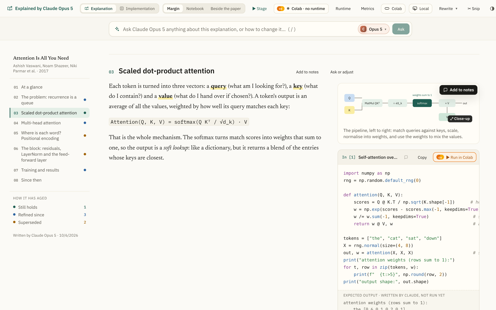

A click lifts the drawing off the page. It does not appear in the middle of
the window; it *goes* there, from its place in the margin, growing as it
goes, so the eye follows it and knows where it will return to. The page
behind dims and blurs a little, and stays where it was scrolled. Figures are
SVG, so the close-up is the same drawing set at the larger size, not a
bitmap scaled up: the type in it is as sharp at 1,300 pixels as at 380.

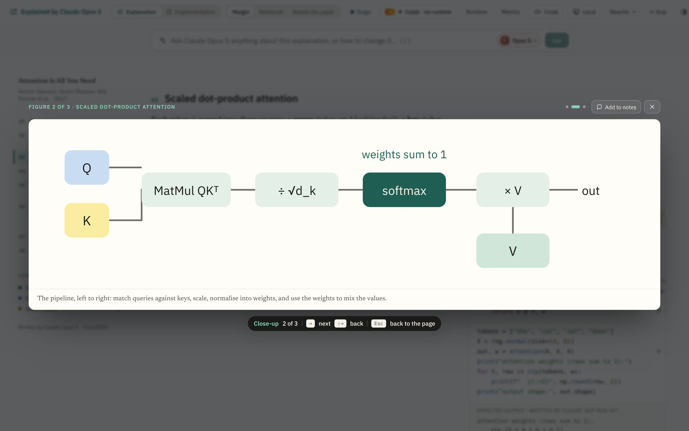

Over the card, in the close-up's own colour on the dark ground, is which
figure this is and whose section: *Figure 2 of 3 · Scaled dot-product
attention*. Under it, the caption, in the reading face. Under that, a chip
in the same dark lozenge the PDF's loupe and close-up use, saying the keys.
The card is as large as the window allows with room for those, in the
drawing's own proportions, and never smaller than the drawing was on the
page.

### Tab goes on, Esc goes back

A page has several figures, and a reader who opens one usually wants the
next. <kbd>⇥</kbd>, or the arrow keys, go on to the next drawing on the
page in reading order, <kbd>⇧⇥</kbd> back, and the dots over the card say
where you are among them; a dot is a figure, and clicking one goes there.
Going on is a quick fade, not another flight across the page.

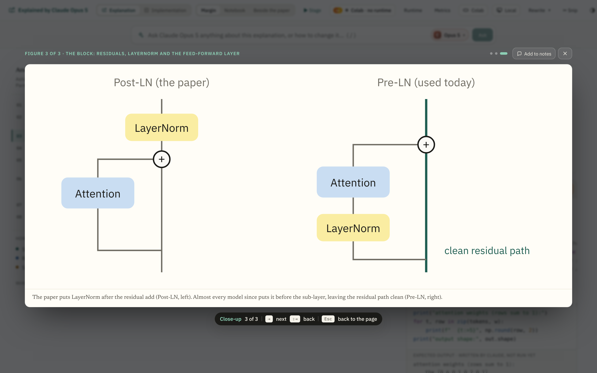

<kbd>Esc</kbd>, the **×**, or a click beside the card shrinks it back to
where it came from, and the focus goes back to the drawing, so a reader
working from the keyboard carries on where they were. The Explain page's
own Esc, which closes the page, keeps off while a close-up is open.

### Add to notes, from here

The card's **Add to notes** keeps the figure in the notes as the corner
button on the page does, and closes the close-up, so the *kept* line is
seen on the page.

### The same for a scene, on its step

A scene is a drawing with steps. Its close-up shows the step it is on,
as a still, in the scene's own colours; the step is picked on the card, with
the dots or the slider, before opening it. The title says *Scene*, and the
caption is the scene's title and the step's caption.

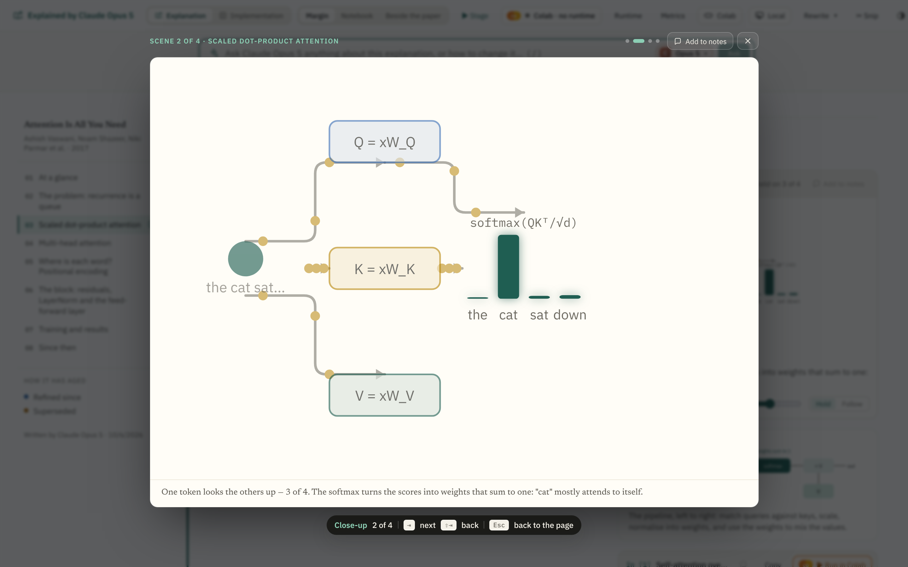

### Every layout, every page, every screen

The close-up takes the whole window in the Notebook and Beside-the-paper
layouts too, over the paper on the left as well as the explanation; the
figures on the Implementation page, the pipeline among them, open the same
way; the dark theme has its own ground.

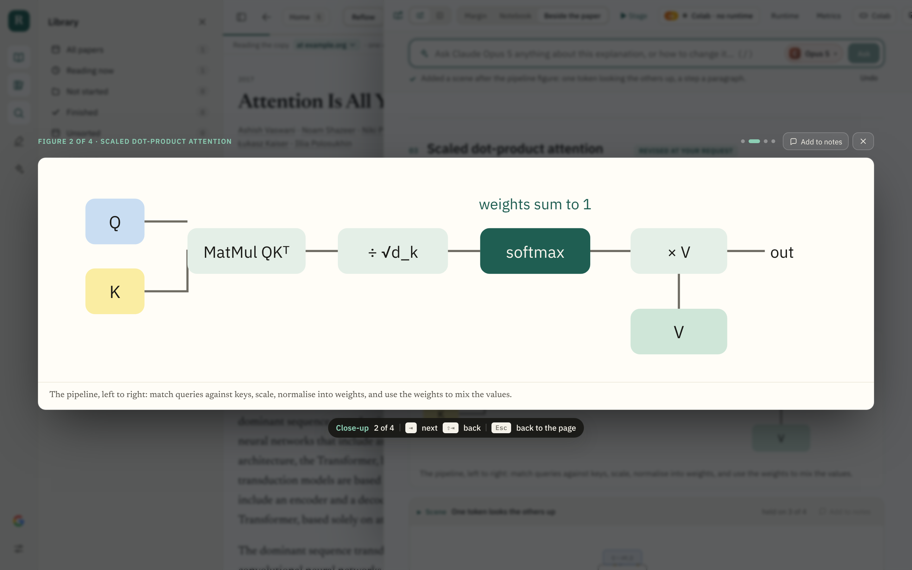

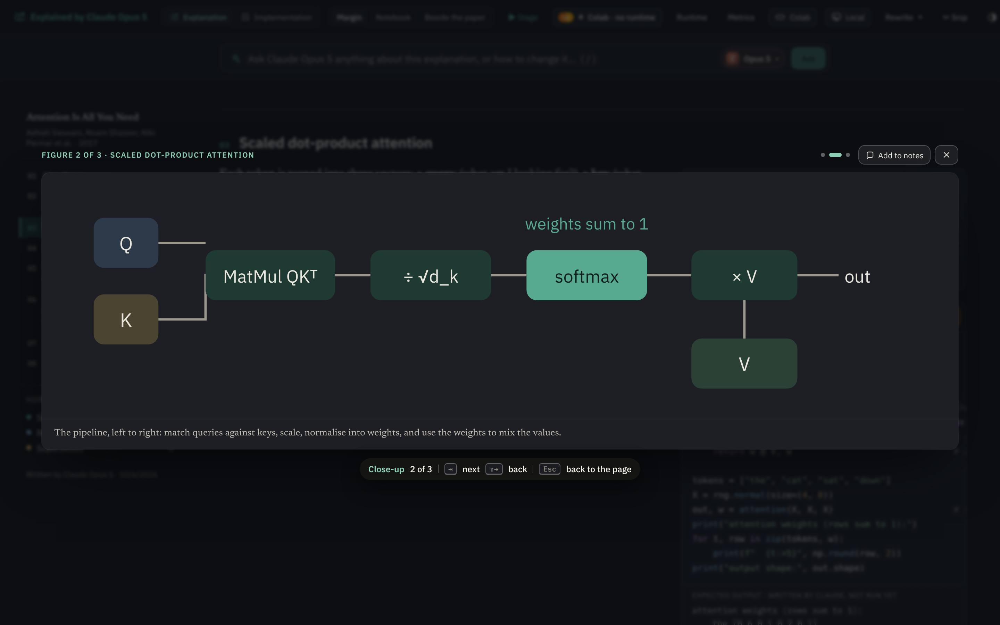

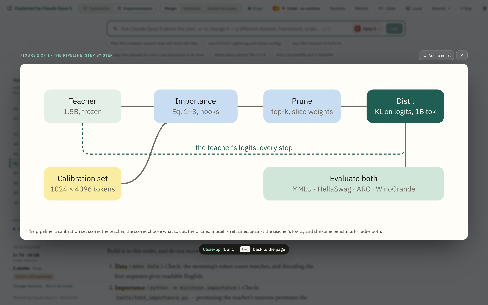

On a phone the card fills the width with a small gutter, the chip is left
out, since there are no keys, and a tap beside the card closes it.

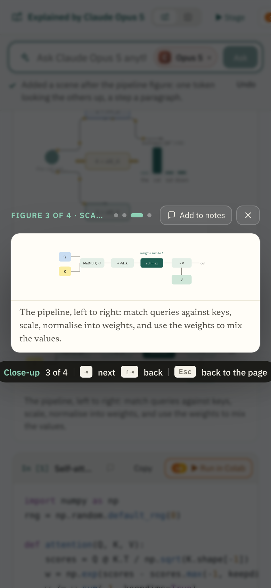

## The options considered

Four other ways of seeing a figure larger were mocked up and set aside. The
mock-ups are frames of
[`mockups/closeup-src/index.html`](mockups/closeup-src/index.html), with the
reason on a yellow note in each.

**A. A close-up in the middle, grown from its place** — the one built. The
page stays as it was; the drawing is the only thing that moves; where it
went and where it comes back to are plain. It is the same shape as the
PDF's close-up (⌥-click a figure on the page), so a reader who knows one
knows the other.

**B. Expand in place.** The figure widens across the reading column and
the margin, and the prose and the cell move down to make room.

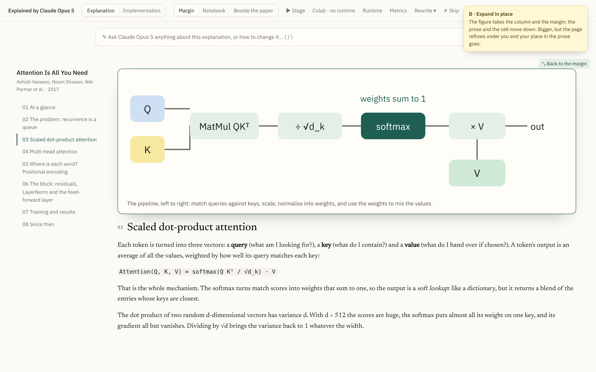

Bigger, and no overlay, but the page reflows under you: the paragraph you
were reading moves, the figures below it move, and the width it can take
is the column's, not the window's. On a phone the column is already the
width, so it gains nothing there.

**C. A peek on hover.** A round glass at 2× follows the pointer over the
figure, as the PDF's loupe does.

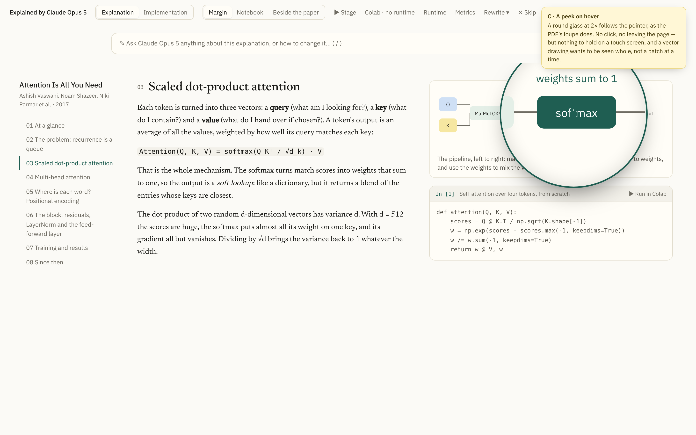

No click and no leaving the page, but a vector drawing wants to be seen
whole, not a patch at a time: a loupe suits a scanned page, where the
detail is in the pixels, and these drawings have no detail the page does
not already show. And there is nothing to hold on a touch screen.

**D. Pinned beside the prose.** The figure sits in a pane on the right,
kept while you read the section, and the explanation narrows to make room,
the way *Beside the paper* keeps the paper.

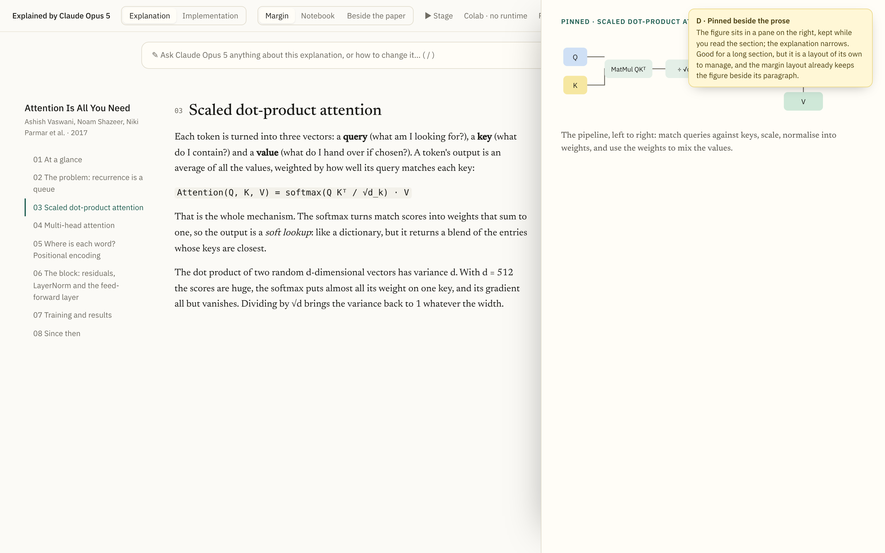

Good for a long section whose figure the prose keeps coming back to, but
it is a fourth layout to manage, and the Margin layout already keeps the
figure beside its paragraph; the stage, for scenes, already pins. It could
come later as a **Pin** on the close-up's card.

**E. Zoom inside the close-up.** The close-up as built, with <kbd>+</kbd>
and <kbd>−</kbd>, the wheel, drag to pan, and a map in the corner, as the
PDF's zoom has.

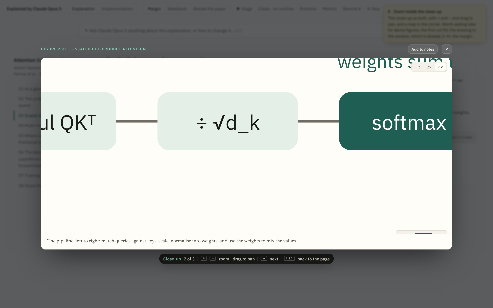

Worth adding when a figure is dense enough to need it. The first cut fits
the drawing to the window, which is already two to four times the margin,
and the drawings Claude writes are small by instruction.

## What it takes

- `src/components/FigureCloseUp.tsx` — `closeUpVisuals` finds every
  drawing on the page in reading order (a figure's `.figure-art > svg`, a
  scene's `.motion-art > svg`), with its section, caption, the SVG, and the
  width over height from its `viewBox`; `FigureCloseUp` is the card, in a
  portal on `body` so a glass page's `backdrop-filter` does not pin it to
  the page's box, with the flight from the drawing's rectangle (a FLIP
  transform from `getBoundingClientRect`, dropped on the next frame, and
  set back on close) and the keys.
- `src/components/Explain.tsx` — a click or Enter on a drawing, judged from
  the page, opens it; buttons under a figure, a scene's controls, a
  selection being dragged across a figure, and the *Drawing…* placeholder
  do not. The close-up gets the page's `keepElement`, so *Add to notes*
  keeps the figure as the corner button does.
- `src/components/Motion.tsx` — a scene's drawing is a button like a
  figure's.
- `src/styles.css` — the cursor and the corner mark on a drawing; the
  close-up, named with its own class so the page's own caps on a drawing's
  height (420px for a figure, 250px for a scene) do not hold inside it;
  the scene's colour tones shared with the close-up.
- `scripts/explain-closeup-smoke.mjs` — the whole path, photographed; it
  writes a scene through the bar from
  `scripts/fixtures/explain-revise-scene.md`, and the Implementation page
  from its own fixture.

## Open questions

- **Zoom inside the close-up** (E above): wanted once a figure Claude
  writes is dense enough; the chip has room for the keys.
- **Pin** on the card (D above): a figure kept beside the prose while a
  section is read.
- **A scene that plays close up.** The close-up shows a still of the step;
  the scene's own controls could move onto the card, so a scene is watched
  large. The card would then hold a live `MotionScene` rather than its SVG.
- **The paper's own figures.** Reflow shows the paper's figures as images;
  the same click could open those, from the same card, with the PDF's
  close-up drawing the region afresh at the larger size.
