# A stage beside the explanation

The Explain page writes a paper out as a lesson: prose in a reading column,
and in the margin beside each paragraph the figure, the code cell and the
caveat that belong to it. This document is a design for one more thing in
that margin: a **stage**, a small animation that stays on screen while you
scroll a section and changes with the paragraph you are reading. For a
distillation paper it shows the weights flowing through the two networks,
the softmax flattening as the temperature rises, and which layer's output of
the big network is compared with which of the small one. The pictures are
from a working mock-up in the app's own colours and type; its source is
[`mockups/stage-src/index.html`](mockups/stage-src/index.html) and the
pictures are re-rendered with `node docs/mockups/stage-src/render.mjs`.
The mock-up can be scrolled at
[saurav717.github.io/reader-mockups/stage/mock.html](https://saurav717.github.io/reader-mockups/stage/mock.html).

**Not built.** This is the design as decided after four rounds of
mock-ups. What the rounds settled is below under *The design*, with the
options that were considered after it.

## The design

### Figures first, motion where it earns it

Every section keeps its figure in the margin, drawn as it is today. The page
is never without its stills, and nothing about the Margin, Notebook or
Beside-the-paper layouts changes. Only some sections get a **scene**: the
ones Claude marks as worth animating when it writes the page, and the ones
the reader asks for. The rule in the prompt is about the section, not the
field: suggest a scene for a process that happens over time or in stages, a
pass through a model, a loss that compares two things, a procedure with
steps, a quantity that changes with a knob; never for a table of results, a
list of related work, a definition or a timeline. Most papers end up with
two to four suggestions.

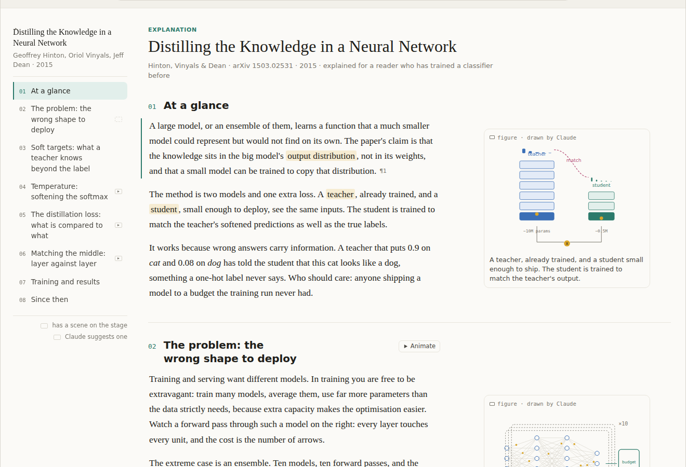

### A stage per section, not per page

The stage appears at the top of the margin when you enter a section that has
a scene, follows its paragraphs, and is gone in the next section. In every
other section the margin is exactly what it is now. Within a section with a
scene, the section's other margin items, a second still, the paper's own
figure, a caveat, a cell, sit beside their paragraphs beneath the stage and
come out from under it as you read on.

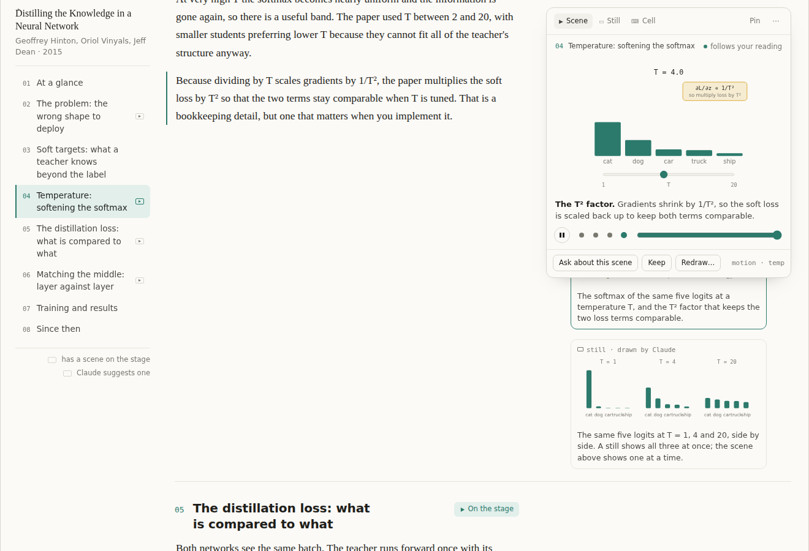

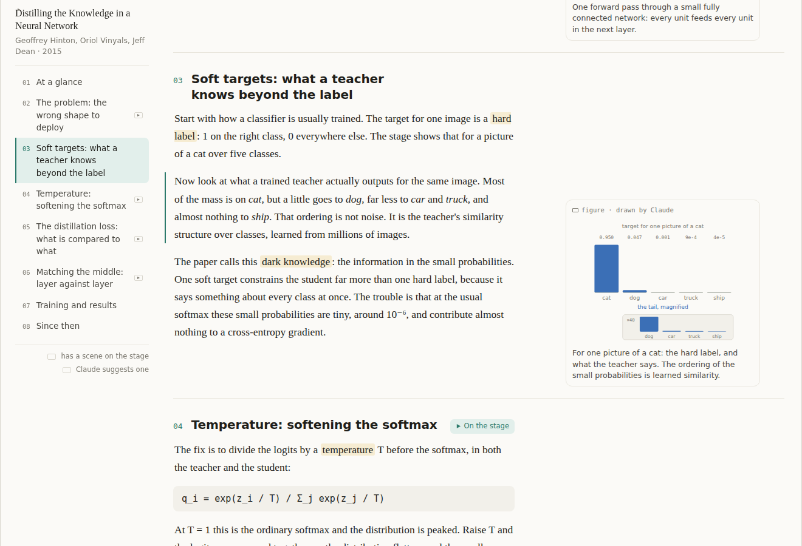

### Stepped by paragraph

Each paragraph of the section is a step. The paragraph crossing a line a
third of the way down the window picks the step (the same line the outline
already follows), the scene tweens to that state and idles there, and
reading backwards steps backwards. The stage has dots and a slider to step
by hand, a pause for the idle motion, and **Pin**, which holds a scene while
you read on. Scrubbing the scene by scroll position was considered and
rejected: reading speed is not animation speed, and a reader who stops to
think should not be left with a half-drawn frame.

### Suggested, then on demand

A figure Claude thinks worth animating carries **Animate this figure** with
a one-line reason; the section head has the same button and the outline
marks the section with a hollow play. Pressing it, or asking in the bar
(*animate how the loss compares the two outputs*), is a section-scoped edit
like any other: the reply is a `motion` block inserted into the section, the
scene streams in node by node, then plays bound to the paragraphs, and the
block is saved into the explanation Markdown, so IndexedDB, Drive and the
Git mirror get it for free. Any other figure can be asked for the same way;
Claude just does not offer. Scenes are not written with the first
explanation: that keeps the page as fast to write as it is now, and a
request for one section, with its paragraphs already written, binds steps
to them exactly.

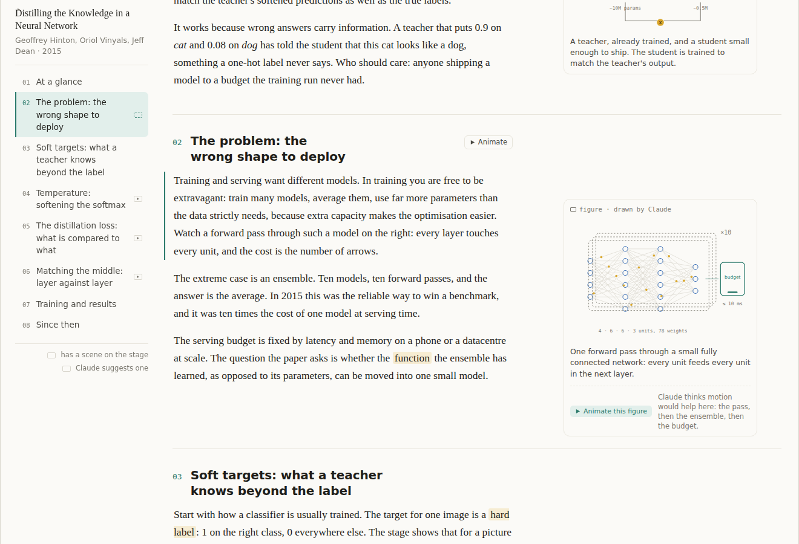

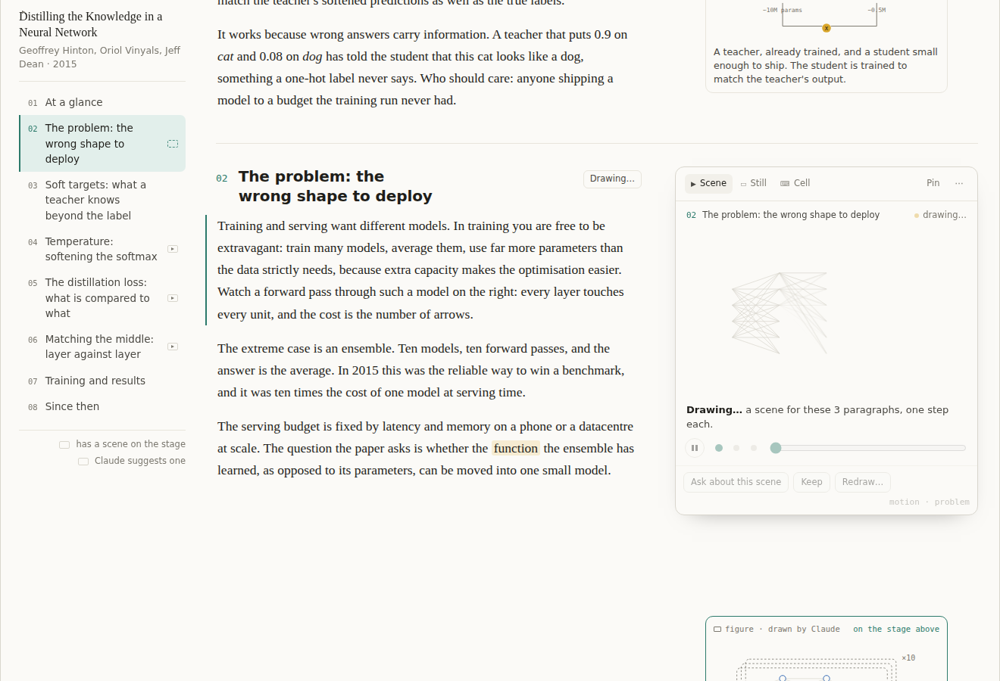

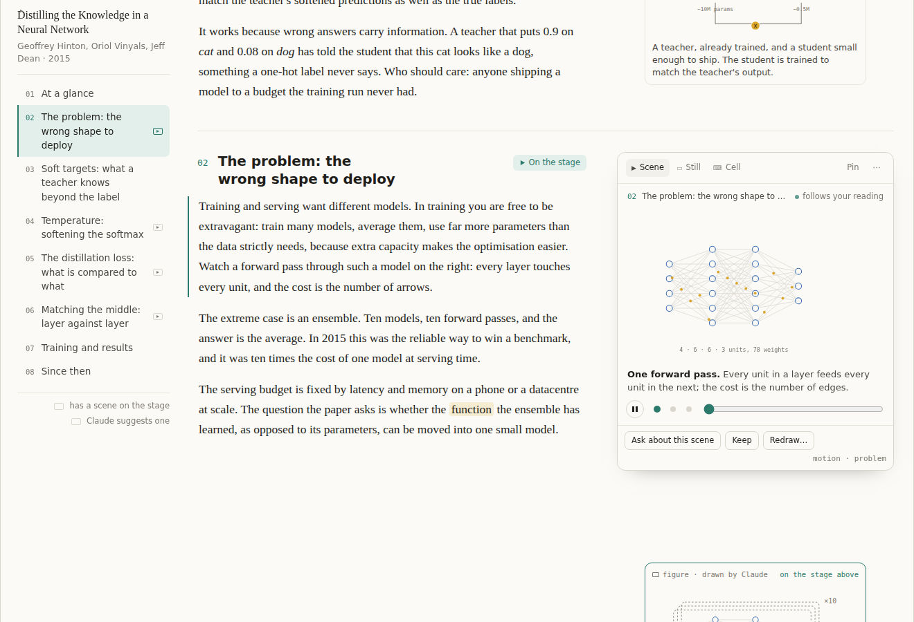

### One drawing, two states

The figure and the scene are the same drawing. A `figure` block Claude
already writes is the scene at rest; a `motion` block names elements in that
SVG by id and says what each step does to them. The margin's still is
literally the scene on its last step, the stage's **Still** tab is the
resting frame, and Keep and the notes always get the still. Drawn once, the
still and the animation can never disagree, and the scene goes through the
figure pipeline that exists: DOMPurify, the colour classes the page themes,
the snip, Keep.

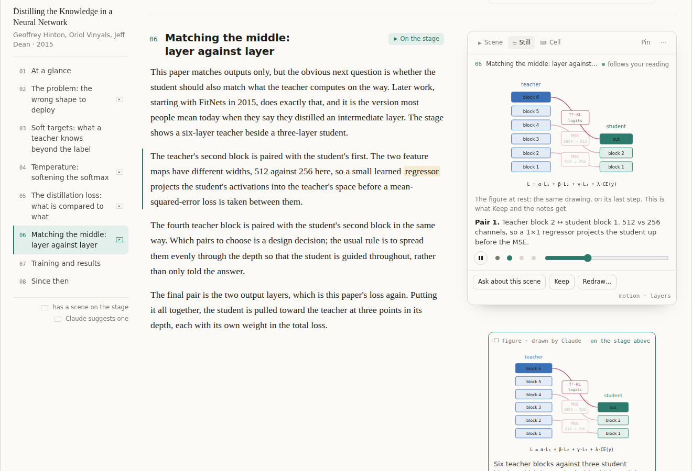

### The tab row is the filmstrip

The stage's tabs show only what the section has: **Scene**, **Still**,
**Cell**, and **Paper** when Claude cites a figure in the paper, a snip from
the PDF with the page it is on. Three pictures of one idea, from the most
trusted to the most explanatory, and the reader can check one against the
other.

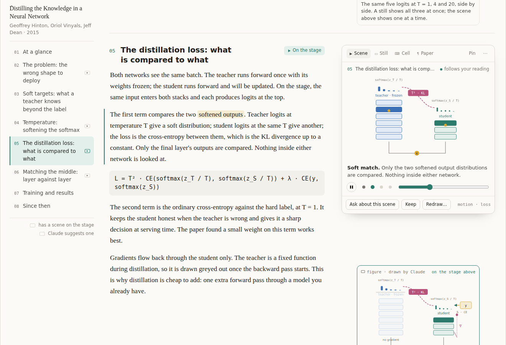

### Bound to a cell when it should be

A scene can name a cell. Until the cell runs, the scene shows the
illustrative values Claude wrote; after, the real ones, and the figure says
which cell and which machine. Drawing stays on the page and computing stays
in Colab: the page can do a softmax in one line of JavaScript, and a GPU in
another tab is the long way round to a picture, but a training curve or an
attention matrix over a real sentence should come from a run. The page
already reads loss curves from what a cell prints; the stage is a third
consumer of the same run.

![Section 07: a static figure that says "curves from In [3], ran on T4", and its cell under it](mockups/stage-9-static-with-cell-chip.png)

### Off, if you want it off

**Stage** in the Explain bar, beside the layout switch and remembered the
same way, turns every part of this off. With it off the page is the page
as it is today: no stage in any section, no suggestion under any figure, no
marks in the outline or the section heads, every section with its figure
in the margin beside its paragraph. Scenes already written stay in the
page's Markdown and come back when it is switched on again, so turning it
off costs nothing and loses nothing. The same choice is in Settings, for a
reader who never wants to be offered a scene.

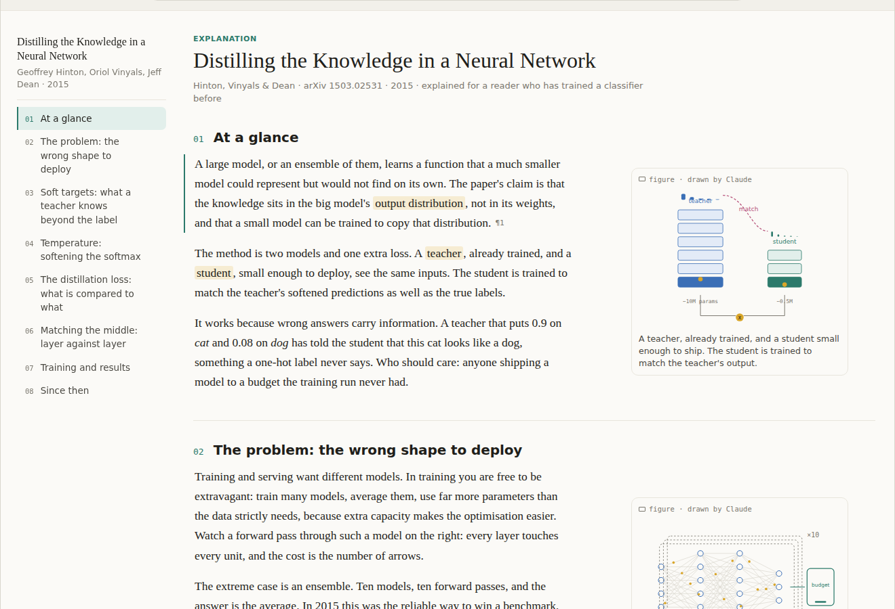

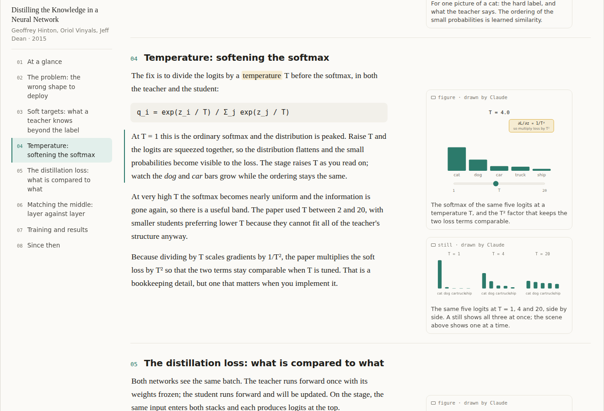

### Video is an export

Nothing is generated as a video file. The stage's menu renders the scene to
WebM or GIF in the browser, keeps the current frame as a still, opens the
scene large in a floating window, and can animate every section that can
take one.

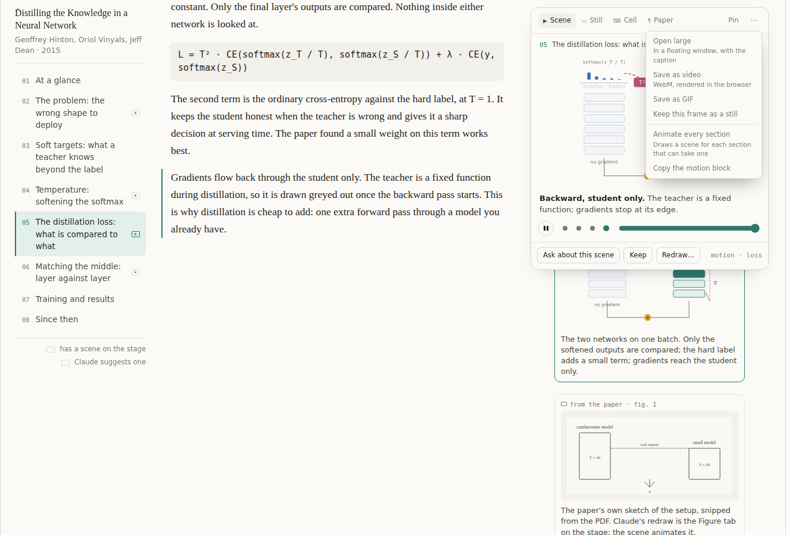

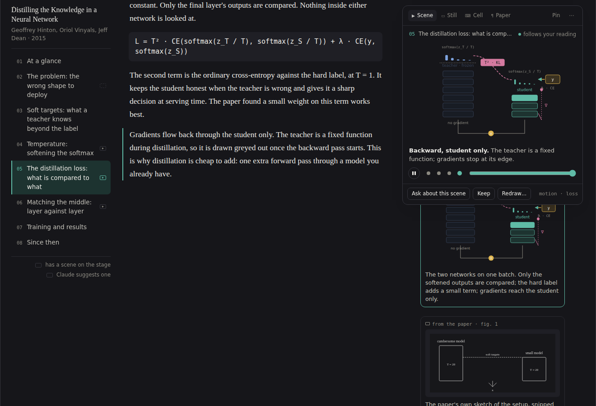

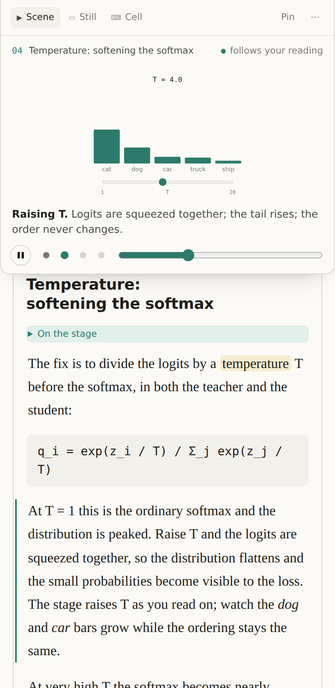

## What Claude writes

A fifth fenced block beside `figure`, `python`, `output` and `caveat`. It
is a declarative scene, not code, so it can be validated, themed and redrawn
without running anything untrusted; the page owns the layout and the
tweening.

````markdown
```motion figure="the-distillation-loss" steps="forward,soft match,hard label,backward"
nodes:
  x:        {kind: input, label: "x"}
  teacher:  {kind: stack, layers: 6, label: "teacher", frozen: true}
  student:  {kind: stack, layers: 3, label: "student"}
  zT:       {kind: dist,  label: "softmax(z_T / T)", from: teacher}
  zS:       {kind: dist,  label: "softmax(z_S / T)", from: student}
  y:        {kind: label, label: "y"}
edges:
  - {from: x, to: [teacher, student], flow: forward}
  - {from: zT, to: zS, kind: compare, label: "KL", step: 1}
  - {from: y,  to: zS, kind: compare, label: "CE", step: 2}
  - {from: zS, to: student, flow: backward, step: 3}
steps:
  0: {caption: "The same batch runs through both networks."}
  1: {caption: "Only the two softened outputs are compared.", highlight: [zT, zS]}
  2: {caption: "A small hard-label term keeps the student honest.", highlight: [y, zS]}
  3: {caption: "Gradients reach the student only.", dim: [teacher]}
```
````

Steps bind to the section's paragraphs in order, or by name with a marker
in the prose. A vocabulary of about a dozen node kinds covers what most
papers draw, in any field: **stack, layer, block, tensor** for architectures
and shapes; **flow** along edges for forward, backward and data passes;
**dist, bars, curve, grid, matrix** for distributions, training curves,
attention and feature maps; **compare, highlight, dim** for what is measured
against what; **slider** for one hyperparameter with a live chart;
**timeline, token row, sequence** for history and language. An attention
paper gets a matrix filling in row by row, a diffusion paper a grid
denoising step by step, a fluid paper a field on a grid, an optimisation
paper a curve and a slider. A survey gets no suggestions, and that is
correct. When the figure already exists, the motion block references its
elements by id instead of declaring nodes, so the still and the scene stay
one drawing.

| Kind of section | Scene that fits |
| --- | --- |
| Architecture | Flow through a stack: packets along edges, layers lighting in order, a tensor's shape changing at each. |
| Loss or objective | Two outputs and the comparison between them, then the gradient path drawn back. Which layers meet which. |
| A hyperparameter | One slider, one live chart: T and the softmax, the learning rate and a curve, the context window and a mask. |
| Training | Curves drawn over time, the two runs the text contrasts. |
| Attention, routing, mixing | A matrix or bipartite graph whose weights fill in as the step moves. |
| Since then | None. A timeline is a still. |

## The options considered

**Where the stage sits.** Top of the margin, sticky for the section (chosen).
The whole margin as a tabbed stage, which hides a section's second and
third figures. A floating picture-in-picture card, which works in every
layout but covers prose. Two sticky panes, scene above and the current
still below, always aligned but needing about 700px of height. Three
columns above 1500px. A short strip under the bar on a phone (chosen for
narrow screens, the stage fixed to the top while its section is read).

**Stills and motion together.** A still shows everything at once and is
what you keep; a scene shows one thing at a time and is only useful while
you read. Keeping the stage per section, and only in sections that earn it,
is what lets both exist without the still ever being pushed off its
paragraph in the sections that are plain. In a section with a scene the
other margin items trail their paragraph by the stage's height; keeping the
stage short, about 450px, is the mitigation.

**Code in Colab instead.** Rejected as the mechanism, kept for the data. A
rendered video is a baked file the page cannot step, pin, theme or redraw,
it needs a runtime before the reader sees anything, and the runtime path
(`src/lib/colab.ts`) carries text and images back, not video. A cell that
renders the scene to a GIF belongs in the exported notebook.

**Written with the explanation.** Rejected in favour of on demand, above.

## What it takes to build

- **`src/lib/explain.ts`**: a `motion` block in `parseExplanation`, parsed
  as YAML-like key–value lines (the parser is forgiving and runs on every
  streamed token, as the others do), with its steps and the figure it
  animates; a `suggest` attribute on `figure` for Claude's marks; and a
  paragraph of the prompt that says when to suggest a scene and what the
  vocabulary is. A scene request is a section-scoped edit through the same
  path as *explain this more simply*.
- **A scene renderer, `src/lib/motion.ts`**: the dozen node kinds laid out
  on a 360×250 viewBox with the colour classes the page themes, and a tween
  from step to step. Pure functions, so the tests can check a block draws
  what it says.
- **`src/components/Explain.tsx`**: a `Stage` component mounted in the side
  column of the section being read when that section has a scene (the
  outline's scroll handler already knows the section; the step is the
  paragraph under the same line); tabs for Scene, Still, Cell and Paper;
  Pin, the dots and the slider; the suggestion row under a figure. The
  Margin layout's per-row grid becomes per-section (prose column, side
  column) for sections with a scene only.
- **`src/styles.css`**: the stage, the suggestion row, the outline's two
  marks, the phone strip.
- **The switch**: `Stage` in the bar beside the layout switch, kept in
  `localStorage` the way the layout is (`readLayout` in `Explain.tsx`),
  and the same setting in Settings. Off hides the stage, the suggestion
  rows and the marks; the parsed `motion` blocks stay in the document.
- **Keep and the notes**: a kept scene is its still, SVG, with the caption
  of the current step.
- **Export**: WebM through `MediaRecorder` on a canvas copy of the SVG, GIF
  through a small encoder, both in the browser; a cell in the exported
  notebook that renders the scene with matplotlib for a self-contained
  `.ipynb`.

## Open questions

- **How much idle motion.** The mock idles gently (packets moving, a curve
  breathing) and has a pause. A stricter version animates only on a step
  change and is otherwise still.
- **Whether a figure's suggestion should be shown at all** when the reader
  has never used a scene, or only after the first one is drawn.
- **The vocabulary's size.** Twelve kinds is a guess at what covers most
  papers without making the block hard to write reliably; the first ten
  papers explained with it will say.
