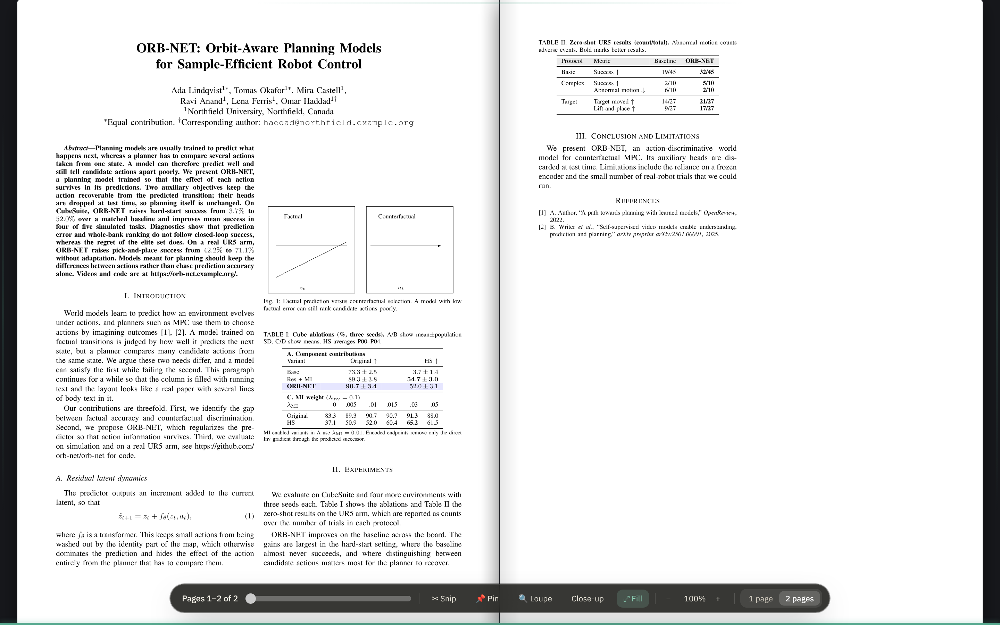
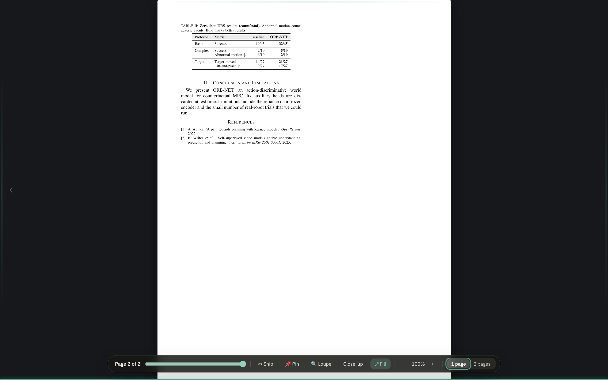
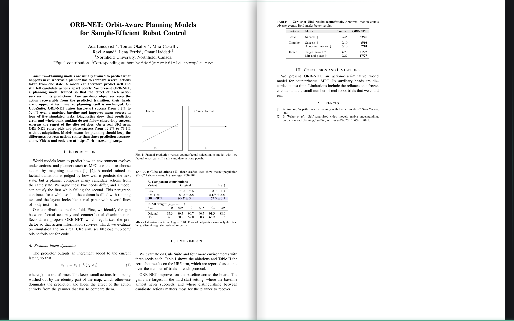

# The dock, under a filled spread

**⤢ Fill** gives a PDF's pages the whole frame, corner to corner. The
first cut put the page bar below the bottom edge, in the rail's colour,
back when the pointer touched the edge. In practice it was hard to see at
all: a bar in the rail's muted colours, with muted type on it, over the
dark ground of zen mode, half under the window's edge, and only there when
the pointer sat on the last twenty pixels of the screen. This document is
the design that replaced it, built, and photographed by
`scripts/zoom-smoke.mjs`.

> **Built.** `src/components/PdfBookView.tsx` (when the dock is out, and
> the hairline), `src/styles.css` under *Filled: the pages corner to
> corner*. See the README's *Closer in on the page*.

## The design

### A lozenge over the pages, not a bar under them

Filled, the page bar is a **dock**: a dark frosted lozenge floating 18
pixels over the foot of the pages, in the middle, with light type on it.
It is the same lozenge the loupe and the close-up already say their keys
in, so it reads on a white page and in the dark alike, and the reader has
seen it before. Everything the bar had is on it, in four groups with a
hairline between: the folio and the slider; Snip, Pin, Loupe, Close-up and
Fill; the zoom; one page or two. A pressed tool is the lozenge's green.

### Out while you move, gone while you read

The dock is out while the pointer moves, and for a moment after a page
turns, with the new folio on it, so a reader turning pages with the arrow
keys sees where they are without reaching for anything. Still for a couple
of seconds, it goes, and nothing is over the pages. It stays while the
pointer or the focus is on it, so a slider being dragged, or a button
being tabbed to, never has the dock go from under it; and it comes out
on entering Fill, so it is seen going. On a touch screen there is no
pointer to move: a tap on the page brings it out for a while.

### The hairline

What stays is a **hairline** along the bottom edge, three pixels, the
accent colour as far as the spread is through the paper, so a glance says
how far there is to go even with the dock away. It moves with the page.

## The options considered

- **The bar as it was, with better contrast.** Darker type on the rail
  would have fixed the reading but not the finding: a bar that comes out
  only at the bottom twenty pixels is a bar most readers never see. The
  dock comes out on any movement.
- **Always out.** A bar that never leaves takes its height from the
  pages, which is what Fill was for.
- **Controls in the corners.** The folio bottom-left, the tools
  bottom-right, as a video player does. The slider wants width, and
  splitting the bar in two means two things to find; one lozenge is one.
- **A dock at the top.** The top bar already has its own dock in zen mode,
  and the pointer rests at the bottom of a page being read, not the top.

## Open questions

- The dock's width is the controls': on a narrow window the groups wrap to
  two rows inside the lozenge. Icons alone, with the labels as titles,
  would keep it to one.
- A click on the hairline could go to that page, as the slider does.
