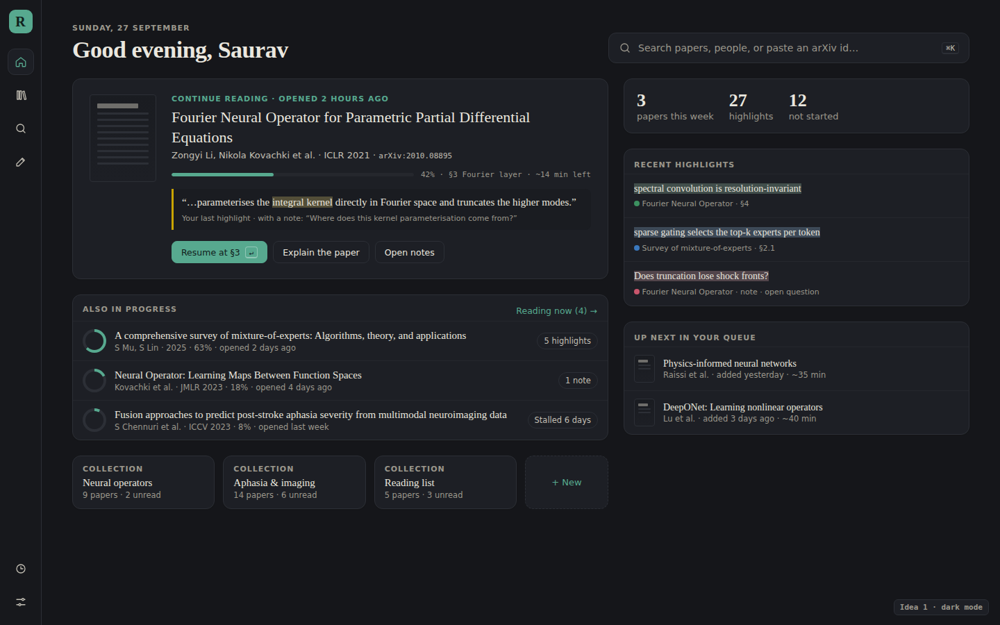

# A landing page after sign-in — ideas

Today, once you're signed in, the app opens straight onto the library list
(`CollectionView`, whatever view was last saved in `reader.view`). The library
is a good place to *manage* papers, but it's a poor place to *start a session*.
To get back into what you were reading you have to find the paper, open it,
then scroll to where you stopped.

Below are five directions for a **Home** view: a new first icon on the rail
that the app lands on after sign-in. They aren't exclusive. The recommendation
at the end combines them. All of them are static mock-ups built in the app's
own colours and type. The sources are in [`mockups/landing-src/`](mockups/landing-src/)
and are re-rendered with `node docs/mockups/landing-src/render.mjs`.

---

## 1. Pick up where you left off

The paper you last opened is the hero. It shows its progress, the section
you stopped in, and your last highlight and note, so you remember *why* you
stopped. **Resume** (or just <kbd>↵</kbd>) opens the paper at that spot.
Around it:

- the other papers in progress, flagged when one has **stalled** for days
- your collections as tiles
- a small weekly tally
- recent highlights
- the next unread papers, with a rough reading time

**Why:** it takes the most common action ("carry on") from about four
clicks down to one keystroke.
**Cost:** low. `progress`, `lastOpenedAt`, highlights, notes and collections
all exist already. The only new parts are "section at progress" and "reading
time", which the PDF outline and word count can give.

Dark mode, for reference:

## 2. Search-first launchpad

One box, centred, and focused as the page loads. It searches your library
first (so a paper you already have **resumes** instead of being added twice),
then the external sources, then people, and it ends with **Ask Claude** about
the query. Below the box:

- a drop zone for PDFs, DOI, arXiv or OpenReview links, and BibTeX
- four single-key actions: <kbd>R</kbd> resume, <kbd>N</kbd> next unread,
  <kbd>D</kbd> discover, <kbd>Q</kbd> open questions

**Why:** most sessions start with either "that paper I was reading" or "a
paper I just heard about", and this page serves both from one place.
**Cost:** low to medium. Search, the command palette (`CommandPalette.tsx`)
and `PdfDropIn` already exist. The new work is ranking library hits above
external ones and adding BibTeX and link parsing.

## 3. "Since you were last here" inbox

New papers since your last visit, each with the reason it's here:

- a new paper by an author you've read 3 times
- a paper that cites the one you're reading now
- a match in your arXiv categories
- a hit on a saved search

You triage from the keyboard, the way you would in a mail client:
<kbd>J</kbd>/<kbd>K</kbd> to move, <kbd>A</kbd> to add, <kbd>L</kbd> for
later, <kbd>X</kbd> for not for me. It can also match a new paper against
your open questions (the pink note).

**Why:** it turns Discover from a place you have to remember to visit into
something that comes to you, and it gets the app opened daily.
**Cost:** the highest. It needs "followed authors" and "saved searches" (which
don't exist yet), a periodic fetch, and a record of what's been seen. The data
sources (Semantic Scholar citations, arXiv listings, author profiles) are
already wired up.

## 4. Review & resurface

This page is about keeping what you've read rather than reading more:

- a short spaced-repetition pass over old highlights (Forgot / Fuzzy / Got it)
- **open questions** from your notes, with prompts to trace where an idea
  came from or ask Claude
- finished papers that have no summary yet, with a *Draft from highlights*
  button that uses Explain / Ask
- a reading-activity heatmap

**Why:** highlights you never look at again are wasted. This closes the loop
and gives the notes and Git side of the app a reason to exist day to day.
**Cost:** medium. The highlights and notes are there. It needs a review
schedule per highlight and a "question" marker on notes.

## 5. First-run setup (new users)

This is for **someone else** signing in for the first time. It replaces the
current empty library with a skippable checklist:

1. Drive (already done by the sign-in)
2. Import: drop PDFs or a `.bib`, `.ris` or Zotero file, or bring in a
   Google Scholar library
3. Pick topics and authors, which seeds idea 3
4. A GitHub notes repo and a model

Alongside the checklist are two starter papers and the four shortcuts worth
knowing, so the app's best features (right-click lookup, <kbd>E</kbd>,
<kbd>⌘\\</kbd>) get found on day one.

**Why:** the current `Welcome` handles sign-in well, but after it a new person
lands on an empty list with no idea what the app can do.
**Cost:** low for the checklist and tips. Import is the real work.

---

## Recommendation

Build **1 as the Home view, with idea 2's search box as its header**, and
show **5** in place of it until the library has a few papers. Then add the
side panels from **3** (the inbox) and **4** (open questions and review) as
they become possible. Home then stays the same page, and the inbox and
review appear in it as more data comes in.

## Smaller workflow ideas (any of the above)

- **Land where you were.** On sign-in, if a paper was open less than an hour
  ago, reopen it directly and skip Home entirely. A setting would make it
  optional.
- **Resume at the exact spot.** Store the scroll anchor, not just
  `progress`, and flash the last highlight when the paper opens
  (`PassageFlash` exists already).
- **A reading queue** with explicit order, not just "not started". Let people
  drag to reorder, and have <kbd>N</kbd> open the next paper from anywhere.
- **"Stalled" nudges.** A paper in progress but untouched for more than 5 days
  gets a gentle prompt: finish it, skim it with Explain, or move it back to
  not started.
- **Paste anywhere.** <kbd>⌘V</kbd> with an arXiv, DOI or OpenReview link on
  the clipboard, pressed anywhere outside a text field, adds the paper
  (there's a toast to undo it).
- **End-of-paper prompt.** When you reach 100%, ask for three takeaways
  (offering a draft from the highlights), mark the paper finished, and
  suggest the next one from its references.
- **Browser bookmarklet / share target.** "Send to Reader" from an arXiv
  page or a phone.
