# A landing page after sign-in — ideas

Today, once you're signed in, the app opens straight onto the library list
(`CollectionView`, whatever view was last saved in `reader.view`). The library
is a good place to *manage* papers, but it's a poor place to *start a session*.
To get back into what you were reading you have to find the paper, open it,
then scroll to where you stopped.

Below are directions for a **Home** view that the app lands on after
sign-in. **The R at the top of the rail is the Home button.** It has a ring
and a bar beside it while Home is showing, and it's plain everywhere else
(see [idea 6](#6-r-is-home--hover-it-for-a-quick-switcher)). They aren't exclusive. The recommendation
at the end combines them. All of them are static mock-ups built in the app's
own colours and type. The sources are in [`mockups/landing-src/`](mockups/landing-src/)
and are re-rendered with `node docs/mockups/landing-src/render.mjs`.

---

## Home: one default view, three more a click away

**Home opens on _Continue reading_**, the view that shows the page you
stopped on. A switcher at the top of Home holds the three other views that
are most worth having:

| Tab | What it's for | Key |
|---|---|---|
| **Continue reading** (default) | The page you left, what's in progress, recent highlights, up next | <kbd>1</kbd> |
| **Today** | A timed reading plan and a focus session (idea 8) | <kbd>2</kbd> |
| **Projects** | Your active research question and its papers (idea 7) | <kbd>3</kbd> |
| **Inbox** | New papers since your last visit, with a count badge (idea 3) | <kbd>4</kbd> |

The **⋯** at the end of the switcher opens the menu below. There you choose
which view **Home opens on** (or "whichever I used last"), and which views
appear as tabs. Search-first (idea 2) and Review (idea 4) can be switched on
as tabs too. The same choice is also in Settings.

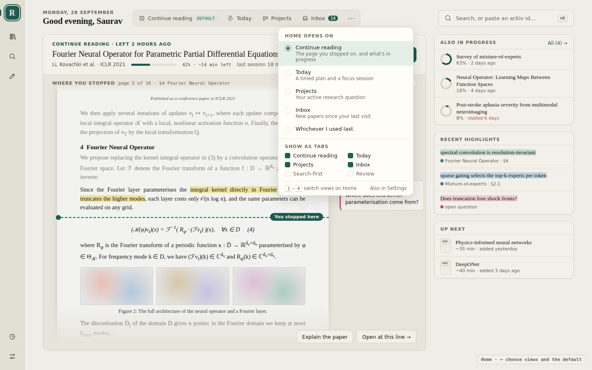

On Today, Projects and Inbox, a **"Pick up where you left off" strip** sits at
the bottom. It shows a few lines of the page with the stop marker, and
**Resume** (<kbd>↵</kbd>). Getting back into your paper is therefore one key
from every view, not just the default one.

Why these three: **Today** and **Projects** are the two ways of deciding
*what* to read next (by time, or by question). The **Inbox** is the one
place new material comes in. Search is already in Home's header on every
view, so it doesn't need a tab of its own. Review works best as a short
step inside Today rather than a place you'd start from.

## 1. Pick up where you left off

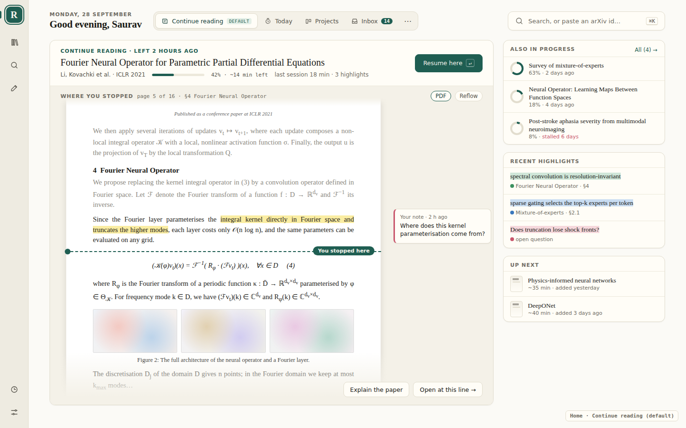

The paper you last opened takes up most of Home, and **most of the page you
stopped on is shown**: the running head, the paragraphs you'd already read
(dimmed), the section heading, your highlight with its note in the margin, a
dashed **"You stopped here"** line, then the equation, figure and paragraph
that come next. It's the real page, in the mode you left it in (PDF or
Reflow). Seeing half a page is enough to remember where you were before you
open anything.

- **Resume here** (<kbd>↵</kbd>) or **Open at this line** opens the paper at
  exactly that line.
- Above the page: the title, the progress, the time left, and what the last
  session added.
- In a column on the right: the other papers in progress (flagged when one has
  **stalled** for days), recent highlights, and the next unread papers with a
  rough reading time.

**Why:** it takes the most common action ("carry on") from about four
clicks down to one keystroke. The page preview also means you don't have to
re-read the page just to find your place.

**How the page preview would work:** today the app saves only `progress` (a
0–1 scroll fraction). It would also need to save the **top visible line** as
a text anchor, the same quote-plus-neighbours scheme `lib/anchor.ts` already
uses for highlights, so it lands on the same spot in PDF and Reflow and
survives a new arXiv version. Two ways to draw the preview:

1. **Snapshot on leave (cheap, instant).** When you close a paper or switch
   away, grab a ~900×400 crop of the viewport around the anchor (the PDF
   canvas, or the Reflow DOM), store it as a small WebP beside the paper in
   IndexedDB, and show it on Home. It's zero work at load time and works
   offline.
2. **Live render (sharper, selectable).** Open the cached PDF with pdf.js,
   render just that page, and scroll it to the anchor; for Reflow, render
   the few paragraphs around the anchor. This is more work on load, but the
   text is real and the highlights are current.

The best option is to start with the snapshot and swap in the live render
once it's ready.

**Cost:** low to medium. `progress`, `lastOpenedAt`, highlights, notes and
text anchoring all exist already. The new parts are saving the reading
anchor, the snapshot, and "section at this line" (from the PDF outline).

Dark mode, for reference:

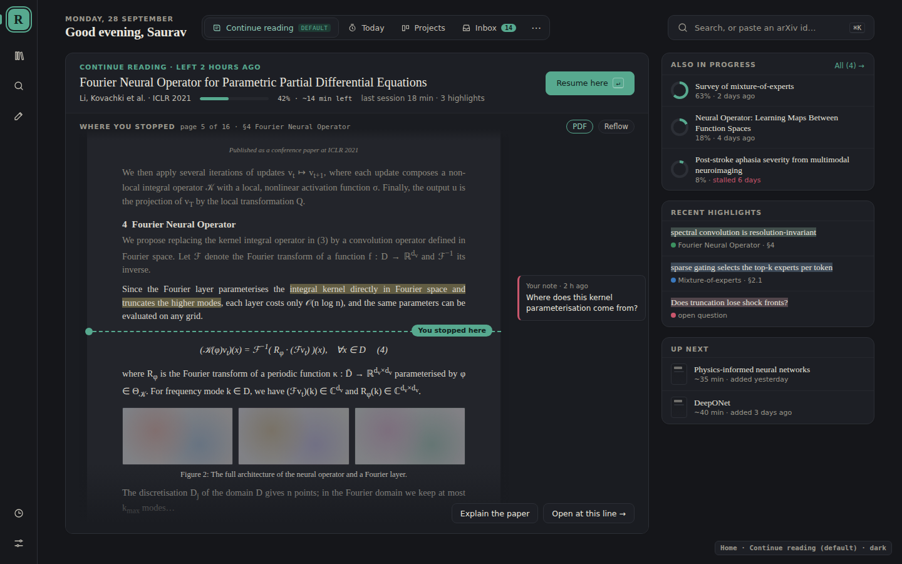

## 2. Search-first launchpad

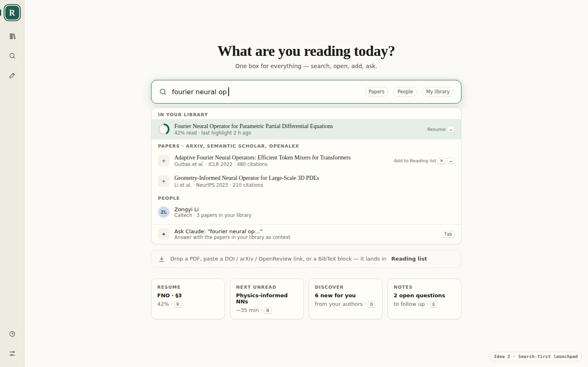

One box, centred, and focused as the page loads. It searches your library
first (so a paper you already have **resumes** instead of being added twice),
then the external sources, then people, and it ends with **Ask Claude** about
the query. Below the box:

- a drop zone for PDFs, DOI, arXiv or OpenReview links, and BibTeX
- four single-key actions: <kbd>R</kbd> resume, <kbd>N</kbd> next unread,
  <kbd>D</kbd> discover, <kbd>Q</kbd> open questions

**Why:** most sessions start with either "that paper I was reading" or "a
paper I just heard about", and this page serves both from one place.
**Cost:** low to medium. Search, the command palette (`CommandPalette.tsx`)
and `PdfDropIn` already exist. The new work is ranking library hits above
external ones and adding BibTeX and link parsing.

## 3. "Since you were last here" inbox

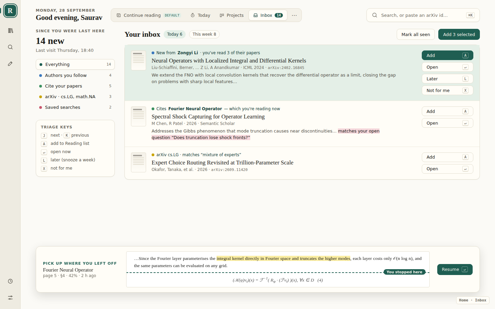

New papers since your last visit, each with the reason it's here:

- a new paper by an author you've read 3 times
- a paper that cites the one you're reading now
- a match in your arXiv categories
- a hit on a saved search

You triage from the keyboard, the way you would in a mail client:
<kbd>J</kbd>/<kbd>K</kbd> to move, <kbd>A</kbd> to add, <kbd>L</kbd> for
later, <kbd>X</kbd> for not for me. It can also match a new paper against
your open questions (the pink note).

**Why:** it turns Discover from a place you have to remember to visit into
something that comes to you, and it gets the app opened daily.
**Cost:** the highest. It needs "followed authors" and "saved searches" (which
don't exist yet), a periodic fetch, and a record of what's been seen. The data
sources (Semantic Scholar citations, arXiv listings, author profiles) are
already wired up.

## 4. Review & resurface

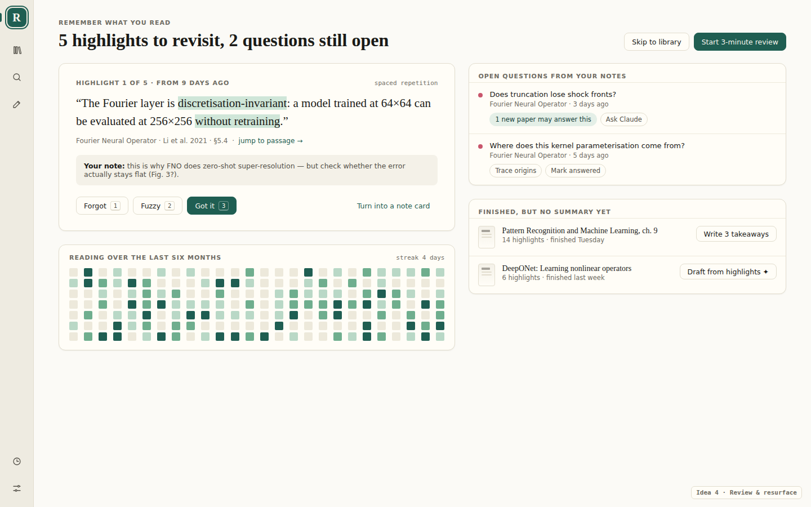

This page is about keeping what you've read rather than reading more:

- a short spaced-repetition pass over old highlights (Forgot / Fuzzy / Got it)
- **open questions** from your notes, with prompts to trace where an idea
  came from or ask Claude
- finished papers that have no summary yet, with a *Draft from highlights*
  button that uses Explain / Ask
- a reading-activity heatmap

**Why:** highlights you never look at again are wasted. This closes the loop
and gives the notes and Git side of the app a reason to exist day to day.
**Cost:** medium. The highlights and notes are there. It needs a review
schedule per highlight and a "question" marker on notes.

## 5. First-run setup (new users)

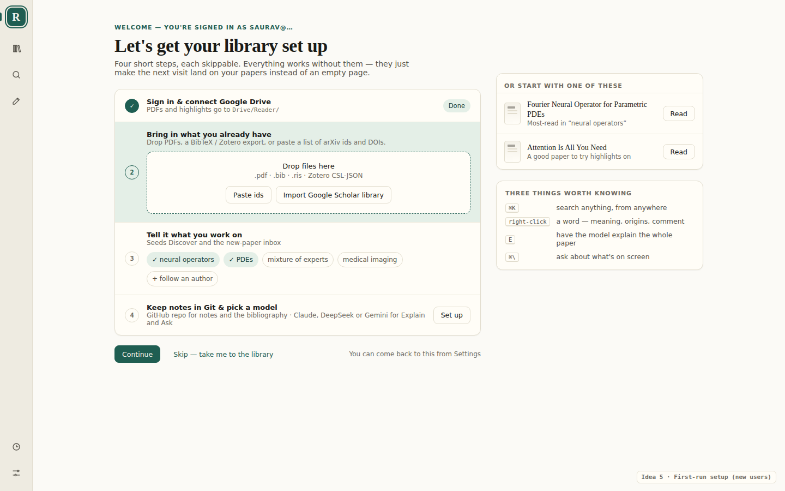

This is for **someone else** signing in for the first time. It replaces the
current empty library with a skippable checklist:

1. Drive (already done by the sign-in)
2. Import: drop PDFs or a `.bib`, `.ris` or Zotero file, or bring in a
   Google Scholar library
3. Pick topics and authors, which seeds idea 3
4. A GitHub notes repo and a model

Alongside the checklist are two starter papers and the four shortcuts worth
knowing, so the app's best features (right-click lookup, <kbd>E</kbd>,
<kbd>⌘\\</kbd>) get found on day one.

**Why:** the current `Welcome` handles sign-in well, but after it a new person
lands on an empty list with no idea what the app can do.
**Cost:** low for the checklist and tips. Import is the real work.

---

## Recommendation

Build **1 as the Home view, with idea 2's search box as its header**, and
show **5** in place of it until the library has a few papers. Then add the
side panels from **3** (the inbox) and **4** (open questions and review) as
they become possible. Home then stays the same page, and the inbox and
review appear in it as more data comes in.

---

# More workflow ideas

The five pages above are all *Home*. The ideas below are about the rest of the
journey: how you get from Home into a paper and back, and how a paper ends up
as something you've written.

## The loop

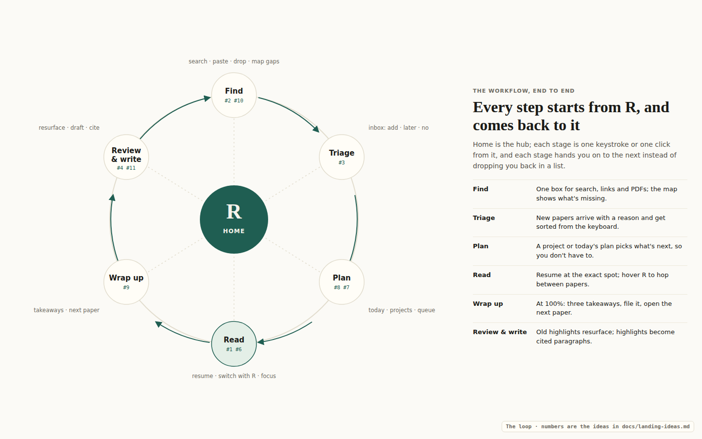

Every stage is one step from **R**, and each one hands you to the next
instead of dropping you back in a list. The numbers on the diagram are the
ideas that serve each stage.

## 6. R is Home — hover it for a quick switcher

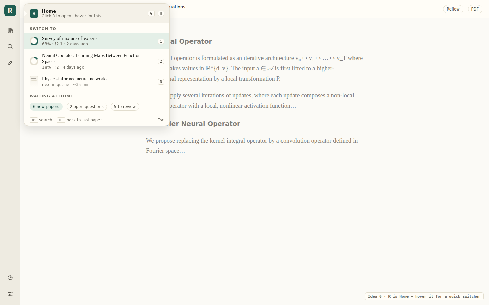

**Click R** to go Home, from anywhere. **Hover R** (or press <kbd>G</kbd>
<kbd>H</kbd>) inside a paper and you get a quick switcher instead:

- the other papers in progress, one number key each
- the next paper in the queue, on <kbd>N</kbd>
- counts of what's waiting at Home (new papers, open questions, reviews)
- <kbd>⌘[</kbd> to jump back to the previous paper

You can hop between two papers without losing your place in either.
**Cost:** low. It reuses Home's data.

## 7. Projects — Home opens on a research question

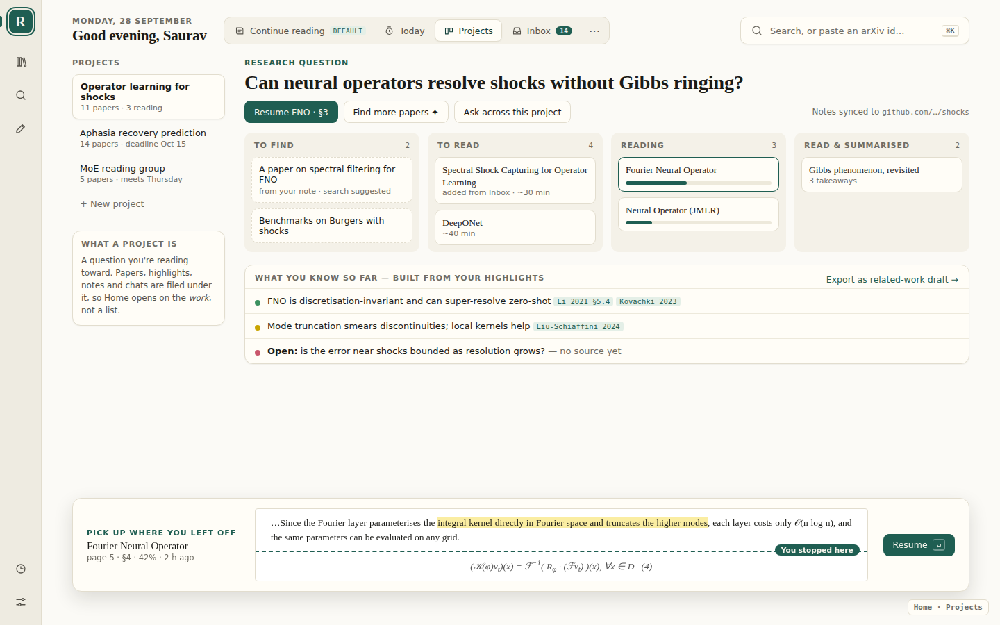

A project is a **question you're reading toward**. Papers, highlights, notes
and chats are filed under it. Its page has:

- the question as its title
- papers in lanes: *to find → to read → reading → summarised*. "To find"
  holds placeholders for papers you know you need but haven't found yet.
- **What you know so far**: your highlights, turned into claims with their
  citations, with open questions marked *no source yet*

Home opens on your active project. Each project could map to a folder in the
GitHub notes repo.
**Cost:** medium. Collections are most of the way there already. The new
parts are the question, the lanes and the claims list.

## 8. Today's plan & focus session

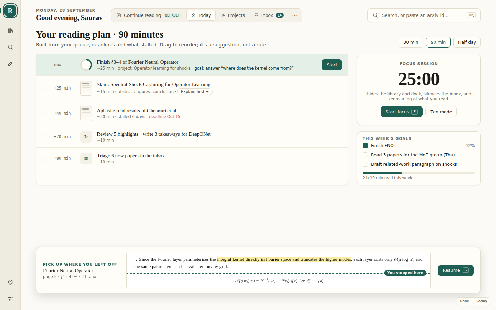

Pick how much time you have (30 min, 90 min or half a day) and Home proposes
a plan. It's built from the queue, deadlines, stalled papers, reviews that
are due and the inbox, and you can drag the steps to reorder them.

**Start focus** runs a timer. While it runs, the library and the dock are
hidden, the inbox is quiet, and it logs what you read, which feeds the weekly
goals and reading time.
**Cost:** low to medium. Zen mode already exists. The planner is ordering
work that the other ideas have already gathered.

## 9. End-of-paper wrap-up

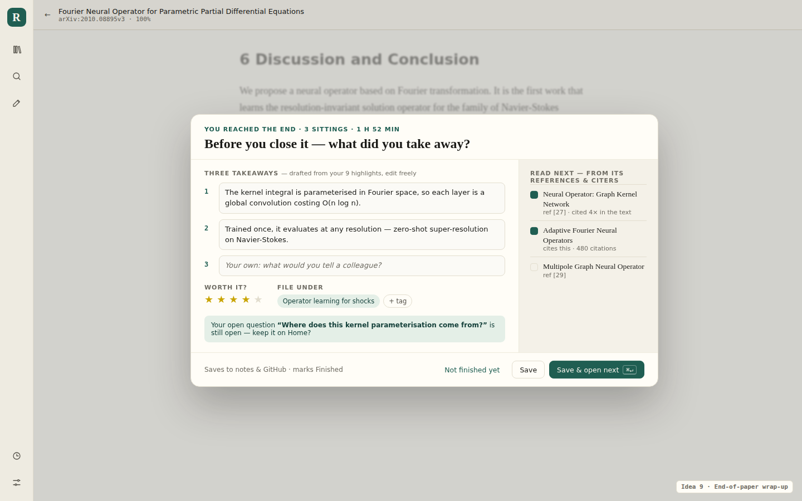

When you reach the end of a paper, a dialog opens (you can dismiss it). It:

- drafts **three takeaways** from your highlights for you to edit
- asks for a rating and where to file the paper
- reminds you of any open question that still has no answer
- suggests the **next paper** from its references and the papers citing it,
  with ticks to pick which

**Save & open next** (<kbd>⌘↵</kbd>) writes the takeaways to your notes and
GitHub, marks the paper finished, and opens the next one. This is the
hand-off that keeps the loop going.
**Cost:** low to medium. Highlights, notes, Explain/Ask and citation lookups
already exist.

## 10. Library map — see the gaps

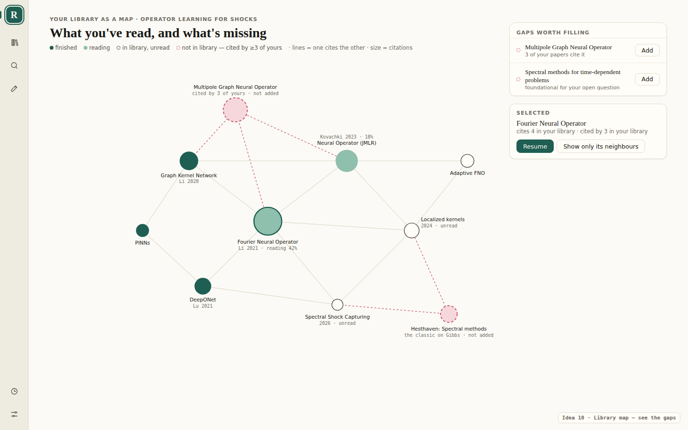

Your library (or one project) drawn as a citation graph, coloured by
finished, reading or unread. The useful part is the **dashed nodes**: papers
that three or more of yours cite, but which you don't have. They're listed
beside the graph under "Gaps worth filling", each with an **Add** button.
**Cost:** medium. The reference data comes from Semantic Scholar or OpenAlex,
which are already wired up, plus a force-directed layout.

## 11. From highlights to a draft

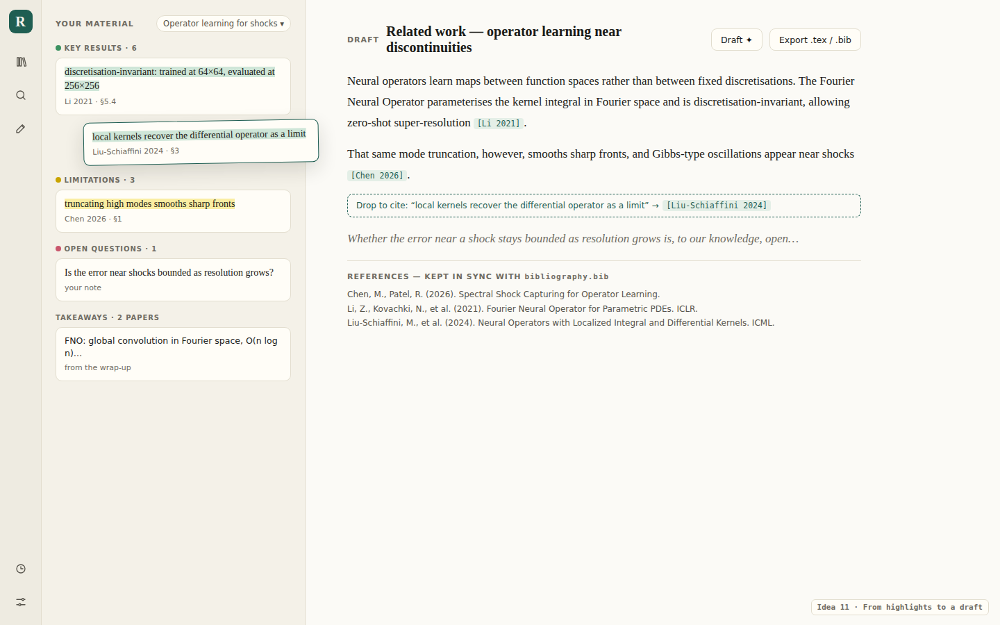

On the left are your highlights, grouped by what each colour means (key
results, limitations, open questions), plus the takeaways from idea 9. On the
right is a draft. **Drag a highlight in and it becomes a citation.** The
reference list keeps itself in sync with the `bibliography.bib` in the Git
repo. **Draft ✦** writes a first pass from the highlights. You can export as
`.tex` and `.bib`.
**Cost:** medium. The Markdown notes and the Git bibliography exist already.
The new parts are the editor and drag-to-cite.

## Recommendation, updated

1. **R → Home** (idea 1 with the search box from idea 2), plus the
   **R hover switcher** (idea 6). Cheap, and it changes every session.
2. The **end-of-paper wrap-up** (idea 9). It closes the loop and feeds
   everything after it.
3. **Projects** (idea 7) as the way Home is organised, with **Today's plan**
   (idea 8) on top of it.
4. Then the inbox (3), review (4), map (10) and writing view (11), as the data
   for each becomes available.

## Smaller workflow ideas (any of the above)

- **Land where you were.** On sign-in, if a paper was open less than an hour
  ago, reopen it directly and skip Home entirely. A setting would make it
  optional.
- **Resume at the exact spot.** Store the scroll anchor, not just
  `progress`, and flash the last highlight when the paper opens
  (`PassageFlash` exists already).
- **A reading queue** with explicit order, not just "not started". Let people
  drag to reorder, and have <kbd>N</kbd> open the next paper from anywhere.
- **"Stalled" nudges.** A paper in progress but untouched for more than 5 days
  gets a gentle prompt: finish it, skim it with Explain, or move it back to
  not started.
- **Paste anywhere.** <kbd>⌘V</kbd> with an arXiv, DOI or OpenReview link on
  the clipboard, pressed anywhere outside a text field, adds the paper
  (there's a toast to undo it).
- **End-of-paper prompt.** When you reach 100%, ask for three takeaways
  (offering a draft from the highlights), mark the paper finished, and
  suggest the next one from its references.
- **Browser bookmarklet / share target.** "Send to Reader" from an arXiv
  page or a phone.
