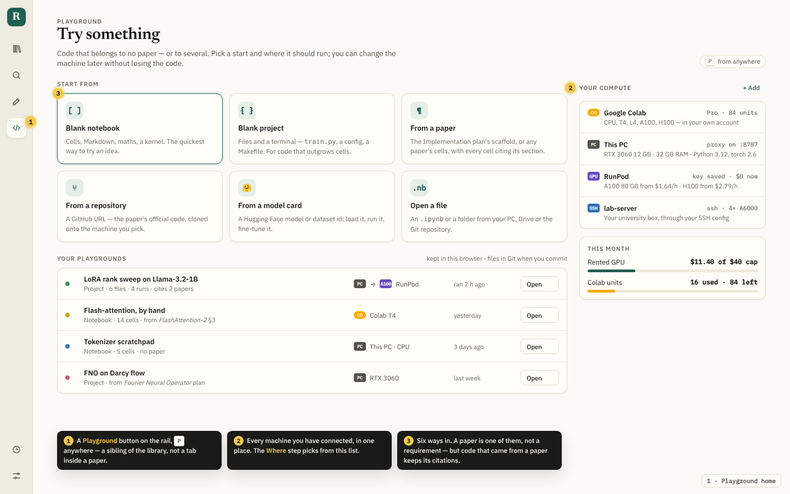
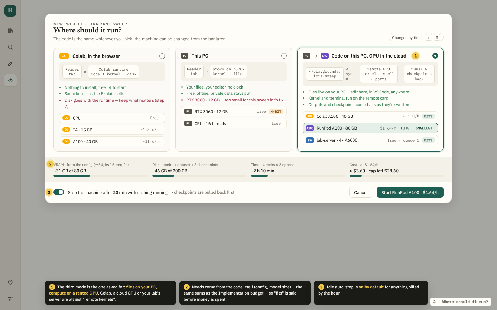
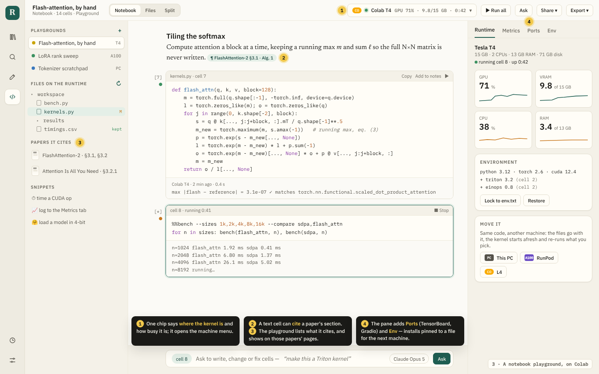
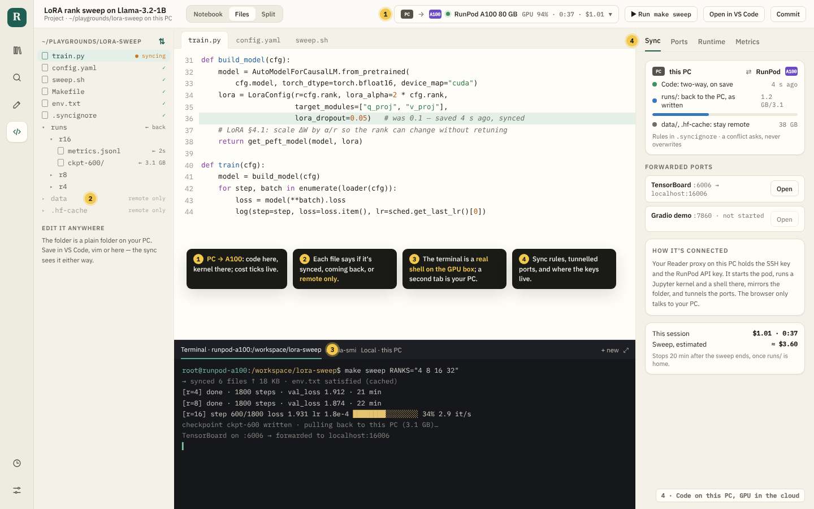
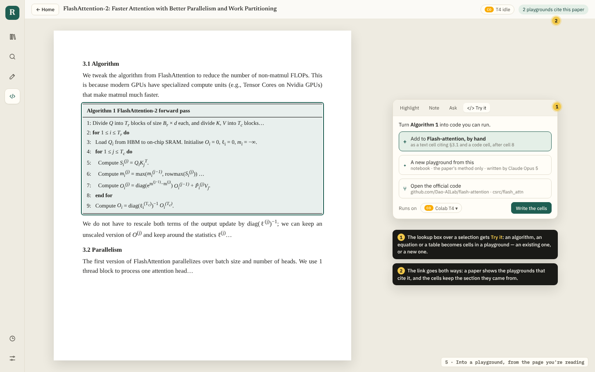
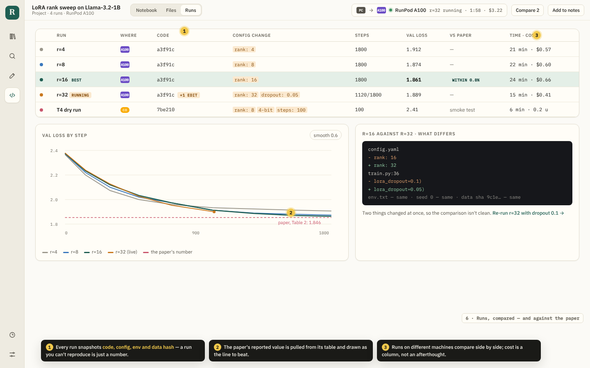
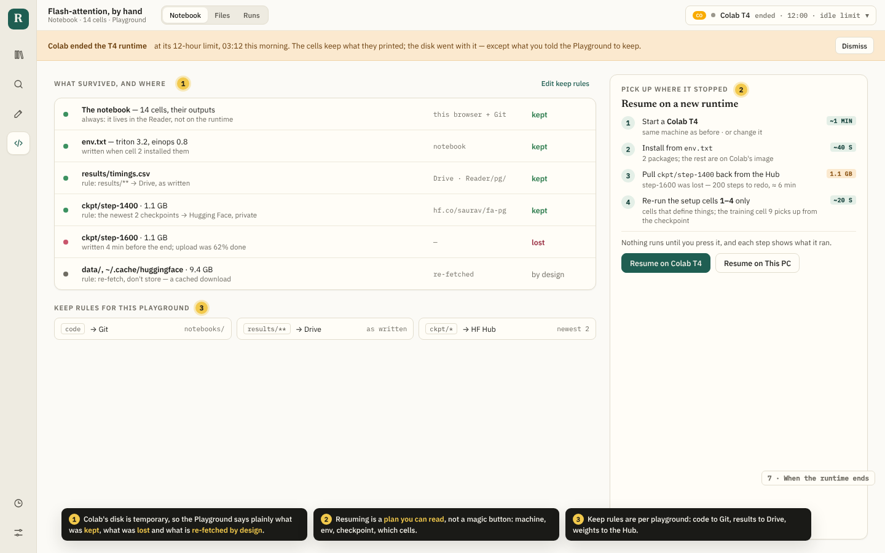
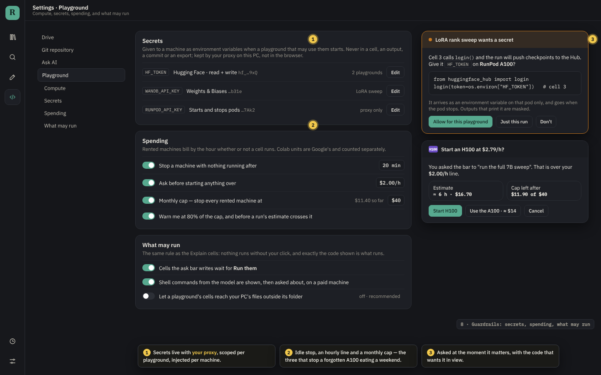

# Playground: code that belongs to no paper

The reader can already run code: the Explain and Implementation pages' cells
run in Colab, every paper has a notebook of its own on that runtime, and
**Local** runs commands in a workspace on your PC. All of it is **tied to a
paper**. Change papers and the notebook changes with it.

The **Playground** is the same machinery with the paper taken off: a place to
write and run anything, in a notebook or as a project of files, on Colab, on
your PC, or **on your PC with the GPU somewhere else**. This document is the
design. The pictures are static mock-ups in the
app's own colours and type. Their sources are in
[`mockups/playground-src/`](mockups/playground-src/), and
`node docs/mockups/playground-src/render.mjs` renders them again.

> **Built, in part.** The Playground is in the app. See the README's
> [Playground](../README.md#playground) and [Addresses](../README.md#addresses)
> for the pictures of it as it is. Two things were decided by building
> rather than as written here:
>
> - **Every machine is a Jupyter server.** The rented GPU, the lab server
>   and this PC are reached the same way: a Jupyter server the person
>   starts with this site's origin allowed, reached straight from the page
>   (directly, over an SSH tunnel, or through a pod's HTTPS proxy). The page
>   speaks to it with the kernel client Colab already used
>   (`chooseBackend` in `src/lib/colab.ts`). No provider API and no SSH in
>   the proxy.
> - **Sync is done by the page, through the Jupyter contents API.** The
>   folder goes onto the machine before a console command, and what the
>   bring-back rules name comes home after it. It carries text files up to
>   2 MB; data and weights are fetched on the machine.
>
> **Built:** steps 1–4 (the home, where it runs, the notebook and the
> project with its console and sync), the citations on a playground, a
> paper's notebook copied into one (a smaller form of step 5), the Metrics
> pane over the console's runs, Colab's idle stop (a part of step 8), and
> an address for every page.
>
> **Not built yet:**
> - **Rented GPUs.** Starting and stopping one through a provider's API,
>   and the cost meter and monthly cap that go with it. Today you start
>   the machine yourself and add its Jupyter server.
> - **Step 5's Try it** in the lookup box.
> - **Step 6's run snapshots** and the comparison against the paper's
>   number.
> - **Step 7's keep rules** to Drive and the Hub, and the resume plan.
> - **Step 8's secrets.**
> - **Ports.**

---

## The idea in one paragraph

A playground is a **folder of code plus a binding to a machine**. The code is
a notebook, a set of files, or both. The machine is any *runtime*: something
that gives the reader a Jupyter kernel, a shell, a disk and some ports. Colab,
your PC, a rented GPU and your lab's server all fit that description, so the
page treats them the same way, and switching machines keeps the code. Papers
connect to it in both directions. A playground can start from a paper and
cite its sections, and a paper lists the playgrounds that cite it. Neither
needs the other.

---

## Step by step

### 1 · A place of its own



- **On the rail, and on <kbd>P</kbd>.** It sits beside the library, not inside
  a paper's Explain view. The per-paper notebook stays where it is: it is now
  a playground that cites a single paper and opens from that paper.
- **Six ways to start:** a blank notebook, a blank project (files and a
  terminal), from a paper (the Implementation plan's scaffold, or a paper's
  cells), from a repository (the paper's official code), from a Hugging Face
  model or dataset id, or from an `.ipynb` or folder.
- **Your compute in one list:** Colab with its units, this PC as the proxy
  reports it (`/workspace/machine` already does), rented providers with a
  saved key, and SSH hosts. The step-2 picker reads from this list.
- **This month's spend:** rented dollars against a cap, and Colab units
  separately.

### 2 · Where should it run?



There are three modes. The third one is the one you asked for.

| | Colab, in the browser | This PC | Code on this PC, GPU in the cloud |
|---|---|---|---|
| Files live | on the runtime's disk | on your PC | **on your PC** |
| Kernel and shell run | on Colab | on your PC | **on the remote machine** |
| Needs installed | nothing | `npm start` with `READER_WORKSPACE` | the same, plus a provider key or an SSH host |
| Lost when it stops | the disk, apart from the keep rules (step 7) | nothing | nothing on your PC; the remote disk |

- **What the code needs, worked out before you pay.** It uses the same sums as the
  Implementation budget (`src/lib/hardware.ts`), fed by the playground's own
  config or model size, so the page shows "fits / 4-bit / too small" on each
  machine, with VRAM, disk, time and cost.
- **Idle auto-stop is on by default** for anything billed by the hour, and it
  pulls checkpoints back before stopping.
- **The machine can be changed later** with <kbd>⇧</kbd><kbd>M</kbd> or from the bar's chip.

### 3 · A notebook playground



This is mostly the notebook that exists now (`Notebook.tsx`, `RuntimePane.tsx`),
plus these:

- **Notebook / Files / Split** at the top. A notebook playground can grow
  files, and a project can hold notebooks.
- **Citations on cells.** `¶ FlashAttention-2 §3.1 · Alg. 1` opens the paper
  at that place. The side panel lists the papers the playground cites.
- **Snippets.** Small cells you keep and reuse: time a CUDA op, log to the
  Metrics tab, load a model in 4-bit.
- **Two new pane tabs.** **Ports** forwards whatever a cell serves
  (TensorBoard, Gradio, a FastAPI app). **Env** records what the cells
  installed and saves it as `env.txt`, so the next machine starts with the
  same packages.
- **Move it** to another machine: the files go with it, and the kernel starts
  fresh.

### 4 · Code on this PC, GPU in the cloud



This is the mode that is new to the reader:

- **The folder is an ordinary folder on your PC**
  (`~/playgrounds/lora-sweep`). You can edit it here, in VS Code, or in
  vim. **Open in VS Code** opens the folder, and the sync picks up saves from
  any editor.
- **Sync, with a state on every file.** Code is two-way and syncs on save.
  `runs/` comes back to the PC as it is written. `data/` and the HF cache
  stay on the remote machine. The rules live in `.syncignore`. A conflict
  always asks you; it never overwrites.
- **A real shell on the GPU machine,** with a second terminal tab for your PC.
  The Makefile's targets become buttons (`▶ Run make sweep`), as on the
  Implementation page.
- **Ports tunnelled to `localhost`,** so TensorBoard opens like a local page.
- **The chip shows the cost live:** `PC → A100 · GPU 94% · 0:37 · $1.01`.

How it is wired: **your Reader proxy on the PC is the hub**. It holds the
provider key and the SSH key, starts the pod through the provider's API, and
connects to it over SSH. Over that connection it starts a Jupyter kernel, a
shell and the port tunnels, and it mirrors the folder in the background
(rsync on save, or a watcher). The browser only ever talks to your own PC, as
**Local** already does. Colab can fill the "GPU in the cloud" role too: its
contents API (`/colab/contents`, already proxied) carries the files, and its
kernel does the work. Whether Colab exposes Jupyter's terminal API for a real
shell needs checking. If it does not, the terminal runs commands through
`subprocess` in a second kernel, the way the telemetry probe already does.

### 5 · From the page you're reading



- The lookup box gets a fourth tab, **Try it**. Select an algorithm, an
  equation or a table, and the model writes it as cells: a text cell that
  cites the section, then the code. The cells go into a playground you pick,
  or into a new one.
- **Open the official code** clones the paper's repository (from Papers with
  Code or the PDF's links) into a project playground.
- The paper's bar shows **2 playgrounds cite this paper**.

### 6 · Runs, compared, and against the paper



- **Every run is a snapshot** of the code commit, config, `env.txt` and data
  hash, plus where it ran, how long it took and what it cost. Without those,
  a run is a number nobody can reproduce.
- **The paper's number is the target.** It is read from the paper's table and
  drawn as a dashed line, with a "within 0.8%" badge.
- **Diff two runs.** If two things changed at once, the page says the
  comparison is not clean and offers the re-run that would make it clean.
- This builds on `metricSeries` in `src/lib/telemetry.ts`. Runs from
  different machines sit in one table.

### 7 · When the runtime ends



- **Keep rules for each playground:** code to Git, `results/**` to Drive,
  the newest *n* checkpoints to a private Hugging Face repo. The page states
  plainly what was **kept**, what was **lost** (an upload cut off by the end
  of the session) and what is **re-fetched by design** (datasets and caches).
- **Resume is a plan you can read:** the machine, the env, which checkpoint,
  which cells to re-run. Nothing runs until you press it.

### 8 · Guardrails



- **Secrets** (`HF_TOKEN`, `WANDB_API_KEY`, provider keys) are held by the
  proxy, not the browser. Each playground is allowed only certain secrets,
  each machine receives them as environment variables, and output that
  prints one is masked. They never appear in a cell, a commit or an export.
- **Spending:** idle stop, a per-hour line above which the page asks first,
  a monthly cap that stops every rented machine, and warnings at 80% and
  before a run's estimate would cross the cap.
- **What may run:** the Explain rules carry over. Nothing runs without a
  click, and the code you see is exactly the code that runs. A model's shell
  commands on a paid machine are shown and asked about first. A playground
  cannot reach files outside its own folder.

---

## How it should be built

### One abstraction: a runtime

Everything above depends on one interface. Colab already almost fits it:

```ts
interface Runtime {
  kind: 'colab' | 'local' | 'ssh' | 'runpod' | 'lambda' | 'vast' | 'modal';
  machine(): Promise<Machine>;              // GPU, VRAM, CPUs, RAM, disk — the probe
  kernel(): Promise<JupyterKernel>;         // the protocol src/lib/colab.ts already speaks
  shell?(): Promise<Pty>;                   // a terminal, when the runtime has one
  files: Contents;                          // list / read / write / watch
  ports?: { forward(remote: number): Promise<string> };
  cost(): { perHour: number; unit: '$' | 'CU' | 'free' };
  stop(): Promise<void>;
}
```

- `colab` wraps what `src/lib/colab.ts` and `server/colab.js` already do.
- `local` wraps `server/workspace.js`, plus a local Jupyter kernel
  (`jupyter kernel` or `ipykernel`).
- `ssh` covers your lab server and every rented provider once a pod is up.
  The provider adapters only do `create / status / stop` through their own
  APIs, and everything after that goes over SSH.

### A playground is a folder plus a record

```ts
interface Playground {
  id: string; title: string;
  kind: 'notebook' | 'project';
  root: { where: 'browser' | 'pc'; path?: string };   // IndexedDB, or ~/playgrounds/<id>
  notebooks: NotebookDoc[];                         // the existing model in src/lib/notebook.ts
  cites: { paperId: string; anchor?: string }[];    // sections, algorithms, tables
  runtime?: RuntimeBinding;                         // what it is bound to now
  sync: { rules: string; lastSync?: number };       // .syncignore
  keep: KeepRule[];                                 // code → Git, results → Drive, ckpt → Hub
  runs: Run[];                                      // snapshot + metrics + cost
  secrets: string[];                                // names only; values stay with the proxy
}
```

The current per-paper notebook becomes a `Playground` with one `cites` entry,
migrated in place, so nothing already kept is lost.

### Build order

Each phase is useful on its own:

1. **Detach the notebook from the paper.** Add a Playground route, the rail
   button and the home screen. Blank notebook on the existing Colab runtime.
   `cites` stays optional. *(Mostly moving existing code: `Notebook.tsx`,
   `notebook.ts`.)*
2. **This PC as a runtime.** Run a Jupyter kernel through the proxy beside
   `workspace.js`. Projects with files, the editor and a terminal. Notebook
   playgrounds on your own GPU.
3. **SSH runtimes and sync.** Lab servers first, since they cost nothing to
   test. Then sync rules, port forwarding and per-file sync state.
4. **Rented GPUs.** Provider adapters (start with one: RunPod or Lambda), the
   cost meter, idle stop and the monthly cap. Keep rules with checkpoints to
   the Hub.
5. **Papers back in.** Try it in the lookup box, citations on cells, "N
   playgrounds cite this paper", and cloning the official code.
6. **Runs.** Snapshots, comparison, the paper's number as the target.

### Also worth having (not drawn)

- **Templates you save:** your own starting point, with your snippets and env.
- **Share a playground** as a read-only link, or as a commit others open in
  Colab (the Implementation page's export already does half of this).
- **Ask Claude across playgrounds:** "which of my runs used rank 16?"
- **Schedule a run** for tonight on whichever machine is cheapest.
- **Data browser** for what a playground fetched: sizes, where it lives,
  whether it is kept.
- **Phone view:** watch a run, see the curve, stop the machine. No editing.

### Open questions

- **A real terminal on Colab.** Check whether the runtime proxy exposes
  Jupyter's `/api/terminals`. If not, use the subprocess fallback.
- **Which rented provider first.** Pick on API quality, SSH access and
  per-second billing. Do not try to support all of them at once.
- **Sync engine.** rsync on save is simple and good enough to start. A
  watcher with conflict detection is better, and it is where the risk is.
- **Static deployments.** The Worker has no disk and cannot hold SSH, so the
  "This PC" and hybrid modes need `npm start` on your machine, as **Local**
  does now. A static deployment offers Colab only, and the page says so.
